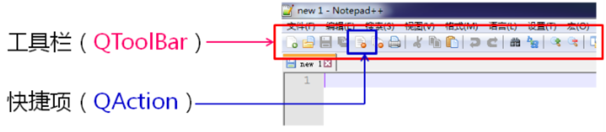
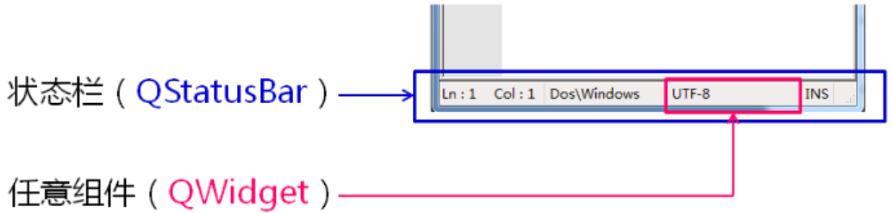
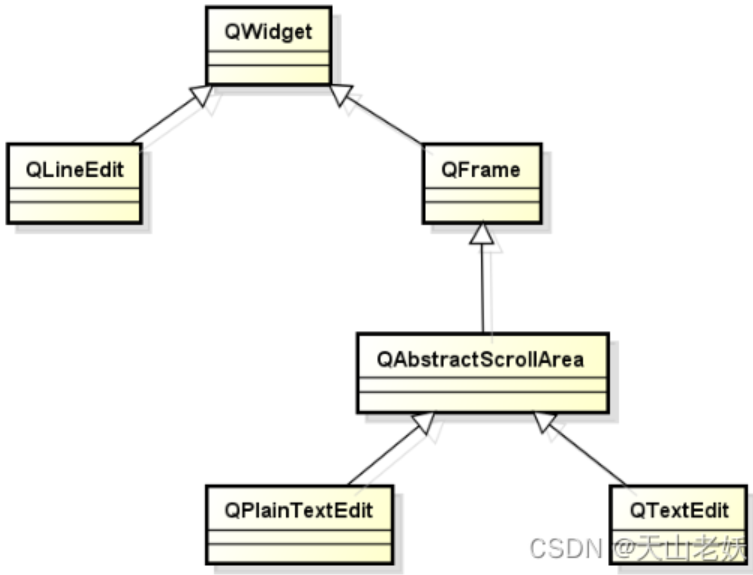

# QMainWindow主窗口

应用程序中的主窗口

- 是与用户进行`长时间交互的顶层窗口`
- 程序的`绝大多数功能`直接由主窗口提供
- 主窗口通常是应用程序启动后显示的第一个窗口
- 整个程序由`一个主窗口`和`多个对话框`组成


Qt中的主窗口

- Qt开发平台中直接支持主窗口的概念
- QMainWindow是Qt中主窗口的基类
- QMainWindow`继承于QWidget`是一种`容器类型`的组件

 


**QMainWindow中封装的秘密**
1.菜单栏文件
2.工具栏
3.中心组件
4.停靠组件
5.状态栏

 


**QMainWindow中的组件布局**

 

------

# 主窗口中的菜单

**在Qt中提供与菜单相关的类组件**

 

```cpp
QMenuBar* mb = menuBar();
QMenu* menu = new QMenu("File(&F)");

QAction *action = new QAction(text, NULL);
menu->addAction(action);

mb->addMenu(menu);
```

快捷键设置

```cpp
action->setShortcut(shortcut);
```

------

# 工具栏

工具栏是应用程序中集成各种功能使用快捷方式的区域，不是应用程序必须存在的组件，工具栏的元素可以是各种窗口组件，但通常以`图标按钮`的方式存在。

QT中提供了预定义的工具栏相关组件，工具栏QToolBar和快捷项QAction。

 

 

- 工具栏使用方法

```cpp
//创建工具栏
QToolBar *tb = addToolBar("ToolBar");
 
//创建工具栏选项
QAction *action = new QAction("", NULL);
action->setToolTip(“Open”);
action->setIcon(QIcon(“/res/pic/open.png”));

//将工具栏选项加入工具栏
tb->addAction(action);
```

- QToolBar实用函数

```cpp
void setFloatable(bool floatable) //设置工具栏为浮动
void setMovable(bool movable) //设置工具栏为可移动
void setIconSize(const QSize & iconSize) //设置工具栏的图标大小
```

- 工具栏实例

QToolBar组件中可以加入QT中的任意QWidget组件。

```cpp
    QToolBar* tb = addToolBar("Tool Bar");
    QAction* action = new QAction("", NULL);
 
    tb->setFloatable(false);
    tb->setMovable(false);
 
    action->setToolTip("Open");
    action->setIcon(QIcon(":/Res/open.png"));
 
    tb->addAction(action);
 
    QPushButton* b = new QPushButton("Button");
    QLabel* l = new QLabel("Label");
    QLineEdit* e = new QLineEdit();
 
    tb->addWidget(b);
    tb->addWidget(l);
    tb->addWidget(e);
```


------

# 状态栏

状态栏是应用程序中输出简要信息的区域，一般位于窗口的底部。状态栏显示的消息类型如下：

- 实时消息，如当前程序状态

- 永久消息，如程序版本，开发机构

- 进度消息，进度显示

QT中提供了预定义的状态栏相关组件状态栏QStatusBar，QStatusBar是容器型组件，可以是任意组件QWidget的父组件。

 


QT状态栏的一般设计原则：

- 状态栏左边区域用于输出实时消息

- 状态栏右边区域用于输出永久消息

因此，addWidget函数用于在`状态栏左边`区域添加组件，addPermanentWidget函数用于在`状态栏右边`区域添加组件。

状态栏使用方法如下：

```cpp
    QStatusBar* sb = statusBar();
    QLabel* label = new QLabel("CopyRight @ Scorpio Studio 2016");
    if( label != NULL )
    {
        line.setMinimumWidth(120);
        line.setAlignment(Qt::AlignCenter);
        line.setText("Ln: 1    Col: 1");
        label->setMinimumWidth(160);
 
        label->setAlignment(Qt::AlignCenter);
        sb->addPermanentWidget(new QLabel());
        sb->addPermanentWidget(&line);
        sb->addPermanentWidget(label);
    }
```


------

# 文本编辑组件

QT中预定义了三种文本编辑组件，用于满足不同的开发需求。

- QLineEdit 单行文本编辑组件

- QTextEdit 多行富文本编辑组件

- QPlainTextEdit 多行普通文本编辑组件


**QT文本编辑组件的类继承图：**

 

 QT中的文本编辑组件内置了右键弹出和快捷键功能。

文本编辑器的使用：

```cpp
//设置文本编辑器的父组件
mainEditor.setParent(this);
//设置文本编辑器为中央组件
setCentralWidget(&mainEditor);
```

