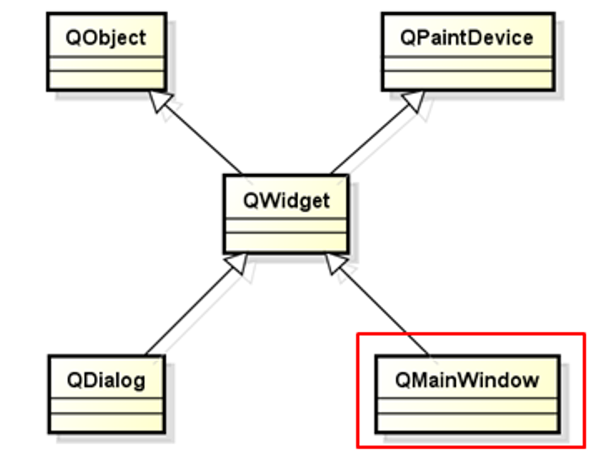
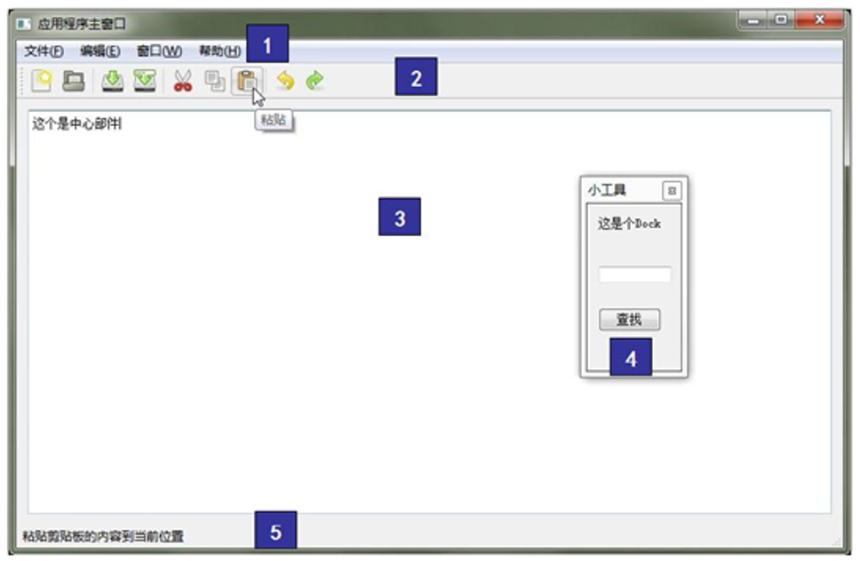
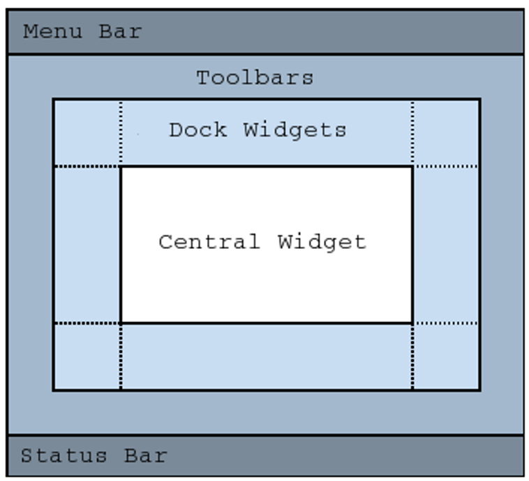
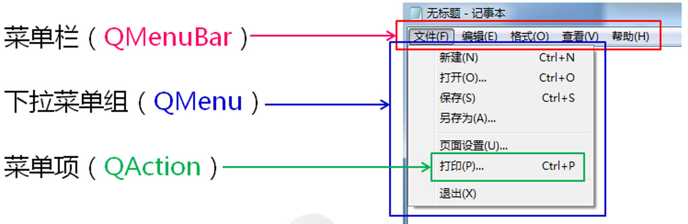

# QMainWindow主窗口

应用程序中的主窗口

- 是与用户进行`长时间交互的顶层窗口`
- 程序的`绝大多数功能`直接由主窗口提供
- 主窗口通常是应用程序启动后显示的第一个窗口
- 整个程序由`一个主窗口`和`多个对话框`组成


Qt中的主窗口

- Qt开发平台中直接支持主窗口的概念
- QMainWindow是Qt中主窗口的基类
- QMainWindow`继承于QWidget`是一种`容器类型`的组件

 


**QMainWindow中封装的秘密**
1.菜单栏文件
2.工具栏
3.中心组件
4.停靠组件
5.状态栏

 


**QMainWindow中的组件布局**

 

------

# 主窗口中的菜单

**在Qt中提供与菜单相关的类组件**

 

```cpp
QMenuBar* mb = menuBar();
QMenu* menu = new QMenu("File(&F)");

QAction *action = new QAction(text, NULL);
menu->addAction(action);

mb->addMenu(menu);
```

快捷键设置

```cpp
action->setShortcut(shortcut);
```

------

# 工具栏