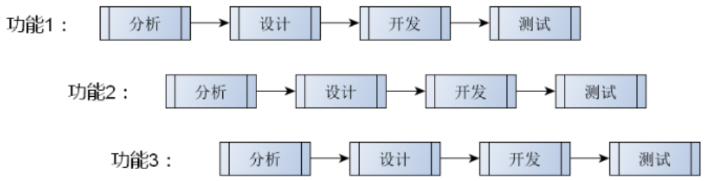
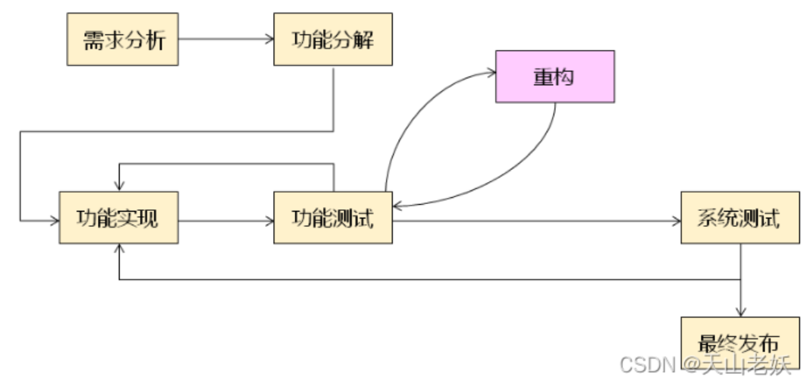

# 软件开发流程

软件开发流程是通过一系列步骤保证软件产品的顺利完成，是软件产品在生命周期内的管理学。

软件开发流程的本质是软件开发流程与具体技术无关，是开发团队必须遵守的规则。

## 常见软件开发流程模型

常见的软件开发流程模型包括即兴模型、瀑布模型、增量模型、螺旋模型、敏捷模型。

### 即兴模型

- 与用户交流后立即进行开发

- 没有需求分析和需求发掘过程

- 没有整体设计和规划

- 没有软件文档，可维护性差

### 瀑布模型

- 自上而下的进行软件开发

- 开发过程不可逆

瀑布模型的开发流程包括：需求分析、架构设计、开发实现、系统测试、发布

### 增量模型

- 将系统功能分解为互不重叠的子功能

- 每次全力实现一个子功能

- 子功能全部完成后系统开发完成

 

### 螺旋模型

- 采用迭代方法开发

- 软件项目分解为多个不同版本完成

- 每个版本的开发过程需要用户参与

- 根据前一个版本的反馈设计下一个版本

### 敏捷模型

- 一切从简

- 拥抱变化

- 高效工作

- 持续开发

## 系统测试

**内存泄漏测试**
Valgrind内存分析工具

Valgrind是用于构建动态分析工具的探测框架，包括一个工具集，每个工具执行某种类型的调试、分析或类似的任务。Valgrind的架构是模块化的，所以可以容易地创建新的工具而又不会扰乱现有的结构。

## 代码重构

重构是以改善代码质量为目的的代码重写，使软件的设计和架构更加合理，提高软件的扩展性和维护性。

代码实现是按照设计编程实现，重点在于功能实现，不考虑架构的好坏，只考虑功能的实现。

代码重构是以提高代码质量为目的的软件架构优化，不能影响已经实现的功能，只考虑架构的改善。

 

 软件的代码重构一般在功能实现并通过功能测试后进行。