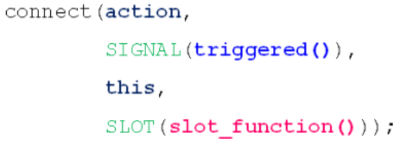
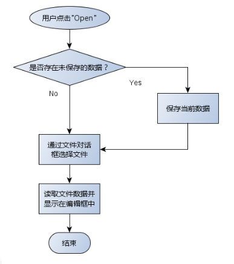
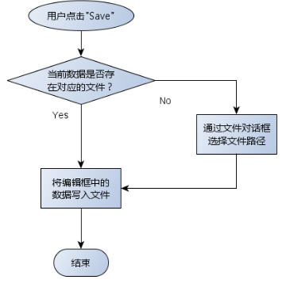
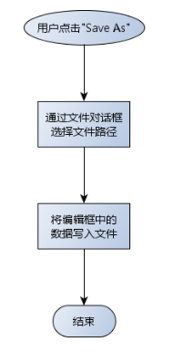
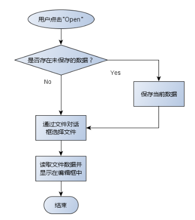
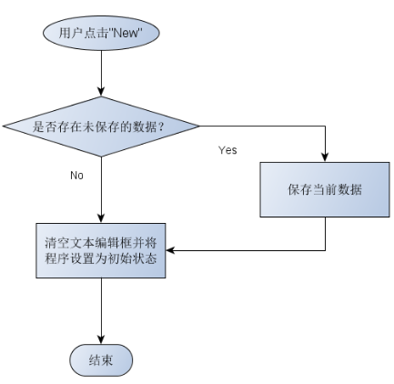

# 文件操作

QT中的IO操作通过统一的接口简化了文件与外部设备的操作方式

QT中文件被当作一种特殊的外部设备，文件操作与外部设备操作相同。


## IO操作的主要函数接口

打开设备：bool open(OpenMode mode)

读取数据：QByteArray read(qint64 maxSize)

写入数据：qint64 write(const QByteArray & byteArray)

关闭设备：void close()

IO操作的本质是连续存储空间的数据读写


## IO设备的类型

顺序存取设备：只能从头开始顺序读写数据，不能指定数据的读写位置

随机存取设备：可以定位到任意位置进行数据的读写

QT中IO设备的继承类图：

 


## 文件操作实例

QFile是QT中用于文件操作的类，QFile对象对应实际的文件。

```cpp
void write(QString f)
{
    QFile file(f);
 
    if( file.open(QIODevice::WriteOnly | QIODevice::Text) )
    {
        file.write("D.T.Software\n");
        file.write("Delphi Tang\n");
        file.close();
    }
}
 
void read(QString f)
{
    QFile file(f);
 
    if( file.open(QIODevice::ReadOnly | QIODevice::Text) )
    {
        QByteArray ba = file.readLine();
        QString s(ba);
        qDebug() << s;
        file.close();
    }
}
```

QFileInfo类用于读取文件的属性信息

```cpp
    QFile file(f);
    QFileInfo info(file);

    qDebug() << info.exists();
    qDebug() << info.isFile();
    qDebug() << info.isReadable();
    qDebug() << info.isWritable();
    qDebug() << info.birthTime();
    qDebug() << info.lastRead();
    qDebug() << info.lastModified();
    qDebug() << info.path();
    qDebug() << info.fileName();
    qDebug() << info.suffix();
    qDebug() << info.size();
```

### QTemporaryFile

QTemporaryFile是QT中的临时文件操作类，用来安全创建全局唯一的临时文件，`QTemporaryFile对象销毁时对应的临时文件将被删除`，临时文件的打开方式为QIODevice::ReadWrite,临时文件常用于`大数据传递或者进程间通信`场合。

```c++
QTemporaryFile tempFile;
 
if( tempFile.open() )
{
    tempFile.write("D.T.Software");
    tempFile.close();
}
```


------

# 文本流与数据流

QT中将文件分为文本文件和数据文件，文本文件内容是可读的文本字符，数据文件的内容是二进制数据。

QFile直接支持文本文件和数据文件的操作，主要函数接口如下：

```cpp
qint64 read( char * data, qint64 maxSize)
QByteArray read( qint64 maxSize)
qint64 write(const char * data, qint64 maxSize)
qint64 write(const QByteArray & byteArray)
```

为了简化文本文件和数据文件的读写操作，QT提供了QTextStream和QDataStream辅助类。QTextStream可将写入的数据全部转换为可读文本，QDataStream可将写入的数据根据类型转换为二进制数据。


## QTextStream使用方法

```cpp
void textStream(QString f){
    QFile file(f);

    if(file.open(QIODevice::WriteOnly | QIODevice::Text)){
        QTextStream ts_Out(&file);
        ts_Out << QString("D.T.Software") << Qt::endl;
        ts_Out << QString("Result: ") << Qt::endl;
        ts_Out << 5 << '*' << 6 << '=' << 5 * 6 << Qt::endl;
        file.close();
    }

    if(file.open(QIODevice::ReadOnly | QIODevice::Text)){
        QTextStream ts_In(&file);
        while(!ts_In.atEnd()){
            QString line = ts_In.readLine();
            qDebug() << line;
        }
        file.close();
    }
}
```


## QDataStream使用方法

```c++
void dataStream(QString f){
    QFile file(f);

    if(file.open(QIODevice::WriteOnly)){
        QDataStream ds_Out(&file);
        ds_Out.setVersion(QDataStream::Qt_6_8);
        ds_Out << QString("D.T.Software");
        ds_Out << QString("Result: ");
        ds_Out << 3.14;
        file.close();
    }

    if(file.open(QIODevice::ReadOnly)){
        QDataStream ds_In(&file);
        ds_In.setVersion(QDataStream::Qt_6_8);
        QString dt = "";
        QString result = "";
        double value = 0;

        ds_In >> dt;
        ds_In >> result;
        ds_In >> value;

        file.close();
        qDebug() << dt;
        qDebug() << result;
        qDebug() << value;
    }
}
```

QDataStream在不同的QT版本中数据流文件格式可能是不同的，如果数据流文件需要在不同版本的QT程序间传递时需要考虑版本问题。

```cpp
void setVersion(int v)
int version() const
```


------

# QBuffer缓冲区

QT中预定义了缓冲区的类QBuffer，可以将缓冲区看成一种特殊的IO设备，文件流辅助类可以直接用于操作缓冲区。QBuffer缓冲区写入和读取的数据必须是同一种数据类型，不能混合多种数据类型。

**QBuffer的使用场合：**

- 线程间不同类型的数据传递

- 缓存外部设备中的数据返回

- 数据读取速度小于写入速度


**QBuffer使用方法如下：**

```cpp
    QByteArray array;
    QBuffer buffer(&array);
    if(buffer.open(QIODevice::WriteOnly))
    {
        QDataStream out(&buffer);
        out << QString("3.1234");
        out << QString("scorpio");
        out << QString("1234");
        buffer.close();
    }
 
    if(buffer.open(QIODevice::ReadOnly))
    {
        QDataStream in(&buffer);
        QString name;
        QString a;
        QString b;
        in >> a;
        in >> name;
        in >> b;
        buffer.close();
 
        qDebug() << name;
        qDebug() << a;
        qDebug() << b;
    }
```

可以将不同类型的多个数据存储在QBuffer对象中，传递数据时只需要传递一个QBuffer对象，简化了数据的传递。


------

# 目录操作

## QDir

QT中提供了目录操作类QDir，QDir功能如下：

- 目录分隔符统一使用’/’

- 能够对目录进行任意操作（创建、删除、重命名）

- 能够获取指定目录中的所有条目（文件和文件夹）

- 能够使用过滤字符串获取指定条目

- 能够获取系统中的所有根目录


**QDir使用方法如下：**

```cpp
    QDir dir;
    QString path("/temp/");
 
    if(!dir.exists())
    {
        dir.mkdir(path);
    }
    else
    {
        dir.cd(path);
        QStringList list = dir.entryList();
        for(int i = 0; i < list.count(); i++)
        {
            qDebug() << list[i];
        }
    }
```

**计算文件大小**

```cpp
unsigned int FileSize(QString path)
{
    QFileInfo info(path);
    unsigned int ret = 0;
    if(info.isFile())
    {
        ret = info.size();
    }
    else if(info.isDir())
    {
        QDir dir(path);
        QFileInfoList list = dir.entryInfoList();
        for(int i = 0; i < list.count(); i++)
        {
            if((list[i].fileName() != ".") && (list[i].fileName() != ".."))
            {
                ret += FileSize(list[i].absoluteFilePath());
            }
        }
    }
    return ret;
}
```


## QFileSystemWatcher

QT中预定义了用于监控文件和目录变化的类QFileSystemWatcher，QFileSystemWatcher主要功能如下：

- 能够监控特定目录和文件的状态

- 能够同时对多个文件和目录进行监控

- 当目录或文件发生改变时触发信号

- 通过信号与槽的机制捕捉信号并做出响应


通常要使用QFileSystemWatcher需要自定义文件监视类。


Watcher.h

```cpp
#ifndef WATCHER_H
#define WATCHER_H

#include <QObject>
#include <QFileSystemWatcher>

class Watcher : public QObject
{
    Q_OBJECT

private:
    QFileSystemWatcher m_watcher;

private slots:
    void statusChanged(const QString &path);
public:
    explicit Watcher(QObject *parent = nullptr);
    void addPath(QString path);
};

#endif // WATCHER_H
```

Watcher.cpp

```cpp
#include "Watcher.h"
#include <QDebug>

Watcher::Watcher(QObject *parent)
    : QObject{parent}{

    connect(&m_watcher, &QFileSystemWatcher::fileChanged, this, &Watcher::statusChanged);
    connect(&m_watcher, &QFileSystemWatcher::directoryChanged, this, &Watcher::statusChanged);
}

void Watcher::statusChanged(const QString &path){
    qDebug() << path << "is changed.";
}

void Watcher::addPath(QString path){
    m_watcher.addPath(path);
}
```

main.cpp

```cpp
#include <QApplication>
#include <QString>
#include "Watcher.h"

int main(int argc, char *argv[])
{
    QApplication a(argc, argv);
    Watcher watcher;
    QString dirPath("C:/Users/Administrator/Desktop/qt");
    QString filePath("C:/Users/Administrator/Desktop/qt/file_watcher.txt");
    watcher.addPath(dirPath);
    watcher.addPath(filePath);
    return a.exec();
}
```


------

# 文本编辑器中的数据存取

**QAction的信号**

QAction被点击之后会产生一个triggered信号

（1）通过信号与槽的机制能够捕捉对QAction对象的操作

（2）项目中可以将`多个信号映射到同一个槽函数`

 


## 文件的打开、保存、另存为操作

**文件的打开操作**

 

**文件的保存操作**

定义成员变量用于标记数据来源

 

**文件的另存为操作**

 


MainWindow.h

```cpp
#ifndef MAINWINDOW_H
#define MAINWINDOW_H

#include <QMainWindow>
#include <QKeySequence>
#include <QMenuBar>
#include <QToolBar>
#include <QAction>
#include <QPlainTextEdit>
#include <QLabel>
#include <QString>
#include <QFileDialog>

class MainWindow : public QMainWindow
{
    Q_OBJECT
private:
    QPlainTextEdit mainEditor;
    QLabel statusLbl;
    QString m_filePath;

    MainWindow();
    MainWindow(const MainWindow&);
    MainWindow& operator= (const MainWindow&);
    bool construct();

    bool initMenuBar();
    bool initToolBar();
    bool initStatusBar();
    bool initMainEditor();

    bool initFileMenu(QMenuBar* mb);
    bool initEditMenu(QMenuBar* mb);
    bool initFormatMenu(QMenuBar* mb);
    bool initViewMenu(QMenuBar* mb);
    bool initHelpMenu(QMenuBar* mb);

    bool initFileToolItem(QToolBar* tb);
    bool initEditToolItem(QToolBar* tb);
    bool initFormatToolItem(QToolBar* tb);
    bool initViewToolItem(QToolBar* tb);

    bool makeAction(QAction* &action, const QString text, const QKeySequence& shortcut);
    bool makeAction(QAction* &action, const QString tip, const QString icon);

    QString showFileDialog(QFileDialog::AcceptMode mode, QString title);
    void showErrorMessage(QString message);

private slots:
    void onFileOpen();
    void onFileSave();
    void onFileSaveAs();

public:
    static MainWindow* NewInstance();
    ~MainWindow();
};
#endif // MAINWINDOW_H
```

MainWindowUI.cpp

```cpp
#include "MainWindow.h"
#include <QMenu>
#include <QKeySequence>
#include <QKeyCombination>
#include <QIcon>
#include <QSize>
#include <QStatusBar>
#include <QLabel>

MainWindow::MainWindow():statusLbl(this){
    m_filePath = "";
}

MainWindow* MainWindow::NewInstance(){

    auto ret = new MainWindow();
    if(!ret || !ret->construct()){
        delete ret;
        ret = nullptr;
    }
    return ret;
}

bool MainWindow::construct(){
    bool ret = true;
    ret = ret && initMenuBar();
    ret = ret && initToolBar();
    ret = ret && initStatusBar();
    ret = ret && initMainEditor();

    return ret;
}

bool MainWindow::initMenuBar(){
    bool ret = true;
    QMenuBar* mb = menuBar();

    ret = ret && initFileMenu(mb);
    ret = ret && initEditMenu(mb);
    ret = ret && initFormatMenu(mb);
    ret = ret && initViewMenu(mb);
    ret = ret && initHelpMenu(mb);

    return ret;
}

bool MainWindow::initToolBar(){
    bool ret = true;
    auto tb = addToolBar("Tool Bar");
    tb->setIconSize(QSize(16, 16));

    ret = ret && initFileToolItem(tb);
    tb->addSeparator();
    ret = ret && initEditToolItem(tb);
    tb->addSeparator();
    ret = ret && initFormatToolItem(tb);
    tb->addSeparator();
    ret = ret && initViewToolItem(tb);

    return ret;
}

bool MainWindow::initStatusBar() {
    QStatusBar* sb = statusBar();
    if (!sb) {
        return false;
    }

    QLabel* label = new QLabel("X.Software", this);
    if (!label) {
        return false;
    }

    statusLbl.setMinimumWidth(200);
    statusLbl.setAlignment(Qt::AlignCenter);
    statusLbl.setText("Ln: 1    Col: 1");

    label->setMinimumWidth(200);
    label->setAlignment(Qt::AlignCenter);

    sb->addPermanentWidget(new QLabel("", this));
    sb->addPermanentWidget(&statusLbl);
    sb->addPermanentWidget(label);

    return true;
}

bool MainWindow::initMainEditor() {

    mainEditor.setParent(this);
    setCentralWidget(&mainEditor);
    return true;
}

bool MainWindow::initFileMenu(QMenuBar* mb){
    if(!mb){
        return false;
    }

    auto fileMenu = new QMenu("&File", mb);
    QAction* action = nullptr;

    if(!makeAction(action, "&New", QKeySequence(QKeyCombination(Qt::CTRL, Qt::Key_N)))){
        delete fileMenu;
        return false;
    }
    fileMenu->addAction(action);

    if(!makeAction(action, "&Open...", QKeySequence(QKeyCombination(Qt::CTRL, Qt::Key_O)))){
        delete fileMenu;
        return false;
    }
    connect(action, &QAction::triggered, this, &MainWindow::onFileOpen);
    fileMenu->addAction(action);

    if(!makeAction(action, "&Save", QKeySequence(QKeyCombination(Qt::CTRL, Qt::Key_S)))){
        delete fileMenu;
        return false;
    }
    connect(action, &QAction::triggered, this, &MainWindow::onFileSave);
    fileMenu->addAction(action);

    if(!makeAction(action, "Save &As...", QKeySequence(QKeyCombination()))){
        delete fileMenu;
        return false;
    }
    connect(action, &QAction::triggered, this, &MainWindow::onFileSaveAs);
    fileMenu->addAction(action);
    fileMenu->addSeparator();

    if(!makeAction(action, "&Printf...", QKeySequence(QKeyCombination(Qt::CTRL, Qt::Key_P)))){
        delete fileMenu;
        return false;
    }
    fileMenu->addAction(action);
    fileMenu->addSeparator();

    if(!makeAction(action, "&Exit",QKeySequence(QKeyCombination(Qt::CTRL, Qt::Key_X)))){
        delete fileMenu;
        return false;
    }
    fileMenu->addAction(action);

    mb->addMenu(fileMenu);
    return true;
}

bool MainWindow::initEditMenu(QMenuBar* mb) {
    if (!mb) {
        return false;
    }

    auto editMenu = new QMenu("&Edit", mb);
    QAction* action = nullptr;

    if (!makeAction(action, "&Undo", QKeySequence(QKeyCombination(Qt::CTRL, Qt::Key_Z)))) {
        delete editMenu;
        return false;
    }
    editMenu->addAction(action);

    if (!makeAction(action, "&Redo...", QKeySequence(QKeyCombination(Qt::CTRL, Qt::Key_Y)))) {
        delete editMenu;
        return false;
    }
    editMenu->addAction(action);
    editMenu->addSeparator();

    if (!makeAction(action, "Cu&t", QKeySequence(QKeyCombination(Qt::CTRL, Qt::Key_X)))) {
        delete editMenu;
        return false;
    }
    editMenu->addAction(action);

    if (!makeAction(action, "&Copy...", QKeySequence(QKeyCombination(Qt::CTRL, Qt::Key_C)))) {
        delete editMenu;
        return false;
    }
    editMenu->addAction(action);

    if (!makeAction(action, "&Paste...", QKeySequence(QKeyCombination(Qt::CTRL, Qt::Key_V)))) {
        delete editMenu;
        return false;
    }
    editMenu->addAction(action);

    if (!makeAction(action, "De&lete", QKeySequence(Qt::Key_Delete))) {
        delete editMenu;
        return false;
    }
    editMenu->addAction(action);
    editMenu->addSeparator();

    if (!makeAction(action, "&Find...", QKeySequence(QKeyCombination(Qt::CTRL, Qt::Key_F)))) {
        delete editMenu;
        return false;
    }
    editMenu->addAction(action);

    if (!makeAction(action, "&Replace...", QKeySequence(QKeyCombination(Qt::CTRL, Qt::Key_H)))) {
        delete editMenu;
        return false;
    }
    editMenu->addAction(action);

    if (!makeAction(action, "&Goto...", QKeySequence(QKeyCombination(Qt::CTRL, Qt::Key_G)))) {
        delete editMenu;
        return false;
    }
    editMenu->addAction(action);
    editMenu->addSeparator();

    if (!makeAction(action, "Select &All", QKeySequence(QKeyCombination(Qt::CTRL, Qt::Key_A)))) {
        delete editMenu;
        return false;
    }
    editMenu->addAction(action);

    mb->addMenu(editMenu);
    return true;
}

bool MainWindow::initFormatMenu(QMenuBar* mb) {
    if (!mb) {
        return false;
    }

    auto formatMenu = new QMenu("F&ormat", mb);
    QAction* action = nullptr;

    if (!makeAction(action, "Auto &Wrap", QKeySequence())) {
        delete formatMenu;
        return false;
    }
    formatMenu->addAction(action);

    if (!makeAction(action, "&Font...", QKeySequence())) {
        delete formatMenu;
        return false;
    }
    formatMenu->addAction(action);

    mb->addMenu(formatMenu);
    return true;
}

bool MainWindow::initViewMenu(QMenuBar* mb) {
    if (!mb) {
        return false;
    }

    auto viewMenu = new QMenu("&View", mb);
    QAction* action = nullptr;

    if (!makeAction(action, "&Tool Bar", QKeySequence())) {
        delete viewMenu;
        return false;
    }
    viewMenu->addAction(action);

    if (!makeAction(action, "&Status Bar", QKeySequence())) {
        delete viewMenu;
        return false;
    }
    viewMenu->addAction(action);

    mb->addMenu(viewMenu);
    return true;
}

bool MainWindow::initHelpMenu(QMenuBar* mb) {
    if (!mb) {
        return false;
    }

    auto helpMenu = new QMenu("&Help", mb);
    QAction* action = nullptr;

    if (!makeAction(action, "User Manual", QKeySequence())) {
        delete helpMenu;
        return false;
    }
    helpMenu->addAction(action);

    if (!makeAction(action, "About NotePad...", QKeySequence())) {
        delete helpMenu;
        return false;
    }
    helpMenu->addAction(action);

    mb->addMenu(helpMenu);
    return true;
}

bool MainWindow::initFileToolItem(QToolBar* tb) {
    if (!tb) {
        return false;
    }
    QAction* action = nullptr;

    if (!makeAction(action, "New", ":/Res/pic/new.png")) {
        return false;
    }
    tb->addAction(action);

    if (!makeAction(action, "Open", ":/Res/pic/open.png")) {
        return false;
    }
    connect(action, &QAction::triggered, this, &MainWindow::onFileOpen);
    tb->addAction(action);

    if (!makeAction(action, "Save", ":/Res/pic/save.png")) {
        return false;
    }
    connect(action, &QAction::triggered, this, &MainWindow::onFileSave);
    tb->addAction(action);

    if (!makeAction(action, "Save As", ":/Res/pic/saveas.png")) {
        return false;
    }
    connect(action, &QAction::triggered, this, &MainWindow::onFileSaveAs);
    tb->addAction(action);

    if (!makeAction(action, "Print", ":/Res/pic/print.png")) {
        return false;
    }
    tb->addAction(action);

    return true;
}

bool MainWindow::initEditToolItem(QToolBar* tb) {
    if (!tb) {
        return false;
    }

    QAction* action = nullptr;
    if (!makeAction(action, "Undo", ":/Res/pic/undo.png")) {
        return false;
    }
    tb->addAction(action);

    if (!makeAction(action, "Redo", ":/Res/pic/redo.png")) {
        return false;
    }
    tb->addAction(action);

    if (!makeAction(action, "Cut", ":/Res/pic/cut.png")) {
        return false;
    }
    tb->addAction(action);

    if (!makeAction(action, "Copy", ":/Res/pic/copy.png")) {
        return false;
    }
    tb->addAction(action);

    if (!makeAction(action, "Paste", ":/Res/pic/paste.png")) {
        return false;
    }
    tb->addAction(action);

    if (!makeAction(action, "Find", ":/Res/pic/find.png")) {
        return false;
    }
    tb->addAction(action);

    if (!makeAction(action, "Replace", ":/Res/pic/replace.png")) {
        return false;
    }
    tb->addAction(action);

    if (!makeAction(action, "Goto", ":/Res/pic/goto.png")) {
        return false;
    }
    tb->addAction(action);

    return true;
}

bool MainWindow::initFormatToolItem(QToolBar* tb) {
    if (!tb) {
        return false;
    }

    QAction* action = nullptr;
    if (!makeAction(action, "Auto Wrap", ":/Res/pic/wrap.png")) {
        return false;
    }
    tb->addAction(action);

    if (!makeAction(action, "Font", ":/Res/pic/font.png")) {
        return false;
    }
    tb->addAction(action);

    return true;
}

bool MainWindow::initViewToolItem(QToolBar* tb) {
    if (!tb) {
        return false;
    }

    QAction* action = nullptr;
    if (!makeAction(action, "Tool Bar", ":/Res/pic/tool.png")) {
        return false;
    }
    tb->addAction(action);

    if (!makeAction(action, "Status Bar", ":/Res/pic/status.png")) {
        return false;
    }
    tb->addAction(action);

    return true;
}

bool MainWindow::makeAction(QAction* &action, const QString text, const QKeySequence& shortcut){
    action = new QAction(text, nullptr);
    if(action){
        action->setShortcut(shortcut);
    }else{
        return false;
    }
    return true;
}

bool MainWindow::makeAction(QAction* &action, const QString tip, const QString icon){
    action = new QAction("", this);
    if(!action){
        return false;
    }

    action->setToolTip(tip);
    action->setIcon(QIcon(icon));
    return true;
}

MainWindow::~MainWindow() {}
```

MainWindowSlots.cpp

```cpp
#include "MainWindow.h"
#include <QFileDialog>
#include <QStringList>
#include <QFile>
#include <QDebug>
#include <QMessageBox>

QString MainWindow::showFileDialog(QFileDialog::AcceptMode mode, QString title){
    QString ret = "";
    QFileDialog fd;

    fd.setWindowTitle(title);
    fd.setAcceptMode(mode);
    QStringList filters;
    filters.append("Text(*.txt)");
    filters.append("All Files(*.*)");
    fd.setNameFilters(filters);

    if(mode == QFileDialog::AcceptOpen){
        fd.setFileMode(QFileDialog::ExistingFile);
    }

    if(fd.exec() == QFileDialog::Accepted){
        ret = fd.selectedFiles()[0];
    }

    return ret;
}

void MainWindow::showErrorMessage(QString message){
    QMessageBox mb(this);
    mb.setWindowTitle("Error");
    mb.setText(message);
    mb.setIcon(QMessageBox::Critical);
    mb.setStandardButtons(QMessageBox::Ok);
    mb.exec();
}

void MainWindow::onFileOpen(){
    QString path = showFileDialog(QFileDialog::AcceptOpen, "open");
    if("" != path){
        QFile file(path);
        if(file.open(QIODevice::ReadOnly | QIODevice::Text)){
            mainEditor.setPlainText(QString(file.readAll()));
            file.close();
            m_filePath = path;
            setWindowTitle("NotePad - [" + m_filePath + "]");
        }else {
            showErrorMessage(QString("Open file Error!\n\n") + "\"" + m_filePath + "\"");
        }
    }
}

void MainWindow::onFileSave(){
    if("" == m_filePath){
        m_filePath = showFileDialog(QFileDialog::AcceptSave, "save");
    }

    if("" != m_filePath){
        QFile file(m_filePath);
        if(file.open(QIODevice::WriteOnly | QIODevice::Text)){
            QTextStream out(&file);
            out << QString(mainEditor.toPlainText());
            file.close();
            setWindowTitle("NotePad - [" + m_filePath + "]");
        }else{
            showErrorMessage(QString("Open file Error!\n\n") + "\"" + m_filePath + "\"");
            m_filePath = "";
        }
    }
}

void MainWindow::onFileSaveAs(){
    QString path = showFileDialog(QFileDialog::AcceptSave, "save as");
    if("" != path){
        QFile file(path);
        if(file.open(QIODevice::WriteOnly | QIODevice::Text)){
            QTextStream out(&file);
            out << QString(mainEditor.toPlainText());
            file.close();
            setWindowTitle("NotePad - [" + m_filePath + "]");
        }else{
            showErrorMessage(QString("Open file Error!\n\n") + "\"" + m_filePath + "\"");
        }
    }
}
```

main.cpp

```cpp
#include "MainWindow.h"
#include <QApplication>

int main(int argc, char *argv[])
{
    QApplication a(argc, argv);
    auto w = MainWindow::NewInstance();
    int ret = -1;
    if( w != NULL ){
        w->resize(800, 600);
        w->show();
        ret = a.exec();
    }
    delete w;
    return ret;
}
```


- Qt项目中尽量将界面代码与功能代码分离开

- Qt项目开发中尽量复用平台中提供的相关组件

- Qt项目中的多数情况都是编写相应的槽函数
  - 槽函数用于响应用户操作
  - 槽函数是具体功能的触发点


------

# 文本编辑器中的功能交互

## 判断未保存的数据

QPlainTextEdit能够触发与编辑功能相关的信号

```cpp
void textChanged()	//字符发生变化时触发
void copyAvailable(bool)
void cursorPositionChanged()
void redoAvailable(bool)
void undoAvailable(bool)
```

解决方案

1. 定义槽函数void onTextChanged()

2. 映射textChanged()到槽函数

3. 定义成员变量bool m_isTextChanged = false;

4. 当文本框内容发生改变时， m_isTextChanged = true;

5. 当m_isTextChanged 为真时，则保存数据


## 文本编辑器的持续开发

**文件打开操作**

 

**文件新建操作**

 


**MainWindow.h**

```cpp
#ifndef MAINWINDOW_H
#define MAINWINDOW_H

#include <QMainWindow>
#include <QKeySequence>
#include <QMenuBar>
#include <QToolBar>
#include <QAction>
#include <QPlainTextEdit>
#include <QLabel>
#include <QString>
#include <QFileDialog>

class MainWindow : public QMainWindow
{
    Q_OBJECT

    QPlainTextEdit mainEditor;
    QLabel statusLbl;
    QString m_filePath;
    bool m_isTextChanged;

    MainWindow();
    MainWindow(const MainWindow&);
    MainWindow& operator= (const MainWindow&);
    bool construct();

    bool initMenuBar();
    bool initToolBar();
    bool initStatusBar();
    bool initMainEditor();

    bool initFileMenu(QMenuBar* mb);
    bool initEditMenu(QMenuBar* mb);
    bool initFormatMenu(QMenuBar* mb);
    bool initViewMenu(QMenuBar* mb);
    bool initHelpMenu(QMenuBar* mb);

    bool initFileToolItem(QToolBar* tb);
    bool initEditToolItem(QToolBar* tb);
    bool initFormatToolItem(QToolBar* tb);
    bool initViewToolItem(QToolBar* tb);

    bool makeAction(QAction* &action, const QString text, const QKeySequence& shortcut);
    bool makeAction(QAction* &action, const QString tip, const QString icon);

    QString showFileDialog(QFileDialog::AcceptMode mode, QString title);
    void showErrorMessage(QString message);
    int showQuesstionMessage(QString message);
    QString saveCurrentData(QString path = "");
    void preEditorChanged();

private slots:
    void onFileNew();
    void onFileOpen();
    void onFileSave();
    void onFileSaveAs();
    void onTextChanged();

public:
    static MainWindow* NewInstance();
    ~MainWindow();
};
#endif // MAINWINDOW_H
```

**MainWindowUI.cpp**

```cpp
#include "MainWindow.h"
#include <QMenu>
#include <QKeySequence>
#include <QKeyCombination>
#include <QIcon>
#include <QSize>
#include <QStatusBar>
#include <QLabel>

MainWindow::MainWindow():statusLbl(this){
    m_filePath = "";
    m_isTextChanged = false;
    setWindowTitle("NotePad-[New]");
}

MainWindow* MainWindow::NewInstance(){

    auto ret = new MainWindow();
    if(!ret || !ret->construct()){
        delete ret;
        ret = nullptr;
    }
    return ret;
}

bool MainWindow::construct(){
    bool ret = true;
    ret = ret && initMenuBar();
    ret = ret && initToolBar();
    ret = ret && initStatusBar();
    ret = ret && initMainEditor();

    return ret;
}

bool MainWindow::initMenuBar(){
    bool ret = true;
    QMenuBar* mb = menuBar();

    ret = ret && initFileMenu(mb);
    ret = ret && initEditMenu(mb);
    ret = ret && initFormatMenu(mb);
    ret = ret && initViewMenu(mb);
    ret = ret && initHelpMenu(mb);

    return ret;
}

bool MainWindow::initToolBar(){
    bool ret = true;
    auto tb = addToolBar("Tool Bar");
    tb->setIconSize(QSize(16, 16));

    ret = ret && initFileToolItem(tb);
    tb->addSeparator();
    ret = ret && initEditToolItem(tb);
    tb->addSeparator();
    ret = ret && initFormatToolItem(tb);
    tb->addSeparator();
    ret = ret && initViewToolItem(tb);

    return ret;
}

bool MainWindow::initStatusBar() {
    QStatusBar* sb = statusBar();
    if (!sb) {
        return false;
    }

    QLabel* label = new QLabel("X.Software", this);
    if (!label) {
        return false;
    }

    statusLbl.setMinimumWidth(200);
    statusLbl.setAlignment(Qt::AlignCenter);
    statusLbl.setText("Ln: 1    Col: 1");

    label->setMinimumWidth(200);
    label->setAlignment(Qt::AlignCenter);

    sb->addPermanentWidget(new QLabel("", this));
    sb->addPermanentWidget(&statusLbl);
    sb->addPermanentWidget(label);

    return true;
}

bool MainWindow::initMainEditor() {

    mainEditor.setParent(this);
    setCentralWidget(&mainEditor);
    connect(&mainEditor,&QPlainTextEdit::textChanged, this, &MainWindow::onTextChanged);
    return true;
}

bool MainWindow::initFileMenu(QMenuBar* mb){
    if(!mb){
        return false;
    }

    auto fileMenu = new QMenu("&File", mb);
    QAction* action = nullptr;

    if(!makeAction(action, "&New", QKeySequence(QKeyCombination(Qt::CTRL, Qt::Key_N)))){
        delete fileMenu;
        return false;
    }
    connect(action, &QAction::triggered, this ,&MainWindow::onFileNew);
    fileMenu->addAction(action);

    if(!makeAction(action, "&Open...", QKeySequence(QKeyCombination(Qt::CTRL, Qt::Key_O)))){
        delete fileMenu;
        return false;
    }
    connect(action, &QAction::triggered, this, &MainWindow::onFileOpen);
    fileMenu->addAction(action);

    if(!makeAction(action, "&Save", QKeySequence(QKeyCombination(Qt::CTRL, Qt::Key_S)))){
        delete fileMenu;
        return false;
    }
    connect(action, &QAction::triggered, this, &MainWindow::onFileSave);
    fileMenu->addAction(action);

    if(!makeAction(action, "Save &As...", QKeySequence(QKeyCombination()))){
        delete fileMenu;
        return false;
    }
    connect(action, &QAction::triggered, this, &MainWindow::onFileSaveAs);
    fileMenu->addAction(action);
    fileMenu->addSeparator();

    if(!makeAction(action, "&Printf...", QKeySequence(QKeyCombination(Qt::CTRL, Qt::Key_P)))){
        delete fileMenu;
        return false;
    }
    fileMenu->addAction(action);
    fileMenu->addSeparator();

    if(!makeAction(action, "&Exit",QKeySequence(QKeyCombination(Qt::CTRL, Qt::Key_X)))){
        delete fileMenu;
        return false;
    }
    fileMenu->addAction(action);

    mb->addMenu(fileMenu);
    return true;
}

bool MainWindow::initEditMenu(QMenuBar* mb) {
    if (!mb) {
        return false;
    }

    auto editMenu = new QMenu("&Edit", mb);
    QAction* action = nullptr;

    if (!makeAction(action, "&Undo", QKeySequence(QKeyCombination(Qt::CTRL, Qt::Key_Z)))) {
        delete editMenu;
        return false;
    }
    editMenu->addAction(action);

    if (!makeAction(action, "&Redo...", QKeySequence(QKeyCombination(Qt::CTRL, Qt::Key_Y)))) {
        delete editMenu;
        return false;
    }
    editMenu->addAction(action);
    editMenu->addSeparator();

    if (!makeAction(action, "Cu&t", QKeySequence(QKeyCombination(Qt::CTRL, Qt::Key_X)))) {
        delete editMenu;
        return false;
    }
    editMenu->addAction(action);

    if (!makeAction(action, "&Copy...", QKeySequence(QKeyCombination(Qt::CTRL, Qt::Key_C)))) {
        delete editMenu;
        return false;
    }
    editMenu->addAction(action);

    if (!makeAction(action, "&Paste...", QKeySequence(QKeyCombination(Qt::CTRL, Qt::Key_V)))) {
        delete editMenu;
        return false;
    }
    editMenu->addAction(action);

    if (!makeAction(action, "De&lete", QKeySequence(Qt::Key_Delete))) {
        delete editMenu;
        return false;
    }
    editMenu->addAction(action);
    editMenu->addSeparator();

    if (!makeAction(action, "&Find...", QKeySequence(QKeyCombination(Qt::CTRL, Qt::Key_F)))) {
        delete editMenu;
        return false;
    }
    editMenu->addAction(action);

    if (!makeAction(action, "&Replace...", QKeySequence(QKeyCombination(Qt::CTRL, Qt::Key_H)))) {
        delete editMenu;
        return false;
    }
    editMenu->addAction(action);

    if (!makeAction(action, "&Goto...", QKeySequence(QKeyCombination(Qt::CTRL, Qt::Key_G)))) {
        delete editMenu;
        return false;
    }
    editMenu->addAction(action);
    editMenu->addSeparator();

    if (!makeAction(action, "Select &All", QKeySequence(QKeyCombination(Qt::CTRL, Qt::Key_A)))) {
        delete editMenu;
        return false;
    }
    editMenu->addAction(action);

    mb->addMenu(editMenu);
    return true;
}

bool MainWindow::initFormatMenu(QMenuBar* mb) {
    if (!mb) {
        return false;
    }

    auto formatMenu = new QMenu("F&ormat", mb);
    QAction* action = nullptr;

    if (!makeAction(action, "Auto &Wrap", QKeySequence())) {
        delete formatMenu;
        return false;
    }
    formatMenu->addAction(action);

    if (!makeAction(action, "&Font...", QKeySequence())) {
        delete formatMenu;
        return false;
    }
    formatMenu->addAction(action);

    mb->addMenu(formatMenu);
    return true;
}

bool MainWindow::initViewMenu(QMenuBar* mb) {
    if (!mb) {
        return false;
    }

    auto viewMenu = new QMenu("&View", mb);
    QAction* action = nullptr;

    if (!makeAction(action, "&Tool Bar", QKeySequence())) {
        delete viewMenu;
        return false;
    }
    viewMenu->addAction(action);

    if (!makeAction(action, "&Status Bar", QKeySequence())) {
        delete viewMenu;
        return false;
    }
    viewMenu->addAction(action);

    mb->addMenu(viewMenu);
    return true;
}

bool MainWindow::initHelpMenu(QMenuBar* mb) {
    if (!mb) {
        return false;
    }

    auto helpMenu = new QMenu("&Help", mb);
    QAction* action = nullptr;

    if (!makeAction(action, "User Manual", QKeySequence())) {
        delete helpMenu;
        return false;
    }
    helpMenu->addAction(action);

    if (!makeAction(action, "About NotePad...", QKeySequence())) {
        delete helpMenu;
        return false;
    }
    helpMenu->addAction(action);

    mb->addMenu(helpMenu);
    return true;
}

bool MainWindow::initFileToolItem(QToolBar* tb) {
    if (!tb) {
        return false;
    }
    QAction* action = nullptr;

    if (!makeAction(action, "New", ":/Res/pic/new.png")) {
        return false;
    }
    connect(action, &QAction::triggered, this, &MainWindow::onFileNew);
    tb->addAction(action);

    if (!makeAction(action, "Open", ":/Res/pic/open.png")) {
        return false;
    }
    connect(action, &QAction::triggered, this, &MainWindow::onFileOpen);
    tb->addAction(action);

    if (!makeAction(action, "Save", ":/Res/pic/save.png")) {
        return false;
    }
    connect(action, &QAction::triggered, this, &MainWindow::onFileSave);
    tb->addAction(action);

    if (!makeAction(action, "Save As", ":/Res/pic/saveas.png")) {
        return false;
    }
    connect(action, &QAction::triggered, this, &MainWindow::onFileSaveAs);
    tb->addAction(action);

    if (!makeAction(action, "Print", ":/Res/pic/print.png")) {
        return false;
    }
    tb->addAction(action);

    return true;
}

bool MainWindow::initEditToolItem(QToolBar* tb) {
    if (!tb) {
        return false;
    }

    QAction* action = nullptr;
    if (!makeAction(action, "Undo", ":/Res/pic/undo.png")) {
        return false;
    }
    tb->addAction(action);

    if (!makeAction(action, "Redo", ":/Res/pic/redo.png")) {
        return false;
    }
    tb->addAction(action);

    if (!makeAction(action, "Cut", ":/Res/pic/cut.png")) {
        return false;
    }
    tb->addAction(action);

    if (!makeAction(action, "Copy", ":/Res/pic/copy.png")) {
        return false;
    }
    tb->addAction(action);

    if (!makeAction(action, "Paste", ":/Res/pic/paste.png")) {
        return false;
    }
    tb->addAction(action);

    if (!makeAction(action, "Find", ":/Res/pic/find.png")) {
        return false;
    }
    tb->addAction(action);

    if (!makeAction(action, "Replace", ":/Res/pic/replace.png")) {
        return false;
    }
    tb->addAction(action);

    if (!makeAction(action, "Goto", ":/Res/pic/goto.png")) {
        return false;
    }
    tb->addAction(action);

    return true;
}

bool MainWindow::initFormatToolItem(QToolBar* tb) {
    if (!tb) {
        return false;
    }

    QAction* action = nullptr;
    if (!makeAction(action, "Auto Wrap", ":/Res/pic/wrap.png")) {
        return false;
    }
    tb->addAction(action);

    if (!makeAction(action, "Font", ":/Res/pic/font.png")) {
        return false;
    }
    tb->addAction(action);

    return true;
}

bool MainWindow::initViewToolItem(QToolBar* tb) {
    if (!tb) {
        return false;
    }

    QAction* action = nullptr;
    if (!makeAction(action, "Tool Bar", ":/Res/pic/tool.png")) {
        return false;
    }
    tb->addAction(action);

    if (!makeAction(action, "Status Bar", ":/Res/pic/status.png")) {
        return false;
    }
    tb->addAction(action);

    return true;
}

bool MainWindow::makeAction(QAction* &action, const QString text, const QKeySequence& shortcut){
    action = new QAction(text, nullptr);
    if(action){
        action->setShortcut(shortcut);
    }else{
        return false;
    }
    return true;
}

bool MainWindow::makeAction(QAction* &action, const QString tip, const QString icon){
    action = new QAction("", this);
    if(!action){
        return false;
    }

    action->setToolTip(tip);
    action->setIcon(QIcon(icon));
    return true;
}

MainWindow::~MainWindow() {}
```

**MainWindowSlots.cpp**

```cpp
#include "MainWindow.h"
#include <QFileDialog>
#include <QStringList>
#include <QFile>
#include <QDebug>
#include <QMessageBox>

QString MainWindow::showFileDialog(QFileDialog::AcceptMode mode, QString title){
    QString ret = "";
    QFileDialog fd;

    fd.setWindowTitle(title);
    fd.setAcceptMode(mode);
    QStringList filters;
    filters.append("Text(*.txt)");
    filters.append("All Files(*.*)");
    fd.setNameFilters(filters);

    if(mode == QFileDialog::AcceptOpen){
        fd.setFileMode(QFileDialog::ExistingFile);
    }

    if(fd.exec() == QFileDialog::Accepted){
        ret = fd.selectedFiles()[0];
    }

    return ret;
}

void MainWindow::showErrorMessage(QString message){
    QMessageBox mb(this);
    mb.setWindowTitle("Error");
    mb.setText(message);
    mb.setIcon(QMessageBox::Critical);
    mb.setStandardButtons(QMessageBox::Ok);
    mb.exec();
}

int MainWindow::showQuesstionMessage(QString message){
    QMessageBox mb(this);
    mb.setWindowTitle("Error");
    mb.setText(message);
    mb.setIcon(QMessageBox::Question);
    mb.setStandardButtons(QMessageBox::Yes | QMessageBox::No | QMessageBox::Cancel);
    return mb.exec();
}

QString MainWindow::saveCurrentData(QString path){
    QString ret = path;
    if("" == ret){
        ret = showFileDialog(QFileDialog::AcceptSave, "save as");
    }

    if("" != ret){
        QFile file(ret);
        if(file.open(QIODevice::WriteOnly | QIODevice::Text)){
            QTextStream out(&file);
            out << QString(mainEditor.toPlainText());
            file.close();
            setWindowTitle("NotePad - [" + ret + "]");
            m_isTextChanged = false;
        }else{
            showErrorMessage(QString("Open file Error!\n\n") + "\"" + ret + "\"");
            ret = "";
        }
    }
    return ret;
}

void MainWindow::preEditorChanged(){
    if(m_isTextChanged){
        int s = showQuesstionMessage("Do you want to Save?");
        switch (s) {
        case QMessageBox::Yes:
            saveCurrentData(m_filePath);
            break;
        case QMessageBox::No:
            m_isTextChanged = false;
            break;
        case QMessageBox::Cancel:
            break;
        default:
            break;
        }
    }
}

void MainWindow::onFileOpen(){
    preEditorChanged();
    if(!m_isTextChanged){
        QString path = showFileDialog(QFileDialog::AcceptOpen, "open");
        if("" != path){
            QFile file(path);
            if(file.open(QIODevice::ReadOnly | QIODevice::Text)){
                mainEditor.setPlainText(QString(file.readAll()));
                file.close();
                m_filePath = path;
                setWindowTitle("NotePad - [" + m_filePath + "]");
            }else {
                showErrorMessage(QString("Open file Error!\n\n") + "\"" + m_filePath + "\"");
            }
        }
    }
}

void MainWindow::onFileSave(){
    QString path = saveCurrentData(m_filePath);
    if("" != path){
        m_filePath = path;
    }
}

void MainWindow::onFileSaveAs(){
    QString path = saveCurrentData();
    if("" != path){
        m_filePath = path;
    }
}

void MainWindow::onFileNew(){
    preEditorChanged();
    if(!m_isTextChanged){
        mainEditor.clear();
        m_filePath = "";
        m_isTextChanged = false;
        setWindowTitle("NotePad-[New]");
    }
}

void MainWindow::onTextChanged(){
    if(!m_isTextChanged){
        setWindowTitle("*" + windowTitle());
    }
    m_isTextChanged = true;
}
```

**main.cpp**

```cpp
#include "MainWindow.h"
#include <QApplication>

int main(int argc, char *argv[])
{
    QApplication a(argc, argv);
    auto w = MainWindow::NewInstance();
    int ret = -1;
    if( w != NULL ){
        w->resize(800, 600);
        w->show();
        ret = a.exec();
    }
    delete w;
    return ret;
}
```


- 文本编辑组件能够触发与编辑操作相关的信号
- textChanged()能够用于检测数据变化

- 文本编辑器项目中需要设置状态变量

- 功能件的交互通过状态变量完成

