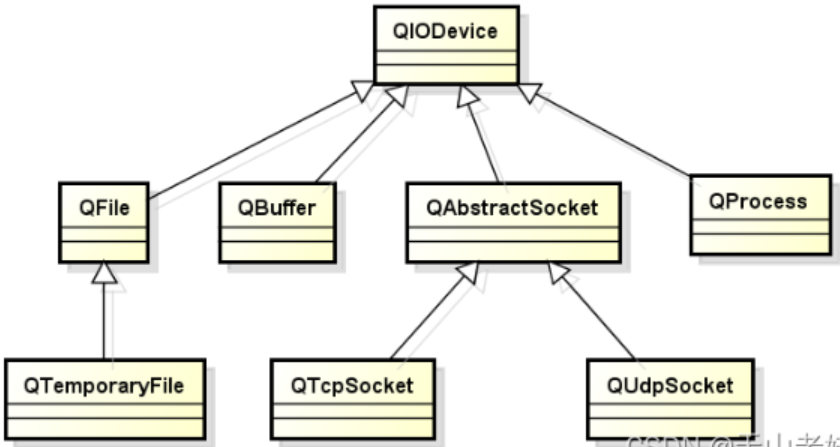

# 文件操作

QT中的IO操作通过统一的接口简化了文件与外部设备的操作方式

QT中文件被当作一种特殊的外部设备，文件操作与外部设备操作相同。


## IO操作的主要函数接口

打开设备：bool open(OpenMode mode)

读取数据：QByteArray read(qint64 maxSize)

写入数据：qint64 write(const QByteArray & byteArray)

关闭设备：void close()

IO操作的本质是连续存储空间的数据读写


## IO设备的类型

顺序存取设备：只能从头开始顺序读写数据，不能指定数据的读写位置

随机存取设备：可以定位到任意位置进行数据的读写

QT中IO设备的继承类图：

 


## 文件操作实例

QFile是QT中用于文件操作的类，QFile对象对应实际的文件。

```cpp
void write(QString f)
{
    QFile file(f);
 
    if( file.open(QIODevice::WriteOnly | QIODevice::Text) )
    {
        file.write("D.T.Software\n");
        file.write("Delphi Tang\n");
        file.close();
    }
}
 
void read(QString f)
{
    QFile file(f);
 
    if( file.open(QIODevice::ReadOnly | QIODevice::Text) )
    {
        QByteArray ba = file.readLine();
        QString s(ba);
        qDebug() << s;
        file.close();
    }
}
```

QFileInfo类用于读取文件的属性信息

```cpp
    QFile file(f);
    QFileInfo info(file);

    qDebug() << info.exists();
    qDebug() << info.isFile();
    qDebug() << info.isReadable();
    qDebug() << info.isWritable();
    qDebug() << info.birthTime();
    qDebug() << info.lastRead();
    qDebug() << info.lastModified();
    qDebug() << info.path();
    qDebug() << info.fileName();
    qDebug() << info.suffix();
    qDebug() << info.size();
```

### QTemporaryFile

QTemporaryFile是QT中的临时文件操作类，用来安全创建全局唯一的临时文件，`QTemporaryFile对象销毁时对应的临时文件将被删除`，临时文件的打开方式为QIODevice::ReadWrite,临时文件常用于`大数据传递或者进程间通信`场合。

```c++
QTemporaryFile tempFile;
 
if( tempFile.open() )
{
    tempFile.write("D.T.Software");
    tempFile.close();
}
```


------

# 文本流与数据流

QT中将文件分为文本文件和数据文件，文本文件内容是可读的文本字符，数据文件的内容是二进制数据。

QFile直接支持文本文件和数据文件的操作，主要函数接口如下：

```cpp
qint64 read( char * data, qint64 maxSize)
QByteArray read( qint64 maxSize)
qint64 write(const char * data, qint64 maxSize)
qint64 write(const QByteArray & byteArray)
```

为了简化文本文件和数据文件的读写操作，QT提供了QTextStream和QDataStream辅助类。QTextStream可将写入的数据全部转换为可读文本，QDataStream可将写入的数据根据类型转换为二进制数据。


## QTextStream使用方法

```cpp
void textStream(QString f){
    QFile file(f);

    if(file.open(QIODevice::WriteOnly | QIODevice::Text)){
        QTextStream ts_Out(&file);
        ts_Out << QString("D.T.Software") << Qt::endl;
        ts_Out << QString("Result: ") << Qt::endl;
        ts_Out << 5 << '*' << 6 << '=' << 5 * 6 << Qt::endl;
        file.close();
    }

    if(file.open(QIODevice::ReadOnly | QIODevice::Text)){
        QTextStream ts_In(&file);
        while(!ts_In.atEnd()){
            QString line = ts_In.readLine();
            qDebug() << line;
        }
        file.close();
    }
}
```


## QDataStream使用方法

```c++
void dataStream(QString f){
    QFile file(f);

    if(file.open(QIODevice::WriteOnly)){
        QDataStream ds_Out(&file);
        ds_Out.setVersion(QDataStream::Qt_6_8);
        ds_Out << QString("D.T.Software");
        ds_Out << QString("Result: ");
        ds_Out << 3.14;
        file.close();
    }

    if(file.open(QIODevice::ReadOnly)){
        QDataStream ds_In(&file);
        ds_In.setVersion(QDataStream::Qt_6_8);
        QString dt = "";
        QString result = "";
        double value = 0;

        ds_In >> dt;
        ds_In >> result;
        ds_In >> value;

        file.close();
        qDebug() << dt;
        qDebug() << result;
        qDebug() << value;
    }
}
```

QDataStream在不同的QT版本中数据流文件格式可能是不同的，如果数据流文件需要在不同版本的QT程序间传递时需要考虑版本问题。

```cpp
void setVersion(int v)
int version() const
```


------

# QBuffer缓冲区

QT中预定义了缓冲区的类QBuffer，可以将缓冲区看成一种特殊的IO设备，文件流辅助类可以直接用于操作缓冲区。QBuffer缓冲区写入和读取的数据必须是同一种数据类型，不能混合多种数据类型。

**QBuffer的使用场合：**

- 线程间不同类型的数据传递

- 缓存外部设备中的数据返回

- 数据读取速度小于写入速度


**QBuffer使用方法如下：**

```cpp
    QByteArray array;
    QBuffer buffer(&array);
    if(buffer.open(QIODevice::WriteOnly))
    {
        QDataStream out(&buffer);
        out << QString("3.1234");
        out << QString("scorpio");
        out << QString("1234");
        buffer.close();
    }
 
    if(buffer.open(QIODevice::ReadOnly))
    {
        QDataStream in(&buffer);
        QString name;
        QString a;
        QString b;
        in >> a;
        in >> name;
        in >> b;
        buffer.close();
 
        qDebug() << name;
        qDebug() << a;
        qDebug() << b;
    }
```

可以将不同类型的多个数据存储在QBuffer对象中，传递数据时只需要传递一个QBuffer对象，简化了数据的传递。


------

# 目录操作

## QDir

QT中提供了目录操作类QDir，QDir功能如下：

- 目录分隔符统一使用’/’

- 能够对目录进行任意操作（创建、删除、重命名）

- 能够获取指定目录中的所有条目（文件和文件夹）

- 能够使用过滤字符串获取指定条目

- 能够获取系统中的所有根目录


**QDir使用方法如下：**

```cpp
    QDir dir;
    QString path("/temp/");
 
    if(!dir.exists())
    {
        dir.mkdir(path);
    }
    else
    {
        dir.cd(path);
        QStringList list = dir.entryList();
        for(int i = 0; i < list.count(); i++)
        {
            qDebug() << list[i];
        }
    }
```

**计算文件大小**

```cpp
unsigned int FileSize(QString path)
{
    QFileInfo info(path);
    unsigned int ret = 0;
    if(info.isFile())
    {
        ret = info.size();
    }
    else if(info.isDir())
    {
        QDir dir(path);
        QFileInfoList list = dir.entryInfoList();
        for(int i = 0; i < list.count(); i++)
        {
            if((list[i].fileName() != ".") && (list[i].fileName() != ".."))
            {
                ret += FileSize(list[i].absoluteFilePath());
            }
        }
    }
    return ret;
}
```


## QFileSystemWatcher

QT中预定义了用于监控文件和目录变化的类QFileSystemWatcher，QFileSystemWatcher主要功能如下：

- 能够监控特定目录和文件的状态

- 能够同时对多个文件和目录进行监控

- 当目录或文件发生改变时触发信号

- 通过信号与槽的机制捕捉信号并做出响应


通常要使用QFileSystemWatcher需要自定义文件监视类。


Watcher.h

```cpp
#ifndef WATCHER_H
#define WATCHER_H

#include <QObject>
#include <QFileSystemWatcher>

class Watcher : public QObject
{
    Q_OBJECT

private:
    QFileSystemWatcher m_watcher;

private slots:
    void statusChanged(const QString &path);
public:
    explicit Watcher(QObject *parent = nullptr);
    void addPath(QString path);
};

#endif // WATCHER_H
```

Watcher.cpp

```cpp
#include "Watcher.h"
#include <QDebug>

Watcher::Watcher(QObject *parent)
    : QObject{parent}{

    connect(&m_watcher, &QFileSystemWatcher::fileChanged, this, &Watcher::statusChanged);
    connect(&m_watcher, &QFileSystemWatcher::directoryChanged, this, &Watcher::statusChanged);
}

void Watcher::statusChanged(const QString &path){
    qDebug() << path << "is changed.";
}

void Watcher::addPath(QString path){
    m_watcher.addPath(path);
}
```

main.cpp

```cpp
#include <QApplication>
#include <QString>
#include "Watcher.h"

int main(int argc, char *argv[])
{
    QApplication a(argc, argv);
    Watcher watcher;
    QString dirPath("C:/Users/Administrator/Desktop/qt");
    QString filePath("C:/Users/Administrator/Desktop/qt/file_watcher.txt");
    watcher.addPath(dirPath);
    watcher.addPath(filePath);
    return a.exec();
}
```

