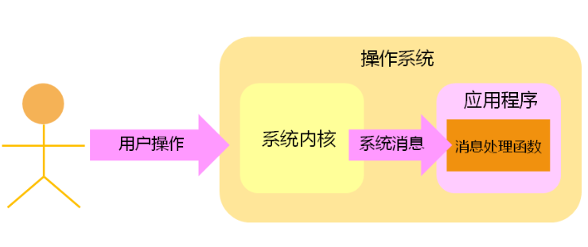
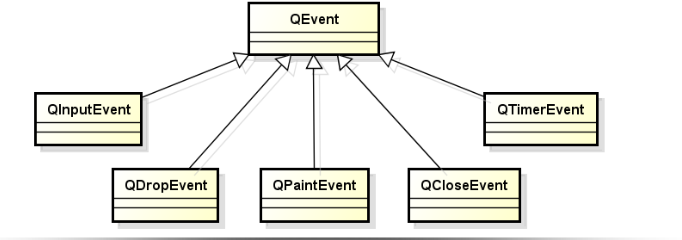
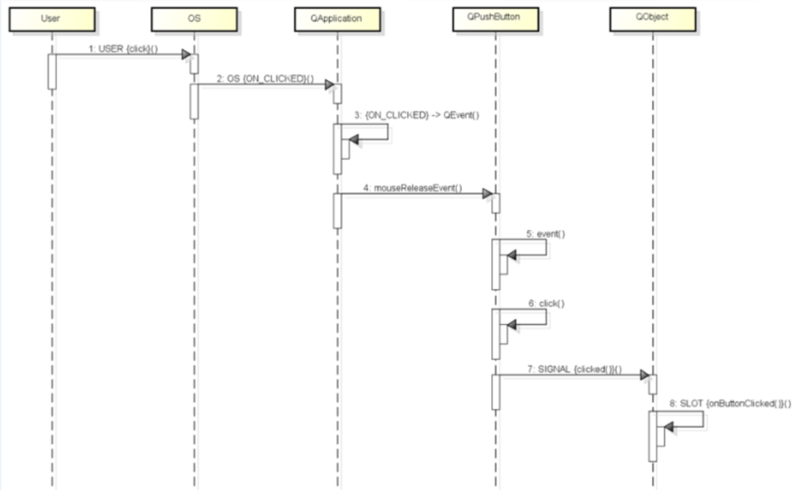
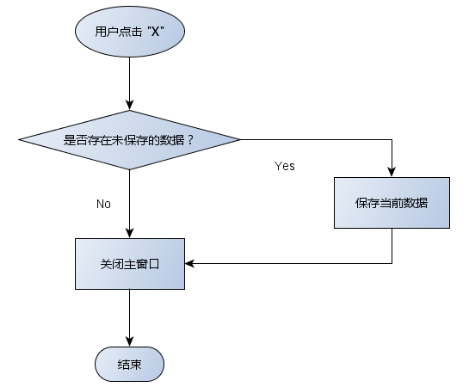
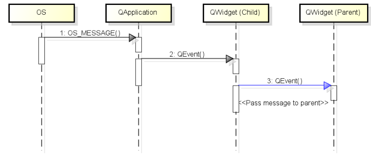
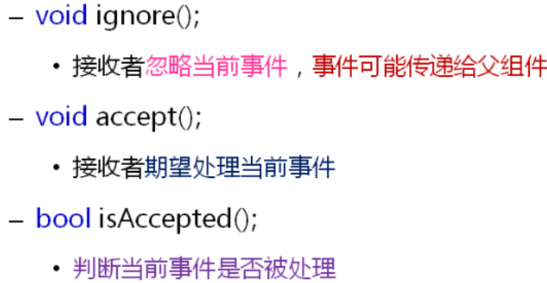
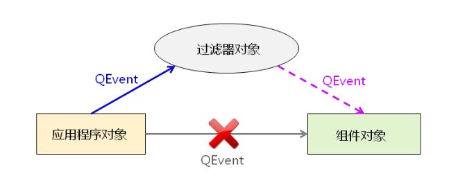
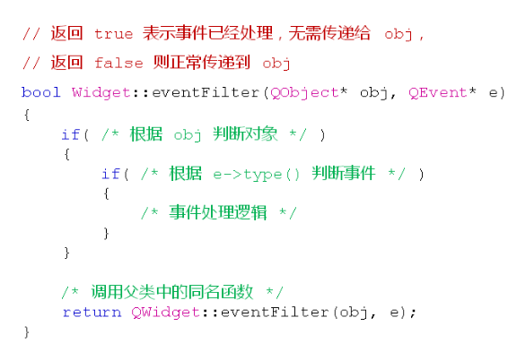
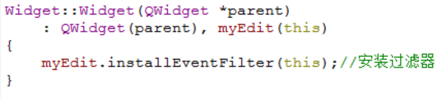

# Qt的事件处理

**图形界面应用程序的消息处理模型**

 


**Qt的事件处理**

Qt平台将系统产生的消息转换为Qt事件（每一个系统消息对象Qt平台的一个事件）

- Qt事件是一个QEvent的对象

- Qt事件用于描述程序内部或者外部发生的动作

- `任意的QObject对象`都具备事件处理的能力

 


**GUI应用程序的事件处理方式**

1. Qt事件产生后立即被分发到QWidget对象

2. QWidget中的event（QEvent*）进行事件处理

3. event()根据事件类型调用不同的事件处理函数

4. 在事件处理函数中发送Qt中预定义的信号

5. 调用信号关联的槽函数


**情景分析：按钮点击**



1. 接收到鼠标事件（代表一个系统消息）

2. 调用event(QEvent*)成员函数

3. 调用MouseReleaseEvent(QMouseEvent*)成员函数

4. 调用clicked()成员函数

5. 触发信号SIGNAL(clicked())


## 事件（QEvent）和信号（SIGNAL）的不同

- 事件由QObject对象进行处理

- 信号由QObject对象触发

- 改写事件处理函数可能导致程序行为发生改变

- 信号是否存在对应的槽函数不会改变程序的行为

- 一般而言，信号在具体的事件处理函数中产生


------

# 文本编辑器的关闭操作

 

**重写窗口关闭处理事件**

```cpp
//MainWindowSlots.cpp
void MainWindow::closeEvent(QCloseEvent *e){
    preEditorChanged();
    if(!m_isTextChanged){
        QMainWindow::closeEvent(e);
    }else{
        e->ignore();
    }
}
```


# Qt中事件处理的顺序

**事件传递的过程**

- 事件被组件对象处理后可能传递到其父组件对象

 

- QEvent中的关键成员函数

 


**实验**：

**MyEdit.h**

```cpp
#ifndef MYEDIT_H
#define MYEDIT_H
 
#include <QLineEdit>
 
class MyEdit : public QLineEdit
{
    Q_OBJECT
public:
    bool event(QEvent* e);
    void keyPressEvent(QKeyEvent* e);
    explicit MyEdit(QWidget *parent = 0);
};

#endif // MYEDIT_H
```

**MyEdit.cpp**

```cpp
#include "MyEdit.h"
#include <QDebug>
#include <QEvent>
#include <QKeyEvent>
MyEdit::MyEdit(QWidget  *parent) :QLineEdit(parent){}
 
bool MyEdit::event(QEvent* e)
{
    if(e->type()==QEvent::KeyPress)
    {
        qDebug() << "MyEdit::event";
    }
 
    return QLineEdit::event(e);
}
void MyEdit::keyPressEvent(QKeyEvent* e)
{
    qDebug() << "MyEdit::keyPressEvent";
    QLineEdit::keyPressEvent(e);
 
    //e->ignore();没有这句时只打印MyEdit::event和MyEdit::keyPressEvent，有这句时
    //打印 MyEdit::event和MyEdit::keyPressEvent、Widget::event和 Widget::keyPressEvent 说明可能传给父对象处理  
}
```

**Widget.h**

```cpp
#ifndef WIDGET_H
#define WIDGET_H

#include <QtGui/QWidget>
#include "MyEdit.h"
 
class Widget : public QWidget
{
    Q_OBJECT
    MyEdit myEdit;
 
public:
    bool event(QEvent* e);
    void keyPressEvent(QKeyEvent* e);
    Widget(QWidget *parent = 0);
    ~Widget();
};
 
#endif // WIDGET_H
```

**Widget.cpp**

```cpp
#include "Widget.h"
#include <QEvent>
#include <QDebug>
 
Widget::Widget(QWidget *parent): QWidget(parent), myEdit(this){}
 
Widget::~Widget(){}
bool Widget::event(QEvent* e)
{
    if(e->type()==QEvent::KeyPress)
    {
        qDebug() << "Widget::event";
    }
    return QWidget::event(e);
}
 
void Widget::keyPressEvent(QKeyEvent* e)
{
    qDebug() << "Widget::keyPressEvent";                              
    QWidget::keyPressEvent(e);
}
```


# Qt事件的过滤器

**Qt中的事件过滤器**

- 事件过滤器可以对其它组件接收到的事件进行监控

- 任意的QObject对象都可以作为事件过滤器使用

- 事件过滤器对象需要重写evenFilter()函数


**组件通过installEventFilter()函数安装事件过滤器**

- 事件过滤器在组件之前接收到事件

- 事件过滤器能够决定是否将事件转发到组件对象

 

**事件过滤器的典型实现**

 

**重写事件过滤器函数**

```cpp
bool Widget::eventFilter(QObject* obj, QEvent* e){
    if((obj != &myEdit) || (e->type() != QEvent::KeyPress)){
        return QWidget::eventFilter(obj, e);
    }

    auto keyEvent = static_cast<QKeyEvent*>(e);
    int key = keyEvent->key();
    if(key >= Qt::Key_0 && key <= Qt::Key_9){
        qDebug() << "Widget::eventFilter - Digit key pressed:" << key;
        return false;
    }
    if (key == Qt::Key_Backspace || key == Qt::Key_Delete) {
        return false;
    }

    return true;
}
```

**安装过滤器：**

 


**小结**

- Qt应用程序有严格的事件处理顺序

- Qt事件在处理后可能传递给父组件对象

- 组件通过installEventFilter()函数安装事件过滤器

- 事件过滤器可以对其它组件接收到的事件进行监控

- 事件过滤器能够决定是否将事件转发到组件对象