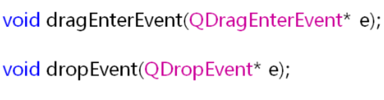
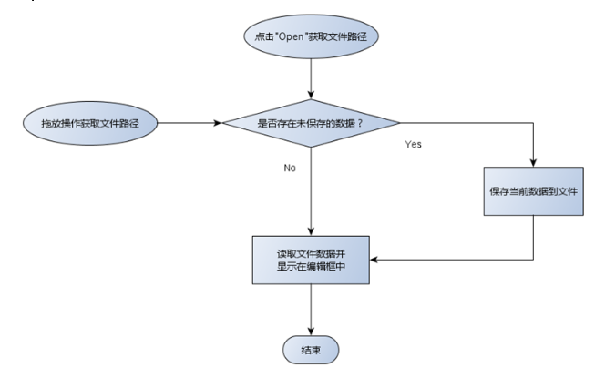

# 拖放事件

**Qt中的拖放事件**

- 拖放一个文件进入窗口将触发拖放事件

- 每一个QWidget对象都能处理拖放事件


**拖放事件的函数**

 


**拖放事件中的QMimeData**

- QMimeData是Qt中的多媒体数据类

- 拖放事件通过QMimeData对象传递数据

- QMimeData支持多种不同的多媒体数据类型


**常用的MIME类型数据处理函数**

 


**自定义拖放事件的步骤**

1. 对接收拖放事件的对象调用setAcceptDrops成员函数

2. 重写dragEnterEvent函数并判断MIME类型

   A、期待类型：e->acceptProposedAction()

   B、其它数据：e->ignore()

3. 重写dragEvent()函数并判断MIME类型

   A、期待类型：从事件对象中获取MIME数据并处理

   B、其它数据：e->ignore()


**拖放事件初探**

```cpp
#include "Widget.h"
#include <QDragEnterEvent>
#include <QDropEvent>
#include <QMimeData>
#include <QList>
#include <QDebug>
#include <QUrl>
 
Widget::Widget(QWidget *parent)
    : QWidget(parent)
{
    setAcceptDrops(true);//1.在接收拖放事件的对象里调用setAcceptDrops(true)
}
 
void Widget::dragEnterEvent(QDragEnterEvent *e)//2.重写void dragEnterEvent(QDragEnterEvent *e)
{
    if(e->mimeData()->hasUrls())//A、期待类型：e->acceptProposedAction()
    {
        e->acceptProposedAction();
    }
    else//B、其它数据：e->ignore()
    {
        e->ignore();
    }
}
void Widget::dropEvent(QDropEvent* e)//3.重写void dropEvent(QDropEvent* p)
{
    if(e->mimeData()->hasUrls())//A、期待类型：从事件对象中获取MIME数据并处理
    {
        QList<QUrl> list = e->mimeData()->urls();
 
        for(int i = 0; i<list.count(); i++)
        {
            qDebug() << list[i].toLocalFile();//打印路径出来
        }
    }
    else//B、其它数据：e->ignore()
    {
        e->ignore();
    }
}
 
Widget::~Widget(){}
```


# 文本编辑器中的拖放事件

 

**打开文件和拖放文件的异同**

1. 打开和拖放都需要先判断是否有数据未保存（所以调用相同的函数）

2. 保存好数据后打开操作是从弹出的一个文本对话框获取文件路径

3. 保存好数据后拖放事件是从MimeData里边获取文件路径

4. 最后通过路径来打开的方式都一样（所以调用相同的函数），所以说区别就是在（2）、（3）


**文本编辑器拖放事件的解决方案**

1. 调用主窗口对象的setAcceptDrops成员函数

2. 重写dragEnterEvent函数并判断MIME类型

3. 重写dragEvent()函数并判断MIME类型后打开文件


**文件编辑器添加拖放功能**

在MainWindowSlots.cpp中添加槽函数dragEnterEvent(QDragEnterEvent* e)和dropEvent(QDropEvent* e)

```cpp
void MainWindow::dragEnterEvent(QDragEnterEvent* e){
    if(e->mimeData()->hasUrls()){
        e->acceptProposedAction();
    }else{
        e->ignore();
    }
}

void MainWindow::dropEvent(QDropEvent* e){
    if(e->mimeData()->hasUrls()){
        QList<QUrl> list = e->mimeData()->urls();
        QString path = list[0].toLocalFile();
        QFileInfo fi(path);

        if(fi.isFile()){
            preEditorChanged();

            if(!m_isTextChanged){
                openFileToEdit(path);
            }
            e->accept();
        }else{
            showErrorMessage("Canot open a folder");
            e->accept();
        }

    }else{
        e->ignore();
    }
}
```

将onFileOpen()里面的部分代码抽取出来封装成一个函数

```cpp
void MainWindow::openFileToEdit(QString path){
    if (!path.isEmpty()) {
        QFile file(path);
        if (file.open(QIODevice::ReadOnly | QIODevice::Text)) {
            mainEditor.setPlainText(QString(file.readAll()));
            file.close();
            m_filePath = path;
            m_isTextChanged = false;
            setWindowTitle("NotePad - [" + m_filePath + "]");
        } else {
            showErrorMessage(QString("Open file Error!\n\n") + "\"" + path + "\"");
        }
    }
}

void MainWindow::onFileOpen(){
    preEditorChanged();
    if(!m_isTextChanged){
        QString path = showFileDialog(QFileDialog::AcceptOpen, "open");
        openFileToEdit(path);
    }
}
```

将此行添加到MainWindow构造函数中或初始化mainEditor 的任何位置：

```cpp
mainEditor.setAcceptDrops(false);
```

>确保mainEditor不会干扰您的自定义拖放逻辑。但是，这也意味着mainEditor不会接受任何拖放事件（例如，在编辑器内拖动文本）。


**小结**

- QWidget对象都能处理拖放事件

- 自定义拖放事件的方法
  - 对接收拖放事件的对象调用setAcceptDrops成员函数
  - 重写dragEnterEvent函数并判断MIME类型
  - 重写dragEvent()函数并判断MIME类型