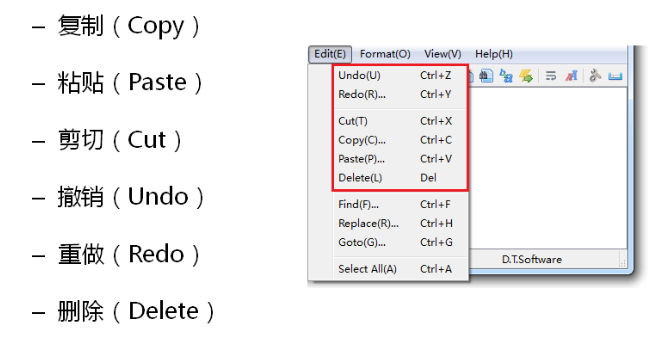
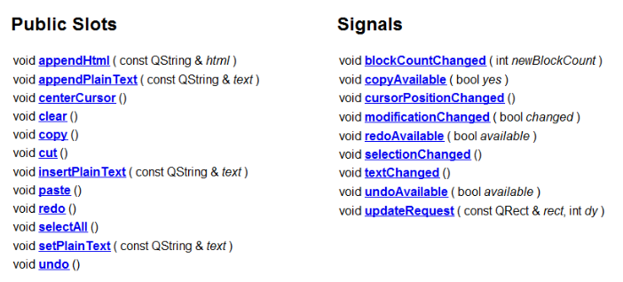
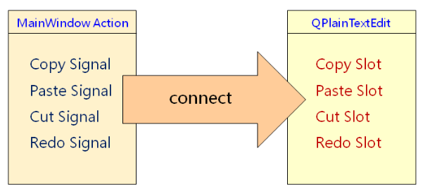
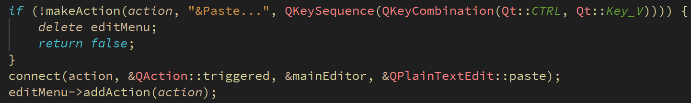
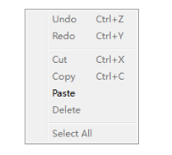
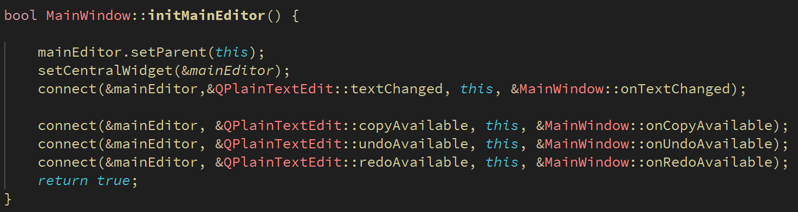
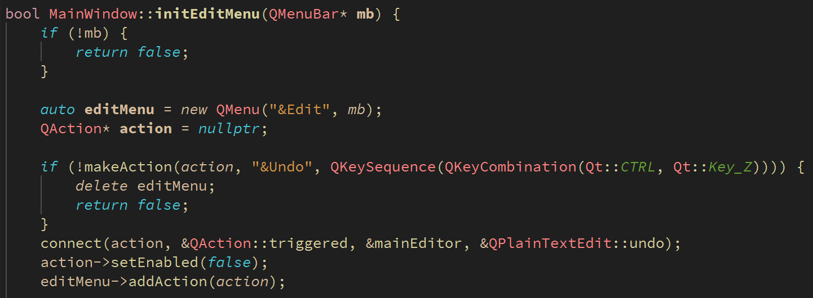
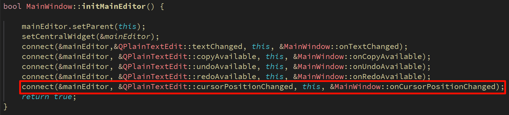

# 编辑交互功能

编辑器中常规的编辑交互功能

 

**QPlainTextEdit提供了丰富的交互接口**

 

**信号与槽的连接**

 

编辑器代码修改：将action触发的信号映射到QPlainTextEdit对象的槽函数




# 文本编辑器中的界面状态

**1、不是任何时候都可以复制、粘贴、撤销、重做（比如开始没有数据时）**

 

**2、QPlainTextEdit能够发送与界面状态相关的信号**

```cpp
void copyAvailable(bool yes)
void redoAvailable(bool available)
void undoAvailable(bool available)
void cursorPositionChanged()
```

**3、实现步骤**

- 连接界面状态信号到自定义的槽函数



- 通过文本信息找到对应的QAction对象

```cpp
QAction* MainWindow::findMenuBarAction(QString text){
    for(const QObject* obj : menuBar()->children()){
        if(const auto menu = qobject_cast<const QMenu*>(obj)){

            const QList<QAction*> actions = menu->actions();
            for(const QAction* action : actions){
                if(action->text().startsWith(text, Qt::CaseInsensitive)){
                    return const_cast<QAction*>(action);
                }
            }
        }
    }
    return nullptr;
}

QAction* MainWindow::findToolBarAction(QString text){
    for(const QObject* obj : children()){
        if(const auto tb = qobject_cast<const QToolBar*>(obj)){

            const QList<QAction*> actions = tb->actions();
            for(const QAction* action : actions){
                if(action->toolTip().startsWith(text, Qt::CaseInsensitive)){
                    return const_cast<QAction*>(action);
                }
            }
        }
    }
    return nullptr;
}
```

- 通过信号标志设置QAction对象的界面状态

```cpp
void MainWindow::onCopyAvailable(bool available){
    QAction* action = findMenuBarAction("&Copy...");
    if(action){
        action->setEnabled(available);
    }
    action = findToolBarAction("Copy");
    if(action){
        action->setEnabled(available);
    }
    action = findMenuBarAction("Cu&t");
    if(action){
        action->setEnabled(available);
    }
    action = findToolBarAction("Cut");
    if(action){
        action->setEnabled(available);
    }
}

void MainWindow::onUndoAvailable(bool available){
    QAction* action = findMenuBarAction("&Undo");
    if(action){
        action->setEnabled(available);
    }
    action = findToolBarAction("Undo");
    if(action){
        action->setEnabled(available);
    }
}

void MainWindow::onRedoAvailable(bool available){
    QAction* action = findMenuBarAction("&Redo...");
    if(action){
        action->setEnabled(available);
    }
    action = findToolBarAction("Redo");
    if(action){
        action->setEnabled(available);
    }
}
```

- 其它修改的地方：将Copy、Cut、Redo、Undo等初始状态设置为false




**小结**

- QPlainTextEdit封装了常用的文本编辑功能

- 可以`将信号直接连接`到QPlainTextEdit的`公有槽`函数

- 界面状态是GUI开发的重点和难点

- Qt中组件的状态信号能够简化界面状态的维护

- 主窗口中的组件可以通过遍历的方法找回


------

# 光标位置设置

光标位置的计算思路

1. 文本框对象的内部包含了QTextCursor对象

2. 通过成员函数blockNumber()、olumnNumber()获取当前光标的字符位置




```cpp
void MainWindow::onCursorPositionChanged(){
    QTextCursor cursor = mainEditor.textCursor();
    int line = cursor.blockNumber();
    int colum = cursor.columnNumber();
    statusLbl.setText(QString("Ln: %1        Col: %2")
                          .arg(line+1)
                          .arg(colum+1));
}
```


**小结**

- QPlainTextEdit将数据和界面分开设计

- QTextDocument用于存储数据信息

- QTextCursor用于提供光标相关信息
