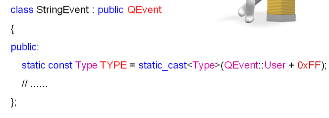

# 发送自定义事件

**在程序中发送事件**

- 堵塞型事件发送
  - 事件发送完后需要等待事件处理完成

- 非堵塞型事件发送
  - 事件发送后立即返回
  - 事件被发送到事件队列中等待处理


**QApplication类提供了支持事件发送的静态成员函数**

 


**注意事项**

- sendEvent中事件对象生命期由Qt程序管理
  - 同时支持栈事件对象和堆事件对象的发送

- postEvent中事件对象的生命周期由Qt平台管理
  - 只能发送堆事件对象
  - 事件被处理后由Qt平台销毁


**事件发送过程**

 

 


**两种方式比较**

```cpp
#include "Widget.h"
#include <QMouseEvent>
#include <QApplication>
#include <QDebug>
 
Widget::Widget(QWidget *parent)
    : QWidget(parent){
    m_pushButton.setParent(this);
    m_pushButton.setText("Test");
 
    connect(&m_pushButton, SIGNAL(clicked()), this, SLOT(onButtonClicked()));
}
 
void Widget::onButtonClicked(){
    qDebug() << "void Widget::onButtonClicked()";
    testSendEvent();
    // testPostEvent();
}
 
void Widget::testSendEvent(){
    //创建一个鼠标左键双击事件对象：
    //参数type：QEvent::MouseButtonPress, QEvent::MouseButtonRelease,QEvent::MouseButtonDblClick, or QEvent::MouseMove之一
    //参数position:鼠标指针相对于接收窗口的位置
    //参数button：左键、右键等发生的事件。如果是mouseMove事件，则为Qt::NoButton
    //参数buttons和modifiers:当事件发生时鼠标和键盘的状态位
    QMouseEvent dbcEvt(QEvent::MouseButtonDblClick, QPoint(0, 0),Qt::LeftButton,
                       Qt::NoButton,Qt::NoModifier);//dbcEvt:double clicked event
 
    qDebug() << "Before sendEvent()";
    QApplication::sendEvent(this, &dbcEvt);//相当于直接调用Widget::event();
    qDebug() << "After sendEvent";
}
 
void Widget::testPostEvent(){
    //postEvent必须发送一个堆对象
    QMouseEvent*  dbcEvt = new QMouseEvent(QEvent::MouseButtonDblClick, QPoint(0, 0),Qt::LeftButton, Qt::NoButton,Qt::NoModifier);//dbcEvt:double clicked event
 
    qDebug() << "Before postEvent()";
 
    //postEvent以后，事件对象的生命期由消息队列来自行负责管理
    QApplication::postEvent(this, dbcEvt);//立即返回
 
    qDebug() << "After postEvent";
}
 
bool Widget::event(QEvent *evt)
{
    if(evt->type() == QEvent::MouseButtonDblClick){
        qDebug() << "event(): " << evt;
    }
    return QWidget::event(evt);
}
 
Widget::~Widget(){}
```


# **文本编辑器中的事件发送**

- 菜单栏中删除功能的实现

1. 自定义事件对象KeyPress

2. 自定义事件对象KeyRelease

3. 发送事件KeyPress

4. 发送事件KeyReleas

 

**文本编辑器程序：**


**onFileDelete()和onFileExit()的实现**

```cpp
void MainWindow::onEditDelete(){
    QKeyEvent keyPress(QEvent::KeyPress, Qt::Key_Delete, Qt::NoModifier);
    QKeyEvent keyRelease(QEvent::KeyRelease, Qt::Key_Delete, Qt::NoModifier);

    QApplication::sendEvent(&mainEditor, &keyPress);
    QApplication::sendEvent(&mainEditor, &keyRelease);
}

void MainWindow::onEditExit(){
    close();
}
```


**小结**

- Qt程序中能够自主地发送系统预定义的事件（系统中存在的事件）
- QApplication类提供了支持事件发送的静态成员函数
- sendEvent发送事件后需要等待事件处理完成

- postEvent发送事件后立即返回


------

# 自定义事件对象

**Qt可以自定义新的事件类**

1. 自定义的事件类必须继承自QEvent

2. 自定义的事件类必须拥有全局唯一的Type值（event->type()可以获得事件的类型）

3. 程序中必须提供处理自定义事件的方法


**自定义事件类**

1. 将QEvent作为父类继承

2. 指定全局唯一的Type值

 


**Qt事件的Type值**

1. 每个事件类都拥有全局唯一的Type值(类似于唯一的ID号)

2. 自定义事件类的Type值也需要自定义

3. 自定义事件类使用QEvent::User之后的值作为Type值（因为之前的值都被Qt预定义的事件用了）

4. 程序中保证QEvent::User + VALUE 全局唯一即可


**处理自定义事件的方法（两种方式）**

- 将事件过滤器安装到目标对象
  - 在eventFilter()函数中编写自定义事件的处理逻辑

- 在目标对象的类中重写事件处理函数
  - 在event函数中编写自定义事件的处理逻辑


**自定义事件类的意义**

- 需要扩展一个已有组件类的功能

- 需要开发一个全新功能的组件类

- 需要向一个第三方的组件类发送消息


**自定义事件类StringEvent 的头文件**

```cpp
#ifndef _STRINGEVENT_H_
#define _STRINGEVENT_H_
 
#include <QEvent>
#include <QString>
 
//自定义事件类必须继承自QEvent
class StringEvent : public QEvent
{
    QString m_data;
public:
 
    //必须提供事件类的Type值
    static const Type TYPE = static_cast<Type>(QEvent::User + 0xFF);
 
    explicit StringEvent(QString data = "");
    QString data();
};
 
#endif // _STRINGEVENT_H_
```

**自定义事件类StringEvent的实现文件**

```cpp
#include "StringEvent.h"
 
StringEvent::StringEvent(QString data):QEvent(TYPE)
{
    m_data = data;
}
 
QString StringEvent::data()
{
    return m_data;
}
```

**Widget.h**

```cpp
#ifndef WIDGET_H
#define WIDGET_H
 
#include <QtGui/QWidget>
#include <QPushButton>
#include <QLineEdit>
 
class Widget : public QWidget
{
    Q_OBJECT
 
    QLineEdit myLineEdit;
    QPushButton myButton;
 
public:
    bool eventFilter(QObject *obj, QEvent *evt);
    Widget(QWidget *parent = 0);
    bool event(QEvent* e);
 
    ~Widget();
};
 
#endif // WIDGET_H
 
Widget.h
```

**Widget.cpp**

```cpp
#include "Widget.h"
#include "StringEvent.h"
#include <QApplication>
#include <QMouseEvent>
#include <qDebug>
 
Widget::Widget(QWidget *parent)
    : QWidget(parent),myLineEdit(this)
{
    myLineEdit.installEventFilter(this);//this 对象作为过滤器来检测myLineEdit对象收到的事件
}
 
//发送自定义事件对象（当鼠标双击窗口时）。
bool Widget::event(QEvent* evt){
    if(evt->type() == QMouseEvent::MouseButtonDblClick){
        qDebug() << "event: Before sentEvent";
        StringEvent se("SantaClaus"); 
        QApplication::sendEvent(&myLineEdit, &se);//将事件对象发送给编辑框
        qDebug() << "event: After sendEvent";
    }
    return QWidget::event(evt);
}
 
//自定义事件的处理，通过eventFilter编写自定义事件的处理逻辑
bool Widget::eventFilter(QObject *obj, QEvent *evt){
    if((obj == &myLineEdit) && (evt->type() == StringEvent::TYPE)){
        StringEvent* se = dynamic_cast<StringEvent*>(evt);
        myLineEdit.insert(se->data());
        qDebug() <<"Receive: " << se->data();
        return true;
    }
    return QWidget::eventFilter(obj, evt);
}
 
Widget::~Widget(){}
 
Widget.cpp
```

