# 创建查找对话框

**查找对话框是应用程序中的常用部件**

目标：开发一个可以在不同项目间复用的查找对话框


**查找对话框的需求分析**

- 可复用软件部件

- 查找文本框中指定字符串

- 能够指定查找方向

- 支持大小写敏感查找

- 附加：点击关闭按钮后隐藏

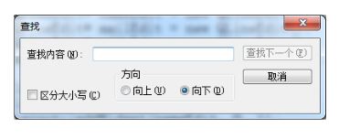 

**查找对话框的架构与设计**

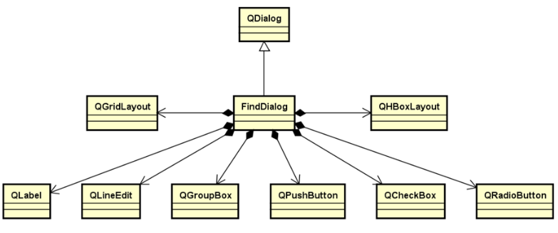 

**查找对话框的界面布局**

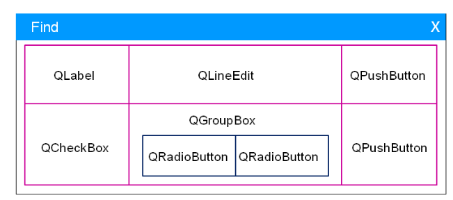 

**可复用查找对话框头文件**

```cpp
#ifndef FINDDIALOG_H
#define FINDDIALOG_H

#include <QDialog>
#include <QDialog>
#include <QPushButton>
#include <QLabel>
#include <QLineEdit>
#include <QRadioButton>
#include <QCheckBox>
#include <QHBoxLayout>
#include <QGroupBox>
#include <QGridLayout>


class FindDialog : public QDialog
{
    Q_OBJECT

protected:
    QGridLayout m_gLayout;
    QGroupBox m_gBox;
    QHBoxLayout m_hLayout;
    QLabel m_findLabel;
    QLineEdit m_findLineEdit;
    QPushButton m_findButton;
    QCheckBox m_checkBox;
    QRadioButton m_forwardButton;
    QRadioButton m_backwardButton;
    QPushButton m_cancleButton;

public:
    explicit FindDialog(QWidget *parent = nullptr);
    bool event(QEvent* e);
};

#endif // FINDDIALOG_H

```

**可复用查找对话框实现文件**

```cpp
#include "FindDialog.h"
#include <QEvent>

FindDialog::FindDialog(QWidget* parent)
    : QDialog(parent,Qt::WindowCloseButtonHint | Qt::Drawer){

    setWindowTitle("find");
    m_findLabel.setText("Find content: ");
    m_findButton.setEnabled(false);
    m_findButton.setText("Find next");
    m_checkBox.setText("Case sensitive");
    m_forwardButton.setText("up");
    m_backwardButton.setChecked(true);
    m_backwardButton.setText("down");
    m_cancleButton.setText("Cancel");
    m_gBox.setTitle("direction");


    m_hLayout.addWidget(&m_forwardButton);
    m_hLayout.addWidget(&m_backwardButton);
    m_gBox.setLayout(&m_hLayout);

    m_gLayout.setSpacing(10);
    m_gLayout.addWidget(&m_findLabel, 0, 0);
    m_gLayout.addWidget(&m_findLineEdit, 0, 1);
    m_gLayout.addWidget(&m_findButton, 0, 2);
    m_gLayout.addWidget(&m_checkBox, 1, 0);
    m_gLayout.addWidget(&m_gBox, 1, 1);
    m_gLayout.addWidget(&m_cancleButton, 1, 2);

    setLayout(&m_gLayout);
}

bool FindDialog::event(QEvent* e){
    if(e->type() == QEvent::Close){
        hide();
        return true;
    }
    return QDialog::event(e);
}
```

**文本编辑器其它修改的地方**

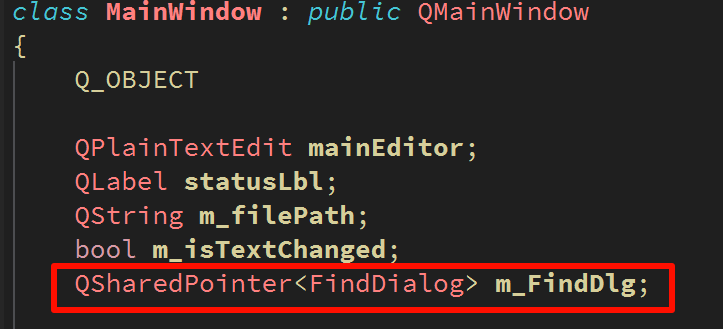 

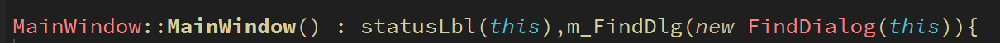 

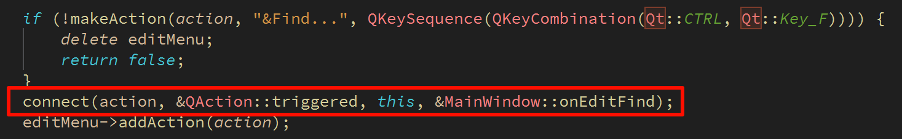 


**小结**

- 查找对话框可以用作一个`可复用的软件部件`进行开发

- 查找对话框`继承自QDialog`

- 查找对话框的界面通过`布局管理器相互嵌套`完成

- 查找对话框的设计与实现是GUI学习中的经典范例


------

# 查找对话框的功能实现

**文本查找功能的核心思想**

1. 获取当前光标的位置并作为起始点

2. 向前（向后）查找目标第一次出现的位置

3. 通过目标位置以及目标长度在文本框中进行标记


**QString提供了子串查找的相关函数**

- indexOf：从指定位置向后查找目标子串下标位置

- lastIndexOf:从指定位置向前查找目标子串下标位置


**QString类中查找函数所使用的下标位置**

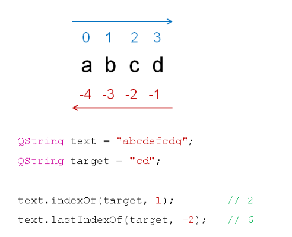 

**Qt中的光标信息类QTextCursor**

- 文本框中的光标是一个QTextCursor类的对象

- 所有与光标相关的信息都通过QTextCursor描述（如光标位置、文本选择等）

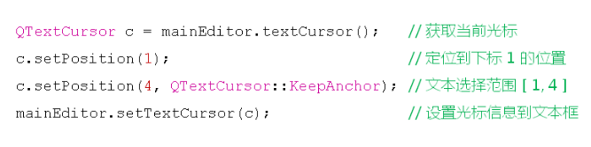 

**查找算法流程图**

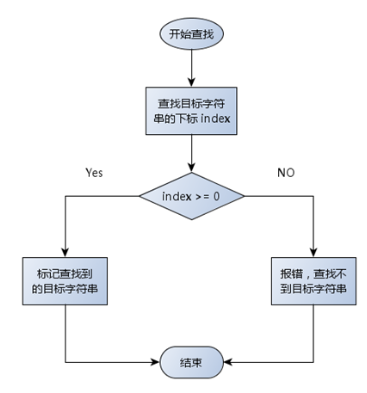 

**MainWindow和FindDialog之间的关系**

（<u>为了实现弱耦合，使FindDialog内部一个指针指向QPlainTextEdit即可</u>）

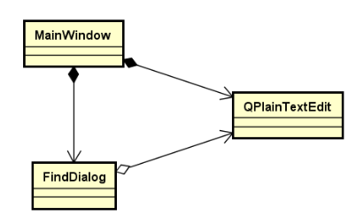 


## 实现的具体步骤：

1、为了简化构造函数，就把一些初始化的东西抽取出来封装到一个函数

FindDialog的组件初始化

```cpp
void FindDialog::initControl(){
    m_findLabel.setText("Find content: ");
    m_findButton.setText("Find next");
    m_checkBox.setText("Case sensitive");
    m_forwardButton.setText("up");
    m_backwardButton.setChecked(true);
    m_backwardButton.setText("down");
    m_cancleButton.setText("Cancel");
    m_gBox.setTitle("direction");

    m_hLayout.addWidget(&m_forwardButton);
    m_hLayout.addWidget(&m_backwardButton);
    m_gBox.setLayout(&m_hLayout);

    m_gLayout.setSpacing(10);
    m_gLayout.addWidget(&m_findLabel, 0, 0);
    m_gLayout.addWidget(&m_findLineEdit, 0, 1);
    m_gLayout.addWidget(&m_findButton, 0, 2);
    m_gLayout.addWidget(&m_checkBox, 1, 0);
    m_gLayout.addWidget(&m_gBox, 1, 1);
    m_gLayout.addWidget(&m_cancleButton, 1, 2);

    setLayout(&m_gLayout);
    setWindowTitle("find");
}
```

2、为了实现弱耦合，FindDialog里定义一个指向QPlainTextEdit的指针，通过构造函数传进来(并定义get和set函数来做相关操作)

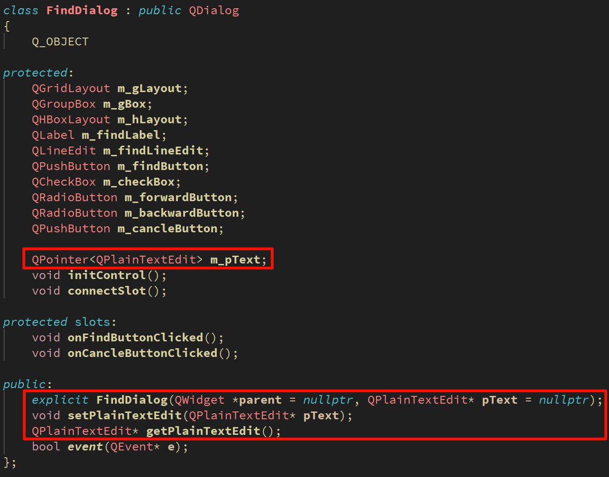

3、定义槽函数并在构造函数中连接信号与槽

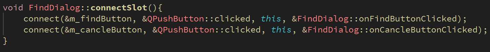

4、编写槽函数

```cpp
void FindDialog::onFindButtonClicked(){
    if(!m_pText) {
        return;
    }

    const QString target = m_findLineEdit.text().trimmed();
    if(target.isEmpty()){
        return;
    }

    const QString text = m_pText->toPlainText();
    QTextCursor cursor = m_pText->textCursor();
    const Qt::CaseSensitivity caseSensitivity = m_checkBox.isChecked() ? Qt::CaseSensitive : Qt::CaseInsensitive;
    int index = -1;

    if(m_backwardButton.isChecked()){
        index = text.indexOf(target, cursor.position(), caseSensitivity);
        if(index >= 0){
            cursor.setPosition(index);
            cursor.setPosition(index + target.length(), QTextCursor::KeepAnchor);
            m_pText->setTextCursor(cursor);
        }
    }else if(m_forwardButton.isChecked()){
        index = text.lastIndexOf(target, cursor.position() - text.length() -1, caseSensitivity);
        if(index >= 0){
            cursor.setPosition(index + target.length());
            cursor.setPosition(index, QTextCursor::KeepAnchor);
            m_pText->setTextCursor(cursor);
        }
    }

    if(index < 0){
        QMessageBox::information(this, tr("Find"), tr("Cannot find \"%1\"").arg(target),
                                 QMessageBox::Ok);
    }
}

void FindDialog::onCancleButtonClicked(){
    close();
}
```

5、记得调用FindDialog构造函数时传多一个参数

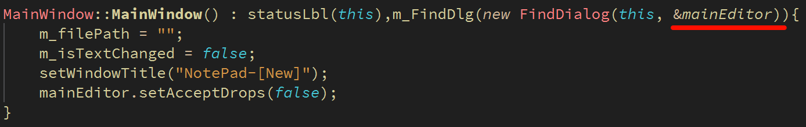


**小结**

- QString提供了不同的子串查找方式

- QTextCursor对象保存了文本框中光标的相关信息

- QString对象和QTextCursor对象协作实现查找功能

- 查找对话框和文本框的弱耦合关系满足了可复用的需求


------

# 替换对话框

**1、替换对话框的需求分析**

1. 可复用软件部件

2. 查找文本框中指定的字符

3. 替换单个指定的字符

4. 替换所有指定的字符


附加需求：点击关闭按钮后隐藏

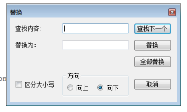 

**2、替换对话框的设计与实现（继承自FindDialog）**

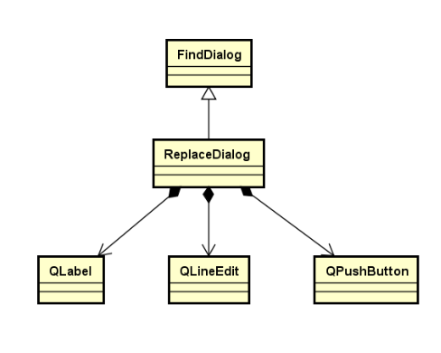 

**3、替换对话框的界面布局**

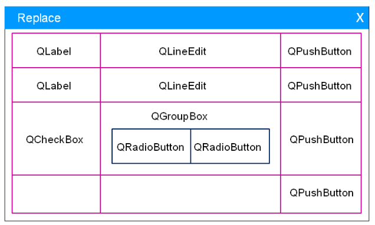 

  **4、替换单个目标算法流程**

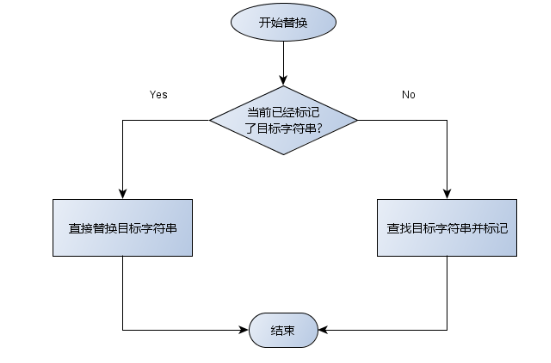 

**5、MainWindow和ReplaceDialog之间的关系图**

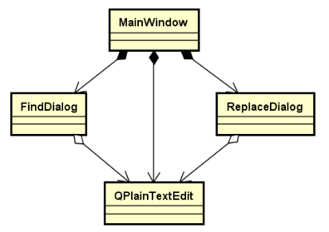 

 

**可复用替换对话框头文件**

```cpp
#ifndef REPLACDIALOG_H
#define REPLACDIALOG_H

#include "FindDialog.h"

class ReplacDialog : public FindDialog
{
    Q_OBJECT

    QPushButton m_replaceButton;
    QPushButton m_replaceAllButton;
    QLabel m_replaceAsLabel;
    QLineEdit m_replaceEdit;

    void initControl();
    void connectSlot();

protected slots:
    void onReplaceButtonClicked();
    void onReplaceAllButtonClicked();

public:
    explicit ReplacDialog(QWidget* parent = nullptr, QPlainTextEdit* pText = nullptr);
};

#endif // REPLACDIALOG_H
```

**可复用替换对话框实现文件**

```cpp
#include "ReplacDialog.h"

ReplacDialog::ReplacDialog(QWidget* parent, QPlainTextEdit* pText)
    : FindDialog(parent, pText){

    initControl();
    connectSlot();
    setWindowTitle("Replace");

}

void ReplacDialog::initControl(){
    m_replaceButton.setText("Replace");
    m_replaceAllButton.setText("Replace All");
    m_replaceAsLabel.setText("Replace with: ");

    m_gLayout.removeWidget(&m_checkBox);
    m_gLayout.removeWidget(&m_gBox);
    m_gLayout.removeWidget(&m_cancleButton);

    m_gLayout.addWidget(&m_replaceAsLabel, 1, 0);
    m_gLayout.addWidget(&m_replaceEdit, 1, 1);
    m_gLayout.addWidget(&m_replaceButton, 1, 2);
    m_gLayout.addWidget(&m_replaceAllButton, 2, 2);
    m_gLayout.addWidget(&m_checkBox, 3, 0);
    m_gLayout.addWidget(&m_gBox, 3, 1);
    m_gLayout.addWidget(&m_cancleButton, 3, 2);

    setLayout(&m_gLayout);
}

void ReplacDialog::connectSlot(){
    connect(&m_replaceButton, &QPushButton::clicked, this, &ReplacDialog::onReplaceButtonClicked);
    connect(&m_replaceAllButton, &QPushButton::clicked, this, &ReplacDialog::onReplaceAllButtonClicked);
}

void ReplacDialog::onReplaceButtonClicked(){
    QString target = m_findLineEdit.text().trimmed();
    QString  replacement = m_replaceEdit.text().trimmed();

    if(!target.isEmpty() && !replacement.isEmpty() && !m_plainTextEdit.isNull()){
        QTextCursor cursor = m_plainTextEdit->textCursor();
        if(cursor.hasSelection()){
            QString selectedText = cursor.selectedText();
            if(selectedText == target){
                cursor.insertText(replacement);
            }
        }
        onFindButtonClicked();
    }
}

void ReplacDialog::onReplaceAllButtonClicked(){

    QString target = m_findLineEdit.text().trimmed();
    QString replacement = m_replaceEdit.text().trimmed();

    if (!target.isEmpty() && !replacement.isEmpty() && !m_plainTextEdit.isNull()) {
        QTextDocument* doc = m_plainTextEdit->document();

        QString text = doc->toPlainText();
        Qt::CaseSensitivity caseSensitivity = m_checkBox.isChecked() ? Qt::CaseSensitive : Qt::CaseInsensitive;
        QString newText = text.replace(target, replacement, caseSensitivity);

        // Update the document and refresh UI
        doc->setPlainText(newText);
        m_plainTextEdit->viewport()->update();
    }
}

```

**文本编辑器其它修改的地方：**

头文件：

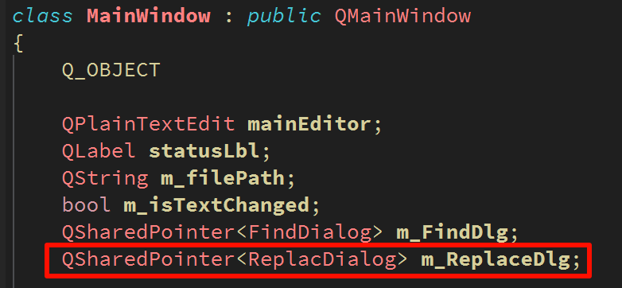 

 UI文件：

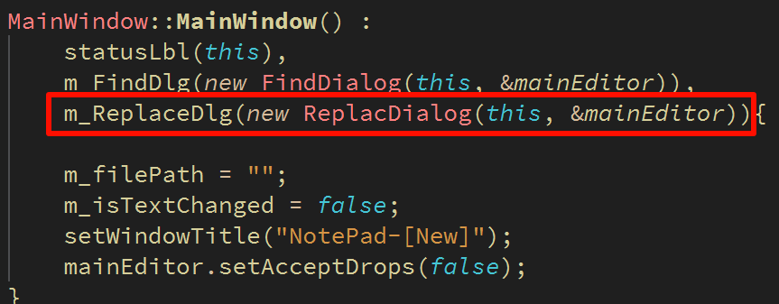 

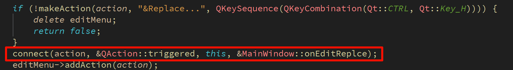 

Slots.cpp:

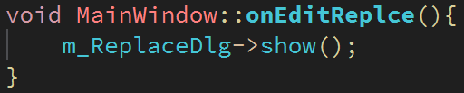 


**小结**

- 替换对话框的功能`涵盖了查找对话框的功能`

- 替换对话框可以`继承自查找对话框`

- 替换功能的实现是基于查找算法完成的

- 替换对话框是一个`可复用`的软件部件
