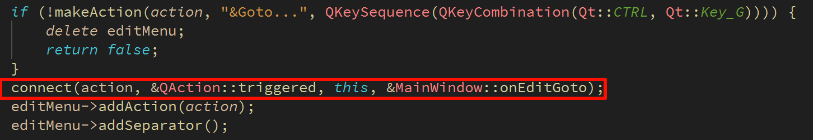
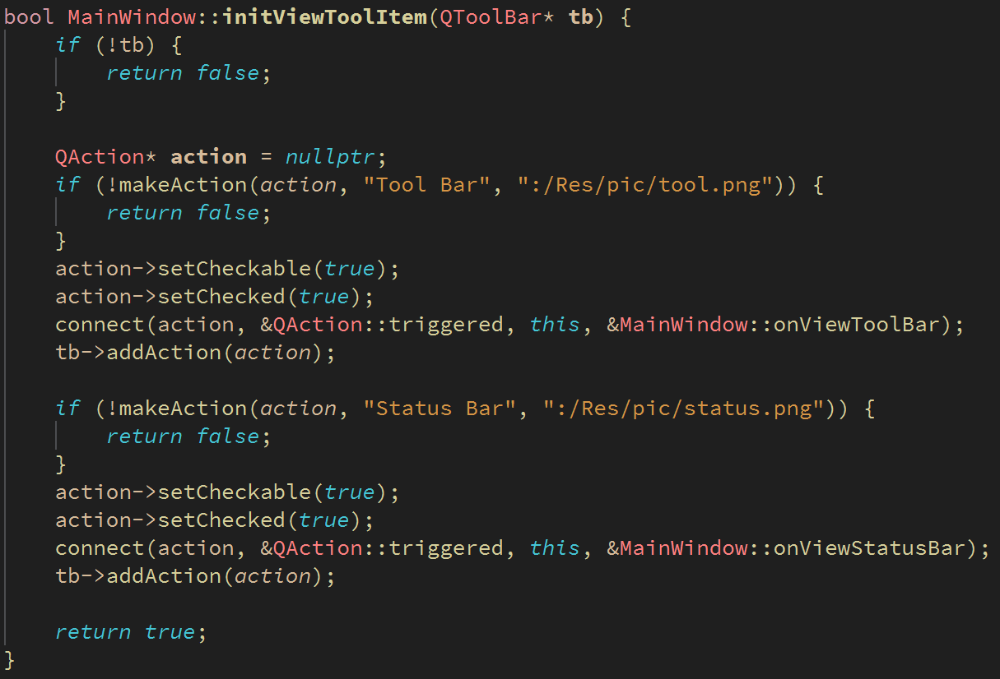

# 跳转指定行

**1、用户需求**

1. 提示输入对话框

2. 用户可输入目标行号

3. 确定后光标跳转到指定行


**2、行间跳转算法设计**

1. 通过输入对话框获取目标行号

2. 查找换行符的位置计算目标行的第一个字符字符下标

3. 通过QCursor定位到目标行

 

**跳转算法的实现**

```cpp
void MainWindow::onEditGoto(){
    int maxLines = mainEditor.document()->lineCount();
    bool ok = false;
    int lineNumber =  QInputDialog::getInt(this, tr("Go to Line"),
                                          tr("Line number (1 - %1):").arg(maxLines),
                                          1, 1, maxLines, 1, &ok);

    if(ok){
        QString text = mainEditor.toPlainText();
        QTextCursor cursor = mainEditor.textCursor();

        int pos = 0;
        int next = -1;
        for(int i = 0; i < lineNumber; ++i){
            pos = next + 1;
            next = text.indexOf('\n', pos);
        }
        cursor.setPosition(pos);
        mainEditor.setTextCursor(cursor);
    }
}
```


------

# 设置工具栏和状态栏的可见性

**1、实现思路**

通过setVisible()设置可见性

更新界面上QAction对象的状态

- 菜单中的QAction是否可以勾选

- 工具栏中的QAction对象是否按下

 

 

**工具栏与状态栏的可见性**

```cpp
void MainWindow::onViewStatusBar(){
    QStatusBar* status = statusBar();
    if(!status){
        return;
    }
    bool newVisible = !status->isVisible();
    status->setVisible(newVisible);
    updateActionState("Status Bar",newVisible);
}
void MainWindow::onViewToolBar(){
    auto toolbars = findChildren<QToolBar*>();
    if(toolbars.isEmpty()){
        return;
    }
    QToolBar* toolbar = toolbars.first();
    bool newVisible = !toolbar->isVisible();
    toolbar->setVisible(newVisible);
    updateActionState("Tool Bar", newVisible);
}
void MainWindow::updateActionState(const QString& actionText, bool checked){
    QAction* menuAction = findMenuBarAction(actionText);
    if(menuAction){
        menuAction->setChecked(checked);
    }

    QAction* toolAction = findToolBarAction(actionText);
    if(toolAction){
        toolAction->setChecked(checked);
    }
}
```


**小结**

- 通过输入对话框获取目标行号并实现行间跳转

- 根据用户操作状态控制状态栏和工具栏的可见性

- 菜单和工具栏中的QAction对象反映可见性状态