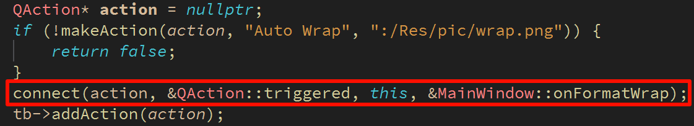

# 跳转指定行

**1、用户需求**

1. 提示输入对话框

2. 用户可输入目标行号

3. 确定后光标跳转到指定行


**2、行间跳转算法设计**

1. 通过输入对话框获取目标行号

2. 查找换行符的位置计算目标行的第一个字符字符下标

3. 通过QCursor定位到目标行

 

**跳转算法的实现**

```cpp
void MainWindow::onEditGoto(){
    int maxLines = mainEditor.document()->lineCount();
    bool ok = false;
    int lineNumber =  QInputDialog::getInt(this, tr("Go to Line"),
                                          tr("Line number (1 - %1):").arg(maxLines),
                                          1, 1, maxLines, 1, &ok);

    if(ok){
        QString text = mainEditor.toPlainText();
        QTextCursor cursor = mainEditor.textCursor();

        int pos = 0;
        int next = -1;
        for(int i = 0; i < lineNumber; ++i){
            pos = next + 1;
            next = text.indexOf('\n', pos);
        }
        cursor.setPosition(pos);
        mainEditor.setTextCursor(cursor);
    }
}
```


------

# 设置工具栏和状态栏的可见性

**1、实现思路**

通过setVisible()设置可见性

更新界面上QAction对象的状态

- 菜单中的QAction是否可以勾选

- 工具栏中的QAction对象是否按下

 

 

**工具栏与状态栏的可见性**

```cpp
void MainWindow::onViewStatusBar(){
    QStatusBar* status = statusBar();
    if(!status){
        return;
    }
    bool newVisible = !status->isVisible();
    status->setVisible(newVisible);
    updateActionState("Status Bar",newVisible);
}
void MainWindow::onViewToolBar(){
    auto toolbars = findChildren<QToolBar*>();
    if(toolbars.isEmpty()){
        return;
    }
    QToolBar* toolbar = toolbars.first();
    bool newVisible = !toolbar->isVisible();
    toolbar->setVisible(newVisible);
    updateActionState("Tool Bar", newVisible);
}
void MainWindow::updateActionState(const QString& actionText, bool checked){
    QAction* menuAction = findMenuBarAction(actionText);
    if(menuAction){
        menuAction->setChecked(checked);
    }

    QAction* toolAction = findToolBarAction(actionText);
    if(toolAction){
        toolAction->setChecked(checked);
    }
}
```


**小结**

- 通过输入对话框获取目标行号并实现行间跳转

- 根据用户操作状态控制状态栏和工具栏的可见性

- 菜单和工具栏中的QAction对象反映可见性状态


------

# 关于对话框（About）

1、标准的桌面软件都有一个关于对话框

2、关于对话框用于标识软件的自身信息

- 软件的Logo、项目名、版本号

- 开发者信息

- 版权信息

- 联系方式等


3、经典设计方案

 

**关于对话框头文件**

```cpp
#ifndef ABOUTDIALOG_H
#define ABOUTDIALOG_H

#include <QDialog>
#include <QLabel>
#include <QPushButton>
#include <QPlainTextEdit>

class AboutDialog : public QDialog
{
    Q_OBJECT
protected:
    QLabel m_label;
    QPushButton m_closeButton;
    QPlainTextEdit m_plainTextEdit;

public:
    explicit AboutDialog(QWidget* parent = nullptr);
};

#endif // ABOUTDIALOG_H
```

**关于对话框实现文件**

```cpp
#include "AboutDialog.h"
#include <QPalette>

AboutDialog::AboutDialog(QWidget* parent) :
    QDialog(parent), m_label(this), m_closeButton(this), m_plainTextEdit(this){

    QPixmap pm(":/Res/pic/Logo.png");
    pm = pm.scaled(120, 120, Qt::KeepAspectRatio);

    m_label.setPixmap(pm);
    m_label.move(20, 20);
    m_label.resize(120, 120);

    QPalette p = m_plainTextEdit.palette();
    p.setColor(QPalette::Active, QPalette::Base, palette().color(QPalette::Active, QPalette::Window));
    p.setColor(QPalette::Inactive, QPalette::Base, palette().color(QPalette::Inactive, QPalette::Window));

    m_plainTextEdit.move(200, 30);
    m_plainTextEdit.resize(180, 130);
    m_plainTextEdit.setPalette(p);
    m_plainTextEdit.setFrameStyle(QFrame::NoFrame);
    m_plainTextEdit.setReadOnly(true);
    m_plainTextEdit.insertPlainText("NotePad Project\n\nPlatform: Qt " + QString(QT_VERSION_STR) +"\n\nVersion: 1.0.0\n\nCopyright: LGC");

    m_closeButton.setText("Close");
    m_closeButton.move(273, 175);
    m_closeButton.resize(100, 30);

    setFixedSize(390, 230);
    setWindowTitle("About NotePad");

    connect(&m_closeButton, &QPushButton::clicked, this, &QDialog::close);
}
```

**其它修改的地方：**

 

 


------

# 自定义文本编译器的字体和大小

**自定义字体大小及实现思路**

通过QFontDialog对话框设置字体以及大小

将QFontDialog设置到文本编辑器

  

```cpp
void MainWindow::onFontDialog(){
    QFontDialog fontDialog(mainEditor.font(), this);
    fontDialog.setWindowTitle("Select Font");
    fontDialog.setOption(QFontDialog::DontUseNativeDialog, false);

    connect(&fontDialog, &QFontDialog::currentFontChanged, &mainEditor, &QPlainTextEdit::setFont);

    if(fontDialog.exec() == QDialog::Accepted){
        mainEditor.setFont(fontDialog.selectedFont());
    }
}
```


------

# 设置文本框是否自动换行

**自动换行实现思路**

1. 获取当前文本编辑器的换行模式

2. 将模式进行反转后并进行设置

3. 更新对QAction对象的状态

 

 ```cpp
 void MainWindow::onFormatWrap(){
     QPlainTextEdit::LineWrapMode mode = mainEditor.lineWrapMode();
 
     if(QPlainTextEdit::NoWrap == mode){
         mainEditor.setLineWrapMode(QPlainTextEdit::WidgetWidth);
         findToolBarAction("Auto Wrap")->setChecked(true);
 
     }else{
         mainEditor.setLineWrapMode(QPlainTextEdit::NoWrap);
         findToolBarAction("Auto Wrap")->setChecked(false);
 
     }
 }
 ```


------

# 打开外部帮助文档

**打开外部文件实现思路**

1. QDesktopServers提供了一系列桌面开发相关的服务接口

2. 通过QDesktopServers中的成员函数打开帮助文档
3. QDesktopServers::openUrl(QUrl("path"))

 

```cpp
void MainWindow::onFindHelp(){
    QDesktopServices::openUrl(QUrl("http://www.google.com"));
}
```


**小结**

- 关于对话框用于标识软件自身的信息

- 使用QFontDialog设置文本编辑器的字体

- 设置文本编辑器的自动换行属性

- 通过QDesktopServers使用桌面环境的系统服务


# 主窗口的状态参数保存

**主窗口的状态参数**

应用程序必须保存和恢复主窗口的状态参数（位置、大小等）

**应用程序退出的过程**

1. 收到关闭事件

2. 执行关闭事件处理函数

3. 主窗口从屏幕上消失

4. 主窗口的析构函数执行

<u>应用程序在收到关闭事件时进行状态参数的保存</u>

**Qt中的解决方案**

1. 重写关闭事件处理函数

2. 在关闭事件处理函数中保存状态参数

**文本编辑器改变：**

AppConfig.h:

增加了两个与主窗口相关的变量及相关函数，则构造函数的参数也要相应增加，再到实现文件里做相应的改变即可（注意输入文件和读取处理的顺序）

```cpp
class AppConfig : public QObject
{
    Q_OBJECT
    QFont m_editFont;
    bool m_isToolBarVisible;
    bool m_isStatusVisible;
    bool m_isAutoWrap;
    QSize m_mainWindowSize;
    QPoint m_mainWindowPoint;
    bool m_isValid;

    bool restore();

public:
    explicit AppConfig(QObject *parent = nullptr);
    explicit AppConfig(QFont editFont, bool isToolBarVisible, bool isStatusVisible,
                       bool isAutoWrap, QSize size, QPoint point, QObject *parent = nullptr);

    QFont editFont();
    bool isToolBarVisible();
    bool isStatusBarVisible();
    bool isAutoWrap();
    QSize mainWindowSize();
    QPoint mainWindowPoint();
    bool isValid();
    bool store();
};
```

将UI.cpp的析构函数里面的保存参数代码搬移到关闭事件处理函数，再重写showEvent函数；

```cpp
void MainWindow::showEvent(QShowEvent *event){
    QMainWindow::showEvent(event);
    AppConfig config;
    if (config.isValid()) {
        resize(config.mainWindowSize());
        move(config.mainWindowPoint());
    }
}

void MainWindow::closeEvent(QCloseEvent *e){
    preEditorChanged();

    if(!m_isTextChanged){
        QFont font = mainEditor.font();
        bool isWrap = (mainEditor.lineWrapMode() == QPlainTextEdit::WidgetWidth);
        bool tbVisible = toolBar()->isVisible();
        bool sbVisible = statusBar()->isVisible();

        AppConfig config(font, tbVisible, sbVisible, isWrap, size(), pos());
        config.store();

        QMainWindow::closeEvent(e);

    }else{
        e->ignore();
    }
}
```


------

# 命令行参数的应用

传统的应用方式：在命令行启动应用程序

 

**操作系统关联**

- 在文件被双击时，操作系统根据文件后缀选择应用程序（如下图的.txt）

- 将文件路径作为命令行参数启动应用程序

 

 **文本编辑器代码改变：**

main.cpp

```cpp
int main(int argc, char *argv[])
{
    QApplication a(argc, argv);
    auto w = MainWindow::NewInstance();
    int ret = -1;
    if( w != NULL ){
        if(argc > 1){
            QFileInfo fi(argv[1]);
            if(fi.exists()){
                w->openFile(fi.absoluteFilePath());
            }
        }

        w->show();
        ret = a.exec();
    }
    delete w;
    return ret;
}
```

主函数用到的openFile函数为：

```cpp
void MainWindow::openFile(QString path){
    preEditorChanged();
    if(!m_isTextChanged){
        openFileToEdit(path);
    }
}
```

**小结**

- GUI程序主窗口的相关参数必须保存

- GUI程序在收到关闭事件时保存状态参数

- GUI程序依然能够接受命令行参数

- 操作系统将文件的路径作为命令行参数传递

