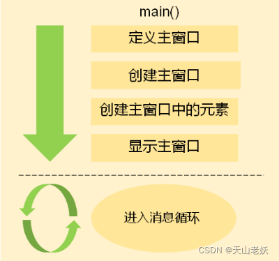
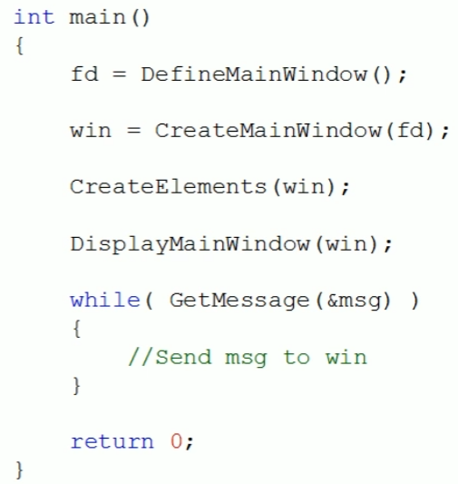
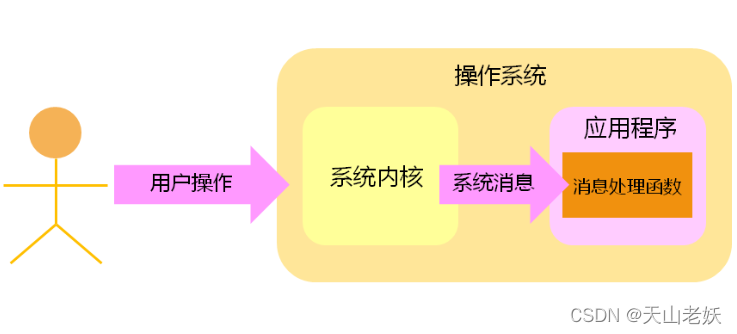
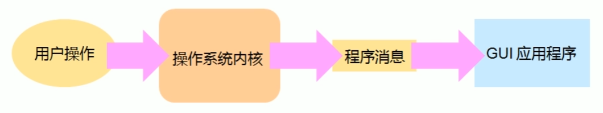
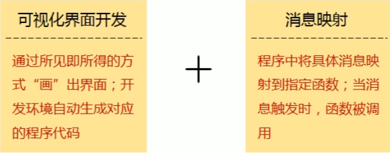
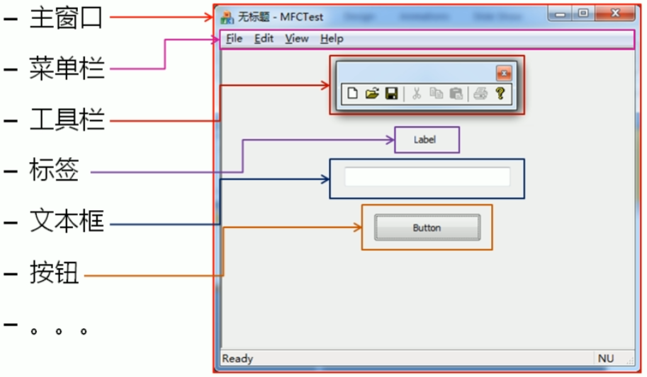
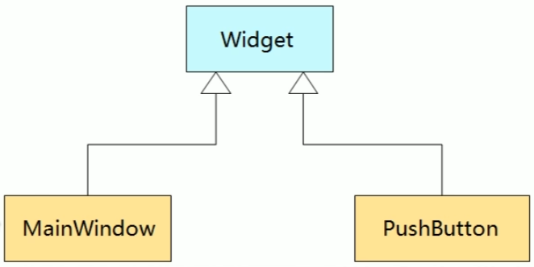

# GUI原理分析

## 命令行程序

命令行程序是`面向过程`的程序设计。

**命令行程序的特点：**

A、基于顺序结构执行

B、程序执行过程中不需与用户交互

C、程序执行结束给出最终运行结果

**命令行程序适用场合：**

A、单任务场合

B、无交互、简单交互场合

C、服务器应用场合

## GUI程序

**GUI程序的特点：**

A、基于消息驱动模型的程序

B、程序执行依赖用户交互过程

C、程序执行过程中实时响应用户操作

D、一般程序执行后不会主动退出

**GUI程序适用场合：**

A、多任务场合

B、强用户交互场合

C、非专业计算机用户

**GUI程序运行模式：**

 

**GUI程序消息处理模型：**

 

## GUI程序开发原理

A、GUI程序在运行时会`创建一个消息队列`

B、系统内核将`用户操作`翻译为对应的`程序消息`

C、程序在运行过程中需要实时处理消息队列中的消息

D、当队列中没有消息时，程序将处于`停滞状态`

 

## GUI程序开发过程

A、创建窗口、窗口元素

B、在消息处理函数中根据程序消息做出不同相应（消息映射）

 


------

# Windows开发GUI程序实例

```c
#include <windows.h>

#define STYLE_NAME    L"MainForm"
#define BUTTON_ID     919
 
/* 主窗口定义函数 */
BOOL DefineMainWindow(HINSTANCE hInstance);
 
/* 主窗口创建函数 */
HWND CreateMainWindow(HINSTANCE hInstance, wchar_t* title);
 
/* 主窗口内部元素创建函数 */
HWND CreateButton(HWND parent, int id, wchar_t* text);
 
/* 主窗口显示函数 */
HWND DisplayMainWindow(HWND hWnd, int nCmdShow);
 
/* 主窗口消息处理函数 */
LRESULT CALLBACK WndProc(HWND hwnd, UINT message, WPARAM wParam, LPARAM lParam);
 
static HWND MainWindow = NULL; // 主窗口句柄标
 
BOOL WINAPI WinMain(HINSTANCE hInstance, HINSTANCE hPrevInstance, LPSTR lpCmdLine, 
                int nCmdShow)
{
    MSG Msg = {0};
 
    /* 1.自定义主窗口样式 */
    if( !DefineMainWindow(hInstance) )
    {
        return FALSE;
    }
 
    /* 2.创建主窗口 */
    MainWindow = CreateMainWindow(hInstance, STYLE_NAME);
 
    if( MainWindow )
    {
        /* 3.创建主窗口中的控件元素 */
        CreateButton(MainWindow, BUTTON_ID, L"My Button");
        /* 4.在屏幕上显示主窗口 */
        DisplayMainWindow(MainWindow, nCmdShow);
    }
    else
    {
        return FALSE;
    }
 
    /* 5.进入消息循环 */
    while( GetMessage(&Msg, NULL, NULL, NULL) )
    {
        /* 6.翻译并转换系统消息 */
        TranslateMessage(&Msg);
        /* 7.分发消息到对应的消息处理函数 */
        DispatchMessage(&Msg);
    }
 
    return TRUE;
}
 
BOOL DefineMainWindow(HINSTANCE hInstance)
{
    static WNDCLASS WndClass = {0}; // 系统结构体类型
                                    // 用于描述窗口样式
    WndClass.style         = 0;
    WndClass.cbClsExtra    = 0;
    WndClass.cbClsExtra    = 0;
    WndClass.hbrBackground = (HBRUSH)(COLOR_WINDOW);          // 定义窗口背景色
    WndClass.hCursor       = LoadCursor(NULL, IDC_ARROW);     // 定义鼠标样式
    WndClass.hIcon         = LoadIcon(NULL, IDI_APPLICATION); // 定义窗口左上角图标
    WndClass.hInstance     = hInstance;                 // 定义窗口式样属于当前应用程序
    WndClass.lpfnWndProc   = WndProc;                         // 窗口消息处理函数
    WndClass.lpszClassName = STYLE_NAME;                      // 窗口样式名
    WndClass.lpszMenuName  = NULL;
 
    /* 将定义好的窗口式样注册到系统 */
    return RegisterClass(&WndClass);
}
 
HWND CreateMainWindow(HINSTANCE hInstance, wchar_t* title)
{
    HWND hwnd = NULL;
    hwnd = CreateWindow(STYLE_NAME,            // 通过定义好的窗口式样创建主窗口
                        title,                 // 主窗口标题
                        WS_OVERLAPPEDWINDOW,   // 创建后主窗口的显示风格
                        CW_USEDEFAULT,         // 主窗口左上角 x 坐标
                        CW_USEDEFAULT,         // 主窗口左上角 y 坐标
                        CW_USEDEFAULT,         // 主窗口宽度
                        CW_USEDEFAULT,         // 主窗口高度
                        NULL,                  // 父窗口
                        NULL,                  // 窗口菜单栏
                        hInstance,             // 主窗口属于当前应用程序
                        NULL);                 // 窗口参数
 
    return hwnd;
}
 
HWND DisplayMainWindow(HWND hWnd, int nCmdShow)
{
    ShowWindow(hWnd,nCmdShow); // 显示窗口
    UpdateWindow(hWnd);        // 刷新窗口
 
    return hWnd;
}
 
HWND CreateButton(HWND parent, int id, wchar_t* text)
{
    HINSTANCE hInstance = (HINSTANCE)GetWindowLong(parent, GWL_HINSTANCE);
    HWND hwnd = NULL;
 
    hwnd = CreateWindow(L"button",                   // 通过系统预定义式样创建窗口元素
                        text,                        // 窗口元素标题
                        WS_CHILD | WS_VISIBLE | BS_PUSHBUTTON,   // 窗口元素的显示风格
                        50,                           // 窗口元素在窗口中的左上角 x 坐标
                        50,                           // 窗口元素在窗口中的左上角 y 坐标
                        200,                          // 窗口元素的宽度
                        60,                           // 窗口元素的高度
                        parent,                       // 窗口元素所在的父窗口
                        (HMENU)id,                    // 窗口元素 ID 值
                        hInstance,                    // 窗口元素属于当前应用程序
                        NULL);                        // 窗口元素参数
    return hwnd;
}
 
 
LRESULT CALLBACK WndProc(HWND hWnd, UINT message, WPARAM wParam, LPARAM lParam)
{
    /* 调用系统提供的默认消息处理函数 */
    return DefWindowProc(hWnd, message, wParam, lParam);
}
```

- 现代操作系统提供原生SDK支持GUI程序开发
- 不同操作系统上的GUI SDK不同
- 不同操作系统上的GUI开发原理相同

------

# QT的本质

## GUI用户界面元素

GUI用户界面是由固定的窗口元素所构成的

 

## 面向对象的GUI程序设计

- 操作系统提供了`创建界面元素所需要的函数`，依次调用不同功能的函数就可以创建出界面元素，但操作系统提供的`原生函数无法直接映射到界面元素`。

- 根据面向对象程序设计思想，将`界面元素抽象为类`，通过`抽象`和`封装`可以`隐藏`界面元素的`细节`。

- GUI界面的创建过程就是组合不同界面元素对象的过程。

 

## QT的本质

QT是利用`面向对象`程序设计思想`开发的一套GUI组件库`，QT将不同操作系统的`GUI细节封装于类内部`，并提供了一套`跨平台的类`用于GUI程序开发。

QT遵循经典的GUI程序开发模式。

### 实例源码

```C++
#include <QApplication>
#include <QMainWindow>
#include <QPushButton>
 
int main(int argc, char* argv[])
{
    QApplication a(argc, argv);
    QMainWindow w;
    QPushButton b(&w);
    b.setText("Hello QT!");
    w.show();
 
    return a.exec();
}
```

**QT Creator环境的调试方法：**

在代码中加入一定打印语句，打印出程序状态和关键变量的值

Log打印需要添加#include \<QDebu\>

```cpp
qDebug() << "hello";
```

