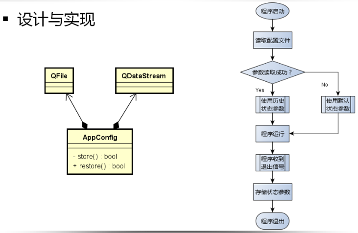

# 程序中的配置文件

**应用程序在刚开始启动时都要一个初始化状态**

- 一般而言程序的初始状态是最近一次运行退出前的状态

**保存和恢复程序状态的解决思路**

1. 程序退出前保存状态参数到文件（数据库）

2. 程序再次启动时读出状态参数并恢复

**状态参数的存储方式**

- 文本文件格式（XML、JSon等）

- 轻量级数据库（Access、SQlite等）

- 私有二进制文件格式

**Qt中的解决方案**

通过`二进制数据流`将状态参数直接`存储于文件中`

参数的存储和读取简单高效，易于编码实现

最终文件为二进制格式，不易被恶意修改


 

编程思路：一个构造函数用来写入，一个构造函数用来读取

**Application.h**

```cpp
#ifndef APPCONFIG_H
#define APPCONFIG_H

#include <QObject>
#include <QFont>

class AppConfig : public QObject
{
    Q_OBJECT
    QFont m_editFont;
    bool m_isToolBarVisible;
    bool m_isStatusVisible;
    bool m_isAutoWrap;
    bool m_isValid;

    bool restore();

public:
    explicit AppConfig(QObject *parent = nullptr);
    explicit AppConfig(QFont editFont, bool isToolBarVisible, bool isStatusVisible,bool isAutoWrap, QObject *parent = nullptr);

    QFont editFont();
    bool isToolBarVisible();
    bool isStatusBarVisible();
    bool isAutoWrap();
    bool isValid();
    bool store();
};

#endif // APPCONFIG_H
```

**Application.cpp**

```cpp
#include "AppConfig.h"
#include <QFile>
#include <QApplication>

AppConfig::AppConfig(QObject *parent)
    : QObject{parent}{

    m_isValid = restore();
}

AppConfig::AppConfig(QFont editFont, bool isToolBarVisible, bool isStatusVisible,bool isAutoWrap, QObject *parent){

    m_editFont = editFont;
    m_isToolBarVisible = isToolBarVisible;
    m_isStatusVisible = isStatusVisible;
    m_isAutoWrap = isAutoWrap;
    m_isValid = true;
}

QFont AppConfig::editFont(){
    return m_editFont;
}

bool AppConfig::isToolBarVisible(){
    return m_isToolBarVisible;
}

bool AppConfig::isStatusBarVisible(){
    return m_isStatusVisible;
}

bool AppConfig::isAutoWrap(){
    return m_isAutoWrap;
}

bool AppConfig::isValid(){
    return m_isValid;
}

bool AppConfig::restore(){
    bool ret = true;
    QFile file(QApplication::applicationDirPath() + "/app.config");

    if(file.open(QIODevice::ReadOnly)){
        QDataStream in(&file);
        in.setVersion(QDataStream::Qt_6_8);

        in >> m_editFont;
        in >> m_isToolBarVisible;
        in >> m_isStatusVisible;
        in >> m_isAutoWrap;

        file.close();
    }else{
        ret = false;
    }
    return ret;
}

bool AppConfig::store(){
    bool ret = true;
    QFile file(QApplication::applicationDirPath() + "/app.config");

    if(file.open(QIODevice::WriteOnly)){
        QDataStream out(&file);
        out.setVersion(QDataStream::Qt_6_8);

        out << m_editFont;
        out << m_isToolBarVisible;
        out << m_isStatusVisible;
        out << m_isAutoWrap;

        file.close();
    }else{
        ret = false;
    }

    return ret;
}
```

使用这个类的方法：在二阶构造那里调用读出的构造函数，在析构函数那里调用写入的构造函数

**读出**

```cpp
bool MainWindow::construct(){
    bool ret = true;
    AppConfig config;

    ret = ret && initMenuBar();
    ret = ret && initToolBar();
    ret = ret && initStatusBar();
    ret = ret && initMainEditor();

    if(config.isValid()){
        mainEditor.setFont(config.editFont());

        if(!config.isAutoWrap()){
            mainEditor.setLineWrapMode(QPlainTextEdit::NoWrap);
            findMenuBarAction("Auto Wrap")->setChecked(false);
            findToolBarAction("Auto Wrap")->setChecked(false);
        }

        if(!config.isToolBarVisible()){
            toolBar()->setVisible(false);
            findMenuBarAction("Tool Bar")->setChecked(false);
            findToolBarAction("Tool Bar")->setChecked(false);
        }

        if(!config.isStatusBarVisible()){
            statusBar()->setVisible(false);
            findMenuBarAction("Status Bar")->setChecked(false);
            findToolBarAction("Status Bar")->setChecked(false);
        }
    }

    return ret;
}
```

**写入**

```cpp
MainWindow::~MainWindow() {

    QFont font = mainEditor.font();
    bool isWrap = (mainEditor.lineWrapMode() == QPlainTextEdit::WidgetWidth);
    bool tbVisible = (findMenuBarAction("Tool Bar")->isChecked() &&
                      findToolBarAction("Tool Bar")->isChecked());
    bool sbVisible = (findMenuBarAction("Status Bar")->isChecked() &&
                      findToolBarAction("Status Bar")->isChecked());

    AppConfig config(font, tbVisible, sbVisible, isWrap);
    config.store();
}
```

其它修改的地方：将查找工具栏的函数抽取出来做一个函数

```cpp
QToolBar* MainWindow::toolBar(){
    for(QObject* obj : children()){
        if(auto tb = qobject_cast<QToolBar*>(obj)){
            return tb;
        }
    }
    return nullptr;
}
```

之前使用到的函数也做了相应修改：

```cpp
QAction* MainWindow::findToolBarAction(QString text){
    QToolBar* tb = toolBar();
    if(!tb){
        return nullptr;
    }
        for(QAction* action : tb->actions()){
            if(action && action->toolTip().startsWith(text, Qt::CaseInsensitive)){
                return action;
                }
            }
    return nullptr;
}

void MainWindow::onViewToolBar(){
    QToolBar* toolbar = toolBar();
    if(!toolbar){
        return;
    }
    bool newVisible = !toolbar->isVisible();
    toolbar->setVisible(newVisible);
    updateActionState("Tool Bar", newVisible);
}
```


**小结**

- 应用程序在`退出时保存`应用状态（用户配置）

- 应用程序`启动时恢复`最近异常程序状态

- 可以通过二进制数据流将状态参数直接存储于文件中

- 二进制数据流的方式非常的安全，简单，高效