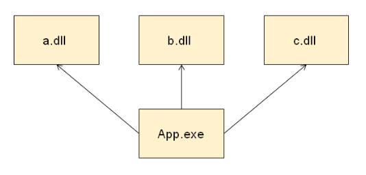
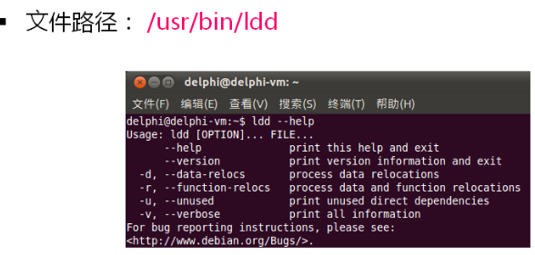
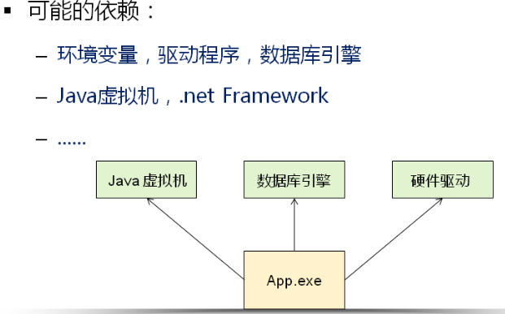
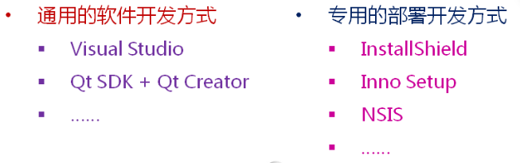
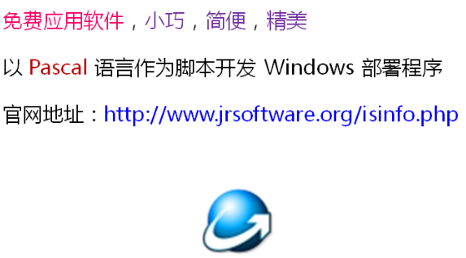

# 调试与发布

**发布应用程序时的候选者**

- 调试版（debug）：开发阶段生成可执行程序

- 发布版（release）：最终产品的可执行程序

**调试版的可执行程序**

- 包含调试相关的信息，体积巨大

- 执行速度慢，支持断点调试

**发布版的可执行程序**

- 无任何冗余信息，体积小巧

- 执行速度快，无法映射到源码调试

# 程序的库依赖

**可执行程序的正常运行需要外部库的支持**

因此：发布程序时必须保证所有依赖库都存在

 

**Windows可以用Depends工具查看程序的依赖库**

 

**Linux可以用ldd命令查看程序的依赖库**

ldd是Linux系统中的一个脚本程序

 

# 程序的环境依赖

1.应用程序对于执行程序环境可能还存在依赖关系

 

2.在客户机上部署程序的执行环境

- 方案一
  - 用户根据提供的手册自行部署环境（不可取）

- 方案二
  - 开发一个专用的部署（安装）程序
  - 部署（安装）程序运行后自动部署执行环境

3.部署（安装）程序的开发

 

 4.InstallShield的简介

 

5.Inno Setup简介

 

6.NSIS简介

 

7.LinuxQt程序发布简介

- 方法一
  - 通过ldd命令确定程序的库依赖
  - 通过shell脚本开发部署程序

- 方法二
  - 根据具体发行版开发专用部署程序（dep、rpm）

**小结**

- 程序开发时能够生成`debug`和`release`版

- 打包时首先要解决程序的`库依赖`

- 程序执行需要特殊环境依赖时必须开发`部署程序`

- Windows中有丰富的部署程序开发工具可供选择

- Linux中可以采用`Shell脚本`开发部署程序　

