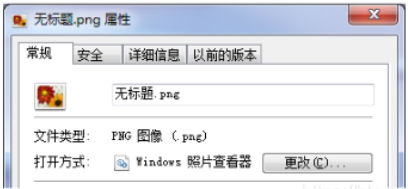
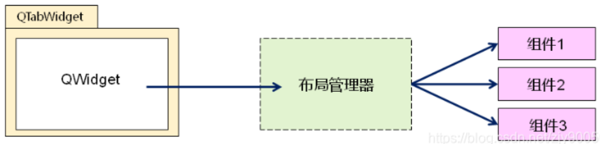
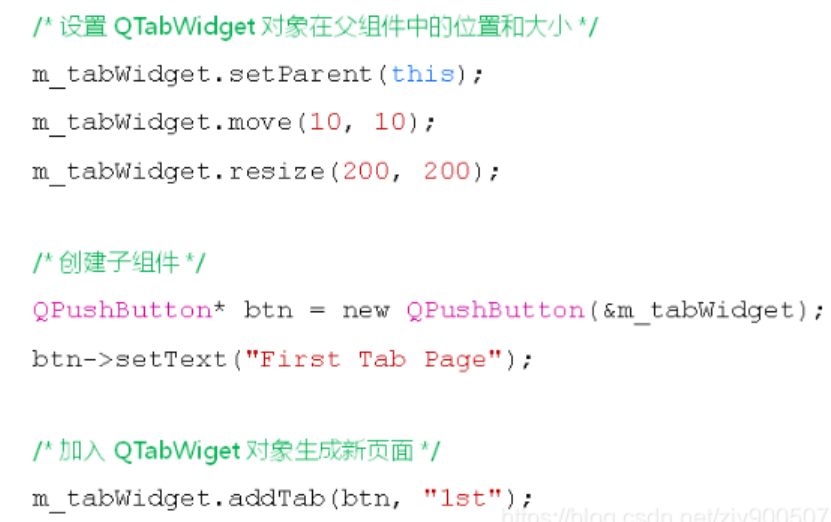

# 多页面切换组件

- Qt中的多页面切换组件QTabWidget
  - 能够在同一个窗口中`自由切换不同页面`的内容
  - 是一个`容器类型的组件`，同时提供友好的页面切换方式

 


**QTabWidget的使用方式**

- 在应用程序中创建QTabWidget 的对象
- 将其他 `QWidget 对象`加入该对象中

> 在QTabWidget对象中加入一个组件将生成一个新的页面
> QTabWidget对象每次只能加入一个QWidget对象


**如何将多个组件加入到一个QTabWidget页面中？**

1. 创建`容器类型`的组件对象
2. 将`多个子组件`在容器对象中布局
3. 将容器对象加入`QTabWidget`中生成新的页面

 


**QTabWidget组件的基本用法**

 


**编程实验：**

```cpp
#ifndef WIDGET_H
#define WIDGET_H

#include <QWidget>
#include <QTabWidget>

class Widget : public QWidget
{
    Q_OBJECT

    QTabWidget m_tabWidget;

protected slots:
    void onTabCurrentChanged(int index);
    void onTabCloseRequested(int index);

public:
    Widget(QWidget *parent = nullptr);
    ~Widget();
};
#endif // WIDGET_H
```

**Widget.cpp**

```cpp
#include "Widget.h"
#include <QPlainTextEdit>
#include <QLabel>
#include <QPushButton>
#include <QVBoxLayout>
#include <QDebug>

Widget::Widget(QWidget *parent)
    : QWidget(parent){

    m_tabWidget.setParent(this);
    m_tabWidget.move(10, 10);
    m_tabWidget.resize(200, 200);
    m_tabWidget.setTabPosition(QTabWidget::South);
    m_tabWidget.setTabShape(QTabWidget::Triangular);
    m_tabWidget.setTabsClosable(true);

    auto edit = new QPlainTextEdit(&m_tabWidget);
    edit->setPlainText("1st Tab Pag");

    m_tabWidget.addTab(edit, "1st");

    auto widget = new QWidget(&m_tabWidget);
    auto layout = new QVBoxLayout();
    auto lable = new QLabel(widget);
    auto btn = new QPushButton(widget);

    lable->setText("2nd Tab Page");
    lable->setAlignment(Qt::AlignCenter);

    btn->setText("2nd Tab Page");

    layout->addWidget(lable);
    layout->addWidget(btn);

    widget->setLayout(layout);

    m_tabWidget.addTab(widget, "2nd");

    m_tabWidget.setCurrentIndex(1);

    connect(&m_tabWidget, &QTabWidget::currentChanged, this, &Widget::onTabCurrentChanged);
    connect(&m_tabWidget, &QTabWidget::tabCloseRequested, this, &Widget::onTabCloseRequested);
}

void Widget::onTabCurrentChanged(int index){
    qDebug() << "Page change to: " << index;
}

void Widget::onTabCloseRequested(int index){
    m_tabWidget.removeTab(index);
}


Widget::~Widget() {}
```


**QTabWidget组件的高级用法**

- 设置 Tab 标签的位置(North, South, West, East）
- 设置 Tab 的外观(Rounded, Triangular)
- 设置 Tab 的可关闭模式


**QTabWidget组件中预定义的信号**

- void currentChanged(int index)
  - 当前显示的页面发生变化，`index为新页面下标`
- void tabCloseRequested(int index)
  - 位置为index页面的`关闭按钮被点击`发出关闭请求


**小结**

- Qt平台中提供了功能强大的多页面组件
- QTabWidget组件每次只能加入一个组件
- 加入多个组件时通过`容器组件`和`布局管理器`完成
- QTabWidget能够定制页面标签的外观和位置
- QTabWidget的`预定义信号`能够实现程序中的高级功能