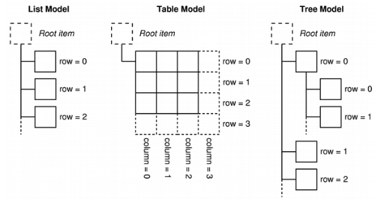

# 模型视图设计模式的核心思想

- 模型（数据）与视图（显示）相分离

- 模型对外提供标准接口存取数据（不关心数据如何显示）

- 视图自定义数据的显示模式（不关心数据如何组织存储）

**模型视图模式的直观理解**

 

## 模型视图的工作机制

- 当数据发生改变时：模型发出信号通知视图

- 当用户与视图进行交互时：视图发出信号提供交互信息

## Qt中的模型类层次结构

 

## Qt中的视图类层次结构

 

## 模型为数据提供统一的访问方式

- Qt中，不管模型以什么结构组织数据，都必须为每一个数据提供独一无二的索引
- 视图通过索引访问模型中的具体数据

## 模型视图编程示例

 

 **MainWindow.h**

```cpp
#ifndef MAINWINDOW_H
#define MAINWINDOW_H
#include <QFileSystemModel>
#include <QTreeView>
 
#include <QtGui/QMainWindow>
 
class MainWindow : public QMainWindow
{
    Q_OBJECT
    QFileSystemModel m_fileModel;
    QTreeView m_treeView;
public:
    MainWindow(QWidget *parent = 0);
    ~MainWindow();
};
 
#endif // MAINWINDOW_H
```

**MainWindow.cpp**

```cpp
#include "MainWindow.h"
#include <QDir>
 
//1.定义视图、模型对象
//2.设置视图对象相关属性（大小位置等）
//3.设置模型取数据的位置（文件系统如此大，要给模型指定一个地方来取数据）
//4.连接模型与视图
//5.视图通过模型提供的索引去取数据来从根部开始显示
MainWindow::MainWindow(QWidget *parent)
    : QMainWindow(parent)
{
    m_treeView.setParent(this);
    m_treeView.resize(600,300);
    m_treeView.move(10,10);
 
    m_fileModel.setRootPath(QDir::currentPath());
 
    m_treeView.setModel(&m_fileModel);
 
    m_treeView.setRootIndex(m_fileModel.index(QDir::currentPath()));
 
}
 
MainWindow::~MainWindow(){}
```

**main.cpp**

```cpp
#include <QtGui/QApplication>
#include "MainWindow.h"
 
int main(int argc, char *argv[])
{
    QApplication a(argc, argv);
    MainWindow w;
    w.show();
    
    return a.exec();
}
```

 

 **小结**

- Qt中内置的支持模型视图的开发方式
- 模型用于组织数据源，不关心数据的显示方式
- 视图用于定义数据的显示方式，不关心数据的组织方式
- Qt中的模型必须为每一个数据提供独一无二的索引
- Qt中的视图通过索引访问模型中的数据


------

# 模型视图中的结构与索引

- 模型定义`标准接口`（成员函数）对数据进行访问（例子中m_fileMode.data（root）等）
- 视图通过`标准接口`获取数据并定义显示方式
- 模型使用信号与槽的机制通知视图数据变化（如上节课的动态显示）
- 模型中的数据都是以`层次结构`表示的

## 模型中的索引

1. 模型索引是将数据与视图分离的重要机制
2. 模型中的数据使用`唯一的索引`来访问
3. QModellndex是Qt中的模型索引类

- 包含具体数据的访问模式

- 包含一个指向模型的指针

## 索引的意义

 

###  索引中的行和列

线性模型可以使用（row、column）作为数据索引

 

###  模型中的通用树形结构

1. Root为虚拟节点，用于统一所有数据到同一棵树中
2. 同一节点的子节点以递增的方式进行编号
3. 通过（lndex，parent）的方式确定节点

 

## 模型中数据索引的通用方式

三元组：（row，column，parent）

 

 

**MainWindow.h**

```cpp
#ifndef MAINWINDOW_H
#define MAINWINDOW_H

#include <QMainWindow>
#include <QFileSystemModel>
#include <QPlainTextEdit>

class MainWindow : public QMainWindow
{
    Q_OBJECT

    QFileSystemModel m_fileModel;
    QPlainTextEdit  m_edit;

protected slots:
    void onDirectoryLoaded(const QString& path);
public:
    MainWindow(QWidget *parent = nullptr);
    ~MainWindow();
};
#endif // MAINWINDOW_H
```

**MainWindow.cpp**

```cpp
#include "MainWindow.h"
#include <QByteArray>
#include <QBuffer>
#include <QTextStream>
#include <QIODevice>

MainWindow::MainWindow(QWidget *parent)
    : QMainWindow(parent){

    m_edit.setParent(this);
    m_edit.resize(800, 600);
    m_edit.move(10, 10);

    m_fileModel.setRootPath(QDir::currentPath());
    connect(&m_fileModel, &QFileSystemModel::directoryLoaded, this, &MainWindow::onDirectoryLoaded);
}

void MainWindow::onDirectoryLoaded(const QString& path){

    QModelIndex root = m_fileModel.index(path);
    QByteArray array;
    QBuffer buffer(&array);

    if(buffer.open(QIODevice::WriteOnly)){
        QTextStream out(&buffer);
        out << m_fileModel.isDir(root) << Qt::endl;
        out << m_fileModel.data(root).toString() << Qt::endl;
        out << root.data().toString() << Qt::endl;
        out << &m_fileModel << Qt::endl;
        out << root.model() << Qt::endl;
        out << m_fileModel.filePath(root) << Qt::endl;
        out << m_fileModel.fileName(root) << Qt::endl;
        out << Qt::endl;

        for(int i{0}; i < m_fileModel.rowCount(root); ++i){
            QModelIndex mi = m_fileModel.index(i, 0,root);
            out << mi.data().toString() << Qt::endl;
        }

        out.flush();
        buffer.close();

        if(buffer.open(QIODevice::ReadOnly)){
            QTextStream in(&buffer);
            m_edit.insertPlainText(in.readAll());
            buffer.close();
        }
    }
}

MainWindow::~MainWindow() {}
```

 

**小结**

- 索引是访问模型中具体数据的`约定方式`
- 获取索引中的通用方式为三元组（row，column，parent）
- 索引在需要时`由模型实时创建`
- 使用`空索引`作为父节点表示顶层数据元素
- 特殊的模型可以自定义特殊的索引获取方式

# 不同视图显示同一数据

不同的视图显示同一个模型中的数据

**Qt中标准模型定义（例子中使用表格模型）**

1. 获取虚拟根节点
2. 动态从堆空间申请并创建三个数据项
3. 分别往三个数据项中放入数据
4. 将数据项放到模型中

 

 **MainWindow.h**

```cpp
#ifndef MAINWINDOW_H
#define MAINWINDOW_H
 
#include <QtGui/QMainWindow>
#include <QTableView>
#include <QStandardItemModel>
class MainWindow : public QMainWindow
{
    Q_OBJECT
private:
    QStandardItemModel m_standerdModel;
    QTableView m_tableView;
    void initStanderdModel();
    void initTableModel();
public:
    MainWindow(QWidget *parent = 0);
    ~MainWindow();
};
 
#endif // MAINWINDOW_H
```

**MainWindow.cpp**

```cpp
#include "MainWindow.h"
#include <QStandardItem>
 
MainWindow::MainWindow(QWidget *parent)
    : QMainWindow(parent)
{
    initStanderdModel();
    initTableModel();
    m_tableView.setModel(&m_standerdModel);
}
void MainWindow::initStanderdModel()
{
    QStandardItem* root = m_standerdModel.invisibleRootItem();
    QStandardItem* itemA = new QStandardItem();
    QStandardItem* itemB = new QStandardItem();
    QStandardItem* itemC = new QStandardItem();
 
    itemA->setData("A");//只是往数据项里面放了数据，并没有告诉如何显示
    itemA->setData("Tip A");
    itemA->setData("Help A");
    itemB->setData("B");
    itemB->setData("Tip B");
    itemC->setData("C");
    itemC->setData("Tip B");
    itemC->setData("Help C");
 
    root->setChild(0, 0, itemA);//itemA、itemB、itemC都是new出来的，这里将数据项
    root->setChild(0, 1, itemB);//加入模型的同时也相当于指定了父组件，不会造成内存泄漏
    root->setChild(1, 0, itemC);
 
}
void MainWindow::initTableModel()
{
    m_tableView.resize(300,100);
    m_tableView.move(10,10);
    m_tableView.setParent(this);
}
MainWindow::~MainWindow(){}
```

 

#  Qt中的数据角色

**数据角色的概念**

- 模型中的数据在视图中的用途（显示方式）可能不同
- 模型必须为数据设置特定的数据角色（数据属性）
- 数据角色用于提示视图数据的作用（直接显示、或者做其它用途）
- 数据角色是不同视图以同一的风格显示数据的标准


**Qt中的数据角色定义**

 

**数据角色的意义（指导视图如何使用数据）**

- 定义了数据在特定系统下的`标准用途`
- 不同的视图可以通过相同的标准显示数据

- 注意事项
  - 数据角色只是一个`附加的属性`，这个属性代表推荐的数据显示方式
  - 不同的视图完全可以自由解析或者忽略数据的角色信息（自定义视图时）

**MainWindow.h**

```cpp
#ifndef MAINWINDOW_H
#define MAINWINDOW_H
 
#include <QtGui/QMainWindow>
#include <QTableView>
#include <QTreeView>
#include <QListView>
#include <QStandardItemModel>
class MainWindow : public QMainWindow
{
    Q_OBJECT
private:
    QStandardItemModel m_standerdModel;
    QTableView m_tableView;
    QTreeView m_treeView;
    QListView m_listView;
    void initStanderdModel();
    void initTableModel();
public:
    MainWindow(QWidget *parent = 0);
    ~MainWindow();
};
 
#endif // MAINWINDOW_H
```

**MainWindow.cpp**

```cpp
#include "MainWindow.h"
#include <QStandardItem>
 
MainWindow::MainWindow(QWidget *parent)
    : QMainWindow(parent, Qt::WindowContextHelpButtonHint)
{
    initStanderdModel();
    initTableModel();
    m_tableView.setModel(&m_standerdModel);
    m_treeView.setModel(&m_standerdModel);
    m_listView.setModel(&m_standerdModel);
}
void MainWindow::initStanderdModel()
{
    QStandardItem* root = m_standerdModel.invisibleRootItem();
    QStandardItem* itemA = new QStandardItem();
    QStandardItem* itemB = new QStandardItem();
    QStandardItem* itemC = new QStandardItem();
    QStandardItem* itemChild = new QStandardItem();
 
    itemA->setData("A", Qt::DisplayRole);
    itemA->setData("Tip A", Qt::ToolTipRole);
    itemA->setData("Help A", Qt::WhatsThisRole);
    itemB->setData("B", Qt::DisplayRole);
    itemB->setData("Tip B", Qt::ToolTipRole);
    itemC->setData("C", Qt::DisplayRole);
    itemC->setData("Tip B", Qt::ToolTipRole);
    itemC->setData("Help C", Qt::WhatsThisRole);
 
    itemChild->setData("Child", Qt::DisplayRole);
    itemChild->setData("Tip Child", Qt::ToolTipRole);
    itemChild->setData("Help Child", Qt::WhatsThisRole);
 
    itemC->setChild(0, 0, itemChild);
 
 
    root->setChild(0, 0, itemA);//itemA、itemB、itemC都是new出来的，这里将数据项
    root->setChild(0, 1, itemB);//加入模型的同时也相当于指定了父组件，不会造成内存泄漏
    root->setChild(1, 0, itemC);
 
}
void MainWindow::initTableModel()
{
    m_tableView.resize(300,100);
    m_tableView.move(10,10);
    m_tableView.setParent(this);
 
    m_treeView.resize(300,100);
    m_treeView.move(10,120);
    m_treeView.setParent(this);
 
    m_listView.resize(300,100);
    m_listView.move(10,230);
    m_listView.setParent(this);
}
MainWindow::~MainWindow(){}
```

 

 **小结**

- 模型中的数据有`附加的角色属性`
- 数据角色`定义了数据显示的标准方式`
- 数据角色用于提示视图数据的作用
- 视图可以`自由解析`或者`忽略`数据的角色信息（自定义视图时）