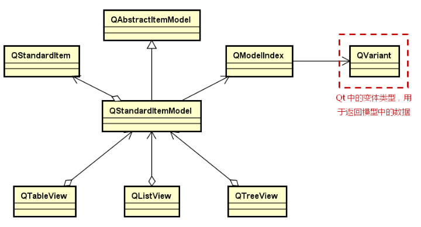

# 自定义模型类

## QStandardItemModel

**QStandardItemModel是一个通用的模型类**

- 能够以任意的方式组织数据（线程、非线性）

- 数据组织的基本单位为`数据项`（QStandardItem）

- 每一个数据项能够`存储多个`具体数据（附加数据角色）

- 每一个数据项能够对`数据状态进行控制`（可编辑、可选...）


- QStandardItemModel继承自抽象的模型类QAbstractItemModel

- QStandardItem与QAbstractItemModel是聚合关系

- QAbstractItemModel里面存储的东西是各种各样的

- 变体类型可以返回不同的类型

 

## QVariant

Qt中的变体类型QVariant（类型可变）

-  QVariant是一个用于封装的类型

- QVariant能够表示大多数常见的`值类型`

- QVariant每次只能封装（保存）`单一类型`的值

- QVariant的意义在于能够设计“`返回类型可变的函数`”


**变体类型QVariant中的常用成员函数**

 

**main.cpp**

```cpp
#include <QtCore/QCoreApplication>
#include <QVariant>
#include <QPoint>
#include <QDebug>
#include <QString>
 
int main(int argc, char *argv[])
{
    QCoreApplication a(argc, argv);
    
    QVariant v1(1);
    QVariant v2(3.14);
    QVariant v3("520");
    QVariant v4(QPoint(15, 15));
    QVariant v5;
 
    qDebug() << v1.type();//指的是v1存储的值的类型
    qDebug() << v1.typeName();
    qDebug() << v1.toInt();
 
    qDebug() << endl;
 
    qDebug() << v2.type();
    qDebug() << v2.typeName();
    qDebug() << v2.toInt();//会发生截断
    qDebug() << v2.toDouble();
    qDebug() << v2.value<double>();//注意使用方法，模板
 
    qDebug() << endl;
 
    qDebug() << v3.type();
    qDebug() << v3.typeName();
    qDebug() << v3.toInt();
    qDebug() << v3.value<QString>();
 
    qDebug() << endl;
 
    bool k = true;
 
    qDebug() << v4.type();
    qDebug() << v4.typeName();
    qDebug() << v4.toInt(&k);//0
    qDebug() << k;//false
    qDebug() << v4.toPoint();
 
    qDebug() << endl;
 
    qDebug() << v5.isValid();//false, 因为v5里面没有装具体的类型数据，所以是无效的，以后使用前都应该判断一下
    return a.exec();
}
```

```cpp
//打印结果
QVariant::int
int
1
 
QVariant::double
double
3
3.14
3.14
 
QVariant::QString
QString
520
"520"
 
QVariant::QPoint
QPoint
0
false
QPoint(15,15)
 
false
```


# 工程中的使用

## 常用模型设计

1. 解析数据源中的数据（数据库、网络、串口等）

2. 将解析后的数据存入QStandardItem对象中（解析成可读的形式）

3. 根据数据间的关系在QStandardItemModel对象中组织数据项

4. 选择合适的视图显示数据值

## 常用的模块设计

 

##  实例分析

1. 在文件中以行的形式存储了考试成绩信息（ID、Name、Score）

2. 开发GUI程序显示文件中的数据


- 计算平均成绩

- 查找最好成绩和最坏成绩

- 可刷新显示的内容和删除的内容

### 系统架构图

1. 将读文件这种底层操作封装在数据层完成

2. 读后数据到了内存，然后交于数据表示层来进行具体表示

3. 数据表示层交于数据组织层（相当于一个模型），数据组织层根据需要传给视图

4. 显示数据

 

###  系统核心类图

（每一次对应一个（或者一组）类）

 

### 自定义模型类分析

 

### DataSource类的设计与实现

1. 设置数据源并读取数据

2. 对数据进行解析后生成数据对象

 

**DataSource.h**

```cpp
#ifndef DATASOURE_H
#define DATASOURE_H

#include "ScoreInfo.h"
#include <QObject>

class DataSoure : public QObject
{
    Q_OBJECT

    ScoreInfo info;
    QList<ScoreInfo> m_data;
    bool parse(const QString& line, ScoreInfo& info);
public:
    explicit DataSoure(QObject *parent = nullptr);
    bool setDataPath(const QString& path);
    QList<ScoreInfo> fetchData();
    int count();
};

#endif // DATASOURE_H
```

**DataSource.cpp**

```cpp
#include "DataSoure.h"
#include <QFile>
#include <QTextStream>

DataSoure::DataSoure(QObject *parent)
    : QObject{parent}
{}

bool DataSoure::setDataPath(const QString& path){

    QFile file(path);
    if(!file.open(QIODevice::ReadOnly | QIODevice::Text)){
        return false;
    }
    {
        QTextStream in(&file);
        while(!in.atEnd()){
            ScoreInfo info;
            QString line = in.readLine();
            if(!line.isEmpty() && parse(line, info)){
                m_data.append(info);
            }
        }
    }
    return true;
}

bool DataSoure::parse(const QString& line, ScoreInfo& info){
    QStringList list = line.split(",", Qt::SkipEmptyParts);
    if(list.count() != 3){
        return false;
    }
    const QString id = list[0].trimmed();
    const QString name = list[1].trimmed();
    const QString scoreStr = list[2].trimmed();

    bool conversionOK = false;
    const int score = scoreStr.toInt(&conversionOK);

    if(!conversionOK || score < 0 || score > 150){
        return false;
    }

    info = ScoreInfo(id, name, score);
    return true;
}

QList<ScoreInfo> DataSoure::fetchData(){
    QList<ScoreInfo> result;
    result.swap(m_data);
    return result;
}

int DataSoure::count(){
    return m_data.count();
}
```

### ScoreInfo类的设计与实现

1. 封装数据源中的一组完整数据

2. 提供返回具体数据值的接口函数

 

**ScoreInfo.h**

```cpp
#ifndef SCOREINFO_H
#define SCOREINFO_H

#include <QObject>
#include <QString>

class ScoreInfo : public QObject
{
    Q_OBJECT

    QString m_id;
    QString m_name;
    int m_score;

public:
    explicit ScoreInfo(QObject *parent = nullptr);
    ScoreInfo(QString id, QString name, int score, QObject *parent = nullptr);
    ScoreInfo(const ScoreInfo& obj);
    ScoreInfo& operator= (const ScoreInfo& obj);
    QString id() const;
    QString name() const;
    int score() const;

};

#endif // SCOREINFO_H
```

**ScoreInfo.cpp**

```cpp
#include "ScoreInfo.h"

ScoreInfo::ScoreInfo(QObject *parent)
    : QObject{parent}{

    m_id = nullptr;
    m_name = nullptr;
    m_score = -1;
}

ScoreInfo::ScoreInfo(QString id, QString name, int score, QObject *){
    m_id = id;
    m_name = name;
    m_score = score;
}

ScoreInfo::ScoreInfo(const ScoreInfo& obj){
    m_id = obj.m_id;
    m_name = obj.m_name;
    m_score = obj.m_score;
}

ScoreInfo& ScoreInfo::operator= (const ScoreInfo& obj){
    if(this != &obj){
        m_id = obj.m_id;
        m_name = obj.m_name;
        m_score = obj.m_score;
    }
    return *this;
}

QString ScoreInfo::id() const { return m_id; }

QString ScoreInfo::name() const { return m_name; }

int ScoreInfo::score() const { return m_score; }
```

### ScoreInfoModel类的设计与实现

1. 使用标准模型类QStandardItemModel作为成员

2. 以ScoreInfo类对象作为最小数据单位进行组织

 

**ScoreInfoModel.h**

```cpp
#ifndef SCOREINFOMODEL_H
#define SCOREINFOMODEL_H

#include <QObject>
#include <QStandardItemModel>
#include <QTableView>
#include "ScoreInfo.h"

class ScoreInfoModel : public QObject
{
    Q_OBJECT
    QStandardItemModel m_model;
public:
    explicit ScoreInfoModel(QObject *parent = nullptr);
    bool add(const ScoreInfo& info);
    bool add(const QList<ScoreInfo>& list);
    bool remove(int i);
    ScoreInfo getItem(int i);
    void clear();
    int count();
    void setView(QTableView& view);
};

#endif // SCOREINFOMODEL_H
```

**ScoreInfoModel.cpp**

```cpp
#include "ScoreInfoModel.h"

ScoreInfoModel::ScoreInfoModel(QObject *parent)
    : QObject{parent}
{}

bool ScoreInfoModel::add(const ScoreInfo& info){
    QStandardItem* root = m_model.invisibleRootItem();
    if(!root){
        return false;
    }

    if(m_model.rowCount() == 0){
        m_model.setHorizontalHeaderLabels({"ID", "Name", "Score"});
    }
    QList<QStandardItem*> items {
        new QStandardItem(),
        new QStandardItem(),
        new QStandardItem()
    };

    if(items[0] && items[1] && items[2]){
        items[0]->setData(info.id(), Qt::DisplayRole);
        items[1]->setData(info.name(), Qt::DisplayRole);
        items[2]->setData(info.score(), Qt::DisplayRole);

        root->appendRow(items);
        return true;
    }
    qDeleteAll(items);
    return false;
}

bool ScoreInfoModel::add(const QList<ScoreInfo>& list){
    if(list.isEmpty()){
        return true;
    }
    bool status = true;
    for(const ScoreInfo& info : list){
        status &= add(info);
    }
    return status;
}

bool ScoreInfoModel::remove(int i){
    if(i < 0 || i >= count()){
        return false;
    }
    m_model.removeRow(i);
    return true;
}

ScoreInfo ScoreInfoModel::getItem(int i) {
    if(i < 0 || i >= count()){
        return ScoreInfo();
    }
    QModelIndex parent;
    QModelIndex index0 = m_model.index(i, 0, parent);
    QModelIndex index1 = m_model.index(i, 1, parent);
    QModelIndex index2 = m_model.index(i, 2, parent);

    return ScoreInfo(
        index0.data().toString(),
        index1.data().toString(),
        index2.data().toInt()
        );
}

void ScoreInfoModel::clear(){
    m_model.clear();
}

int ScoreInfoModel::count(){
    return m_model.rowCount();
}

void ScoreInfoModel::setView(QTableView& view){
    view.setModel(&m_model);
}
```

### 数据交互流程图

 

**小结**

- 工程中的`架构图`用于定义模块功能

- 工程中的`类图`用于定义具体功能的接口

- 工程中的`流程图`用于定义对象间的交互

- 模块实现结束后需要进行`单元测试`


### 界面设计

 

**界面关系图**

 

 **右键上下文菜单的实现**

1. 定义菜单对象

2. 连接菜单中的QAction对象到槽函数

3. 定义事件过滤器，并处理ContextMenu事件

4. 在当前鼠标的位置打开菜单对象

**Widget.h**

```cpp
#ifndef WIDGET_H
#define WIDGET_H

#include <QWidget>
#include "ScoreInfoModel.h"
#include <QTableView>
#include <QPushButton>
#include <QHBoxLayout>
#include <QVBoxLayout>
#include <QMenu>

class Widget : public QWidget
{
    Q_OBJECT

    QVBoxLayout vlayout;
    QHBoxLayout hlayout;
    QTableView m_view;
    QMenu m_memu;
    ScoreInfoModel m_model;
    QPushButton refreshBtn;
    QPushButton clearBtn;
    QPushButton scoreBtn;

protected slots:
    void onRefreshBtnClicked();
    void onClearBtnClicked();
    void onScoreBtnClicked();
    void onDeleteActionClicked();

public:
    Widget(QWidget *parent = nullptr);
    bool eventFilter(QObject *watched, QEvent* event);
    ~Widget();
};
#endif // WIDGET_H
```

**Widget.cpp**

```cpp
#include "Widget.h"
#include "DataSoure.h"
#include "ScoreInfo.h"
#include <QEvent>
#include <QMessageBox>
#include <QDebug>

Widget::Widget(QWidget *parent): QWidget(parent){

    m_view.setParent(this);

    refreshBtn.setText("Refresh");
    clearBtn.setText("Clear");
    scoreBtn.setText("Score");

    hlayout.addWidget(&refreshBtn);
    hlayout.addWidget(&clearBtn);
    hlayout.addWidget(&scoreBtn);

    vlayout.addWidget(&m_view);
    vlayout.addLayout(&hlayout);
    setLayout(&vlayout);

    m_memu.addAction("Delete");

    m_model.setView(m_view);
    m_view.installEventFilter(this);

    connect(&refreshBtn, &QPushButton::clicked, this, &Widget::onRefreshBtnClicked);
    connect(&clearBtn, &QPushButton::clicked, this, &Widget::onClearBtnClicked);
    connect(&scoreBtn, &QPushButton::clicked, this, &Widget::onScoreBtnClicked);

    connect(m_memu.actions().first(), &QAction::triggered, this, &Widget::onDeleteActionClicked);

    onRefreshBtnClicked();
}

void Widget::onRefreshBtnClicked(){
    m_model.clear();
    static const QString dataPath = "D:/Github/Qt_programming/NotePad/test.txt";
    DataSoure ds;
    if(!ds.setDataPath(dataPath)){
        QMessageBox::critical(this, "Error", "Read data Error!", QMessageBox::Ok);
        return;
    }
    m_model.add(ds.fetchData());
}

void Widget::onClearBtnClicked(){
    m_model.clear();
}

void Widget::onScoreBtnClicked(){
    const int count = m_model.count();
    if(0 == count){
        QMessageBox::information(this, "Statisti", "No data record!", QMessageBox::Ok);
        return;
    }

    int min = std::numeric_limits<int>::max();
    int max = std::numeric_limits<int>::min();
    qint64 sum {0};

    for(int i = 0; i < count; ++i){
        const int score = m_model.getItem(i).score();
        min = std::min(min, score);
        qDebug() << "current min" << min;
        max = std::max(max, score);
        qDebug() << "current max" << max;
        sum += score;
    }

    const int average = static_cast<int>(sum / count);

    QMessageBox::information(this, "Statistic", QString("Min: %1\nMax: %2\nAverage: %3")
                                                    .arg(min).arg(max).arg(average), QMessageBox::Ok) ;
}

void Widget::onDeleteActionClicked(){
    m_model.remove(m_view.currentIndex().row());
    qDebug() << m_view.currentIndex().row();
}

bool Widget::eventFilter(QObject *watched, QEvent* event){
    if((watched == &m_view) && (event->type() == QEvent::ContextMenu)){
        m_memu.exec(cursor().pos());
        return true;
    }else{
        return QWidget::eventFilter(watched, event);
    }
}

Widget::~Widget() {}
```

**小结**

- 数据源（DataSource）用于`抽象表示数据的来源`

- 模型类（Model）用于从数据源`获取并组织数据`

- 视图类（View）用于`显示模型中的数据`

- 数据应用4层架构设计非常易于扩展和维护　
