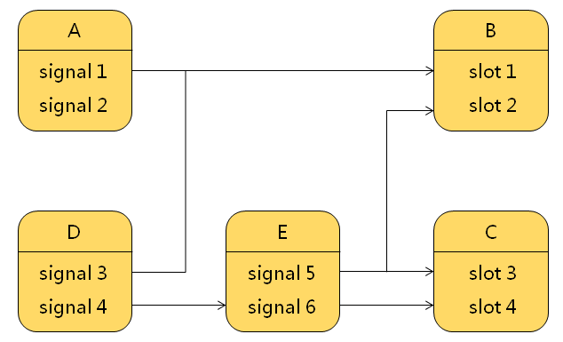

# 信号与槽

在实际的项目开发中，大多数时候是直接将组件中预定义的信号连接到槽函数；

信号发射时槽函数被调用；

## Qt 中信号（SIGNAL）的本质

- 信号只是一个特殊的成员函数声明
  - 函数的返回值是`void`类型
  - 函数只能声明不能定义

- 信号必须使用`signals`关键字进行声明
  - 函数的访问属性`自动`被设置为`protected`
  - 只能通过`emit`关键字调用函数（发射信号）


**信号定义示例**

```cpp
class Test : public QObject //只有 Qt 类才能定义信号
{
    Q_OBJECT				//必须使用宏 Q_OBJECT
        
signals:					//使用 signals 声明信号函数 //访问级别为 protected
    void testSignal(int v); //信号只能声明不能定义

public:
	void test(int i){
        emit testSignal(i);// 通过 emit 发射信号
    }
};
```

## 信号与槽的对应关系

 

- 一个信号可以连接到多个槽（一对多）
- 多个信号可以连接到一个槽（多对一）
- 一个信号可以连接到另一个信号（转嫁）
- 连接可以被皮 disconnect函数删除（移除）

**Signal.h**

```cpp
#ifndef TESTSIGNAL_H
#define TESTSIGNAL_H

#include <QObject>

class TestSignal : public QObject
{
    Q_OBJECT

public:
    void send(int i){
        emit testSignal(i);
    }
    
signals:
    void testSignal(int v);
};
#endif // TESTSIGNAL_H
```

**RxClass.h**

```cpp
#ifndef RXCLASS_H
#define RXCLASS_H

#include <QObject>
#include <QDebug>

class RxClass : public QObject
{
    Q_OBJECT
        
protected slots:
    void mySlot(int v){
        qDebug() << "void mySlot(int v)";
        qDebug() << "Sender: " << sender()->objectName();
        qDebug() << "Receiver: " << this->objectName();
        qDebug() << "Value: " << v;
        qDebug() << endl;
    }
};

#endif // RXCLASS_H
```

**mian.cpp**

```cpp
#include <QtCore/QCoreApplication>
#include <QDebug>
#include "TestSignal.h"
#include "RxClass.h"

void emit_signal()
{
    qDebug() << "emit_signal()" << endl;

    TestSignal t;
    RxClass r;

    t.setObjectName("t");
    r.setObjectName("r");

    QObject::connect(&t, SIGNAL(testSignal(int)), &r, SLOT(mySlot(int)));

    for(int i=0; i<3; i++)
    {
        t.send(i);
    }
}

void one_to_multi()
{
    qDebug() << "one_to_multi()" << endl;

    TestSignal t;
    RxClass r1;
    RxClass r2;

    t.setObjectName("t");
    r1.setObjectName("r1");
    r2.setObjectName("r2");

    QObject::connect(&t, SIGNAL(testSignal(int)), &r1, SLOT(mySlot(int)));
    QObject::connect(&t, SIGNAL(testSignal(int)), &r2, SLOT(mySlot(int)));

    t.send(100);
}

void multi_to_one()
{
    qDebug() << "multi_to_one()" << endl;

    TestSignal t1;
    TestSignal t2;
    RxClass r;

    t1.setObjectName("t1");
    t2.setObjectName("t2");
    r.setObjectName("r");

    QObject::connect(&t1, SIGNAL(testSignal(int)), &r, SLOT(mySlot(int)));
    QObject::connect(&t2, SIGNAL(testSignal(int)), &r, SLOT(mySlot(int)));

    t1.send(101);
    t2.send(102);
}

void signal_to_signal()
{
    qDebug() << "signal_to_signal()" << endl;

    TestSignal t1;
    TestSignal t2;
    RxClass r;

    t1.setObjectName("t1");
    t2.setObjectName("t2");
    r.setObjectName("r");

    QObject::connect(&t1, SIGNAL(testSignal(int)), &t2, SIGNAL(testSignal(int)));
    QObject::connect(&t2, SIGNAL(testSignal(int)), &r, SLOT(mySlot(int)));

    t1.send(101);
    t2.send(102);
}

int main(int argc, char *argv[])
{
    QCoreApplication a(argc, argv);

    // emit_signal();
    // one_to_multi();
    // multi_to_one();
    // signal_to_signal();
    
    return a.exec();
}
```

## 不可忽视的规则

1. Qt类只能在头文件中声明
2. 信号与槽的原型应该完全相同
3. 信号参数多于槽参数时，多于的参数被忽略
4. 槽函数的`返回值`必须是`void` 类型
5. 槽函数可以`像普通成员函数`一样被调用
6. 信号与槽的`访问属性`对于connect / disconnect `无效`

## 信号与槽的意义

- 最大限度的弱化了类之间的耦合关系
- 在设计阶段，可以减少不必要的接口类（抽象类）
- 在开发阶段，对象间的交互通过信号与槽动态绑定

