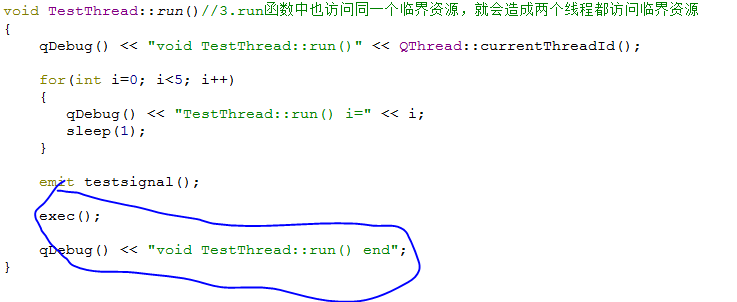

# 信号与槽

在实际的项目开发中，大多数时候是直接将组件中预定义的信号连接到槽函数；

信号发射时槽函数被调用；

## Qt 中信号（SIGNAL）的本质

- 信号只是一个特殊的成员函数声明
  - 函数的返回值是`void`类型
  - 函数只能声明不能定义

- 信号必须使用`signals`关键字进行声明
  - 函数的访问属性`自动`被设置为`protected`
  - 只能通过`emit`关键字调用函数（发射信号）


**信号定义示例**

```cpp
class Test : public QObject //只有 Qt 类才能定义信号
{
    Q_OBJECT				//必须使用宏 Q_OBJECT
        
signals:					//使用 signals 声明信号函数 //访问级别为 protected
    void testSignal(int v); //信号只能声明不能定义

public:
	void test(int i){
        emit testSignal(i);// 通过 emit 发射信号
    }
};
```

## 信号与槽的对应关系

 

- 一个信号可以连接到多个槽（一对多）
- 多个信号可以连接到一个槽（多对一）
- 一个信号可以连接到另一个信号（转嫁）
- 连接可以被皮 disconnect函数删除（移除）

**Signal.h**

```cpp
#ifndef TESTSIGNAL_H
#define TESTSIGNAL_H

#include <QObject>

class TestSignal : public QObject
{
    Q_OBJECT

public:
    void send(int i){
        emit testSignal(i);
    }
    
signals:
    void testSignal(int v);
};
#endif // TESTSIGNAL_H
```

**RxClass.h**

```cpp
#ifndef RXCLASS_H
#define RXCLASS_H

#include <QObject>
#include <QDebug>

class RxClass : public QObject
{
    Q_OBJECT
        
protected slots:
    void mySlot(int v){
        qDebug() << "void mySlot(int v)";
        qDebug() << "Sender: " << sender()->objectName();
        qDebug() << "Receiver: " << this->objectName();
        qDebug() << "Value: " << v;
        qDebug() << endl;
    }
};

#endif // RXCLASS_H
```

**mian.cpp**

```cpp
#include <QtCore/QCoreApplication>
#include <QDebug>
#include "TestSignal.h"
#include "RxClass.h"

void emit_signal()
{
    qDebug() << "emit_signal()" << endl;

    TestSignal t;
    RxClass r;

    t.setObjectName("t");
    r.setObjectName("r");

    QObject::connect(&t, SIGNAL(testSignal(int)), &r, SLOT(mySlot(int)));

    for(int i=0; i<3; i++)
    {
        t.send(i);
    }
}

void one_to_multi()
{
    qDebug() << "one_to_multi()" << endl;

    TestSignal t;
    RxClass r1;
    RxClass r2;

    t.setObjectName("t");
    r1.setObjectName("r1");
    r2.setObjectName("r2");

    QObject::connect(&t, SIGNAL(testSignal(int)), &r1, SLOT(mySlot(int)));
    QObject::connect(&t, SIGNAL(testSignal(int)), &r2, SLOT(mySlot(int)));

    t.send(100);
}

void multi_to_one()
{
    qDebug() << "multi_to_one()" << endl;

    TestSignal t1;
    TestSignal t2;
    RxClass r;

    t1.setObjectName("t1");
    t2.setObjectName("t2");
    r.setObjectName("r");

    QObject::connect(&t1, SIGNAL(testSignal(int)), &r, SLOT(mySlot(int)));
    QObject::connect(&t2, SIGNAL(testSignal(int)), &r, SLOT(mySlot(int)));

    t1.send(101);
    t2.send(102);
}

void signal_to_signal()
{
    qDebug() << "signal_to_signal()" << endl;

    TestSignal t1;
    TestSignal t2;
    RxClass r;

    t1.setObjectName("t1");
    t2.setObjectName("t2");
    r.setObjectName("r");

    QObject::connect(&t1, SIGNAL(testSignal(int)), &t2, SIGNAL(testSignal(int)));
    QObject::connect(&t2, SIGNAL(testSignal(int)), &r, SLOT(mySlot(int)));

    t1.send(101);
    t2.send(102);
}

int main(int argc, char *argv[])
{
    QCoreApplication a(argc, argv);

    // emit_signal();
    // one_to_multi();
    // multi_to_one();
    // signal_to_signal();
    
    return a.exec();
}
```

## 不可忽视的规则

1. Qt类只能在头文件中声明
2. 信号与槽的原型应该完全相同
3. 信号参数多于槽参数时，多于的参数被忽略
4. 槽函数的`返回值`必须是`void` 类型
5. 槽函数可以`像普通成员函数`一样被调用
6. 信号与槽的`访问属性`对于connect / disconnect `无效`

## 信号与槽的意义

- 最大限度的弱化了类之间的耦合关系
- 在设计阶段，可以减少不必要的接口类（抽象类）
- 在开发阶段，对象间的交互通过信号与槽动态绑定

------

# 多线程中的信号与槽

QThread类拥有发射信号和定义槽函数的能力（因为QThread继承自QObject）

**关键信号**

- void start()：线程开始运行时发射该信号

- void finished()：线程完成运行时发射该信号

- void terminated()：线程被异常中发射该信号

**概念科普**

- 进程中存在栈空间的概念（区别于栈数据结构）

- 栈空间专用于函数调用（保存函数参数、局部变量等）

- 线程拥有`独立的栈空间`（可调用其它函数）

<u>只要函数中没有访问临界资源的代码，同一个函数可以被多个线程调用，且不会产生任何副作用（因为用的自己的栈空间）</u>


**实验**

- 操作系统通过整型标识管理进程和线程
  - 进程拥有全局唯一的ID值（PID）
  - 线程拥有进程内唯一的ID值（TID）

- QThread中关键的静态成员函数
  - QThread* currentThread()
  - Qt::HANDLE currentThreadId()

<u>在主线程、MyThread线程以及各个槽函数加上打印线程的ID号后，打印结果如上所示，发现各个槽函数都是在mian函数被调用</u>

**TestThread.h**

```cpp
#ifndef TESTTHREAD_H
#define TESTTHREAD_H

#include <QThread>

class TestThread : public QThread
{
    Q_OBJECT

public:
    explicit TestThread(QObject *parent = nullptr);
    void run();

signals:
    void testsignal();

protected slots:
    void testslot();
};

#endif // TESTTHREAD_H
```

**TestThread.cpp**

```cpp
#include "TestThread.h"
#include <QDebug>

TestThread::TestThread(QObject *parent)
    : QThread{parent}
{
    connect(this, &TestThread::testsignal, this, &TestThread::testslot);
}


void TestThread::testslot(){
    qDebug() << "void TestThread::testSlot() tid = " << currentThreadId();
}

void TestThread::run() {
    qDebug() << "void TestThread::run() -- begin tid = " << currentThreadId();

    for(int i=0; i<10; i++){
        qDebug() << "TestThread::run() i=" << i;
        sleep(1);
    }

    emit testsignal();

    qDebug() << "void TestThread::run() end";
}
```

 **MyObject .h**

```cpp
#ifndef MYOBJECT_H
#define MYOBJECT_H

#include <QObject>

class MyObject : public QObject
{
    Q_OBJECT
public:
    explicit MyObject(QObject *parent = nullptr);

public slots:
    void startslot();
    void finishedslot();
    void terminatedslot();
};

#endif // MYOBJECT_H
```

**MyObject.cpp**

```cpp
#include "MyObject.h"
#include <QThread>
#include <QDebug>

MyObject::MyObject(QObject *parent) : QObject(parent){}

void MyObject::startslot(){
    qDebug() << "void MyObject::getStarted() tid = " << QThread::currentThreadId();
}

void MyObject::finishedslot(){
    qDebug() << "void MyObject::getFinished() tid = " << QThread::currentThreadId();
}

void MyObject::terminatedslot(){
    qDebug() << "void MyObject::getTerminated() tid = " << QThread::currentThreadId();
}
```

**main.cpp**

```cpp
#include <QCoreApplication>
#include <QThread>
#include "TestThread.h"
#include "MyObject.h"

int main(int argc, char *argv[])
{
    QCoreApplication a(argc, argv);

    qDebug() << "main() tid = " << QThread::currentThreadId();

    TestThread t;
    MyObject obj;
    QObject::connect(&t, &TestThread::started, &obj, &MyObject::startslot);
    QObject::connect(&t, &TestThread::finished, &obj, &MyObject::finishedslot);
    // QObject::connect(&t, &TestThread::terminate, &obj, &MyObject::terminatedslot);

    t.start();

    return a.exec();
}
```

 

## **对象的依附性**

1、对象依附于哪个线程？

默认情况下，对象依附于自身被创建的线程（如对象在主线程main()函数）中被创建，则依附于主线程）

 


2、对象的依附性与槽函数执行的关系？

默认情况下，槽函数在对象所依附的线程中调用执行

 

 

3、对象的依附性是否可以改变？

QObject::moveToThread用于改变对象的线程依赖性，使得对象的槽函数在依附的线程中被调用执行

 

 <u>线程对象依附性转移后m的槽函数都不执行了</u>


## **线程中的事件循环**

子线程的事件循环用来支持信号与槽的机制（让槽函数在线程中被调用）


**线程中的事件循环**

1. 信号与槽的机制`需要事件循环的支持`

2. QThread类中提供exec()函数用于`开启线程事件循环`

3. 只有开启事件循环，槽函数才能在信号发送后被调用


**线程的事件循环机制**

1. 信号发送后首先到事件队列

2. 开启事件循环后就会到事件队列里面不断取信号

3. 然后调用相应的槽函数

 

 

**实验**

1. 前提条件：对象依附的线程开启了事件循环

2. 后置结果：对象中的槽函数在依附的线程中被调用执行

```cpp
#ifndef MYOBJECT_H
#define MYOBJECT_H

#include <QObject>

class MyObject : public QObject
{
    Q_OBJECT
public:
    explicit MyObject(QObject *parent = nullptr);

public slots:
    void startslot();
    void testSlot();
};

#endif // MYOBJECT_H
```

```cpp
#include "MyObject.h"
#include <QThread>
#include <QDebug>

MyObject::MyObject(QObject *parent) : QObject(parent){}

void MyObject::startslot(){
    qDebug() << "void MyObject::getStarted() tid = " << QThread::currentThreadId();
}

void MyObject::testSlot(){
    qDebug() << "void MyObject::testSlot() tid = " << QThread::currentThreadId();
}
```

```cpp
#ifndef TESTTHREAD_H
#define TESTTHREAD_H

#include <QThread>

class TestThread : public QThread
{
    Q_OBJECT

public:
    explicit TestThread(QObject *parent = nullptr);
    void run();

signals:
    void testsignal();

protected slots:
    void testslot();
};

#endif // TESTTHREAD_H
```

```cpp
#include "TestThread.h"
#include <QDebug>

TestThread::TestThread(QObject *parent)
    : QThread{parent}
{
    connect(this, &TestThread::testsignal, this, &TestThread::testslot);
}


void TestThread::testslot(){
    qDebug() << "void TestThread::testSlot() tid = " << currentThreadId();
}

void TestThread::run() {
    qDebug() << "void TestThread::run() tid = " << currentThreadId();

    for(int i=0; i<5; i++){
        qDebug() << "TestThread::run() i=" << i;
        sleep(1);
    }

    emit testsignal();

    exec(); //注意：在这里exec后面的语句不再执行

    qDebug() << "void TestThread::run() end";
}
```

```cpp
#include <QCoreApplication>
#include <QThread>
#include "TestThread.h"
#include "MyObject.h"

int main(int argc, char *argv[])
{
    QCoreApplication a(argc, argv);

    qDebug() << "main() tid = " << QThread::currentThreadId();

    TestThread t;
    MyObject obj;
    QObject::connect(&t, &TestThread::started, &obj, &MyObject::startslot);
    QObject::connect(&t, &TestThread::testsignal, &obj, &MyObject::testSlot);

    obj.moveToThread(&t);
    t.moveToThread(&t);
    t.start();

    return a.exec();
}
```

## **槽函数的具体执行线程的意义**

当信号的发送与对应的槽函数不在同一线程时，可能发生临界资源的竞争问题

```cpp
#include "TestThread.h"
#include <QDebug>
 
TestThread::TestThread(QObject *parent) :
    QThread(parent)
{
    connect(this, SIGNAL(testsignal()), this, SLOT(testslot()));//1.如果testslot()槽函数在main中被调用
}
 
void TestThread::testslot()//2.且在槽函数中访问TestThread的某个临界资源
{
    qDebug() << "void TestThread::testslot()" << QThread::currentThreadId();
}
 
 void TestThread::run()//3.run函数中也访问同一个临界资源，就会造成两个线程都访问临界资源
 {
     qDebug() << "void TestThread::run()" << QThread::currentThreadId();
 
     for(int i=0; i<5; i++)
     {
        qDebug() << "TestThread::run() i=" << i;
        sleep(1);
     }
 
     emit testsignal();
 
     exec();
 
     qDebug() << "void TestThread::run() end";
 }
```


**线程体函数开启了事件循环，线程如何正常结束**

- QThread::exec()使得线程进入事件循环
  - 事件循环结束前，exec()后的语句无法执行
  - quit()和exit()函数用于结束事件循环
  - quit() <---->exit(0)，exec()的返回值由exit()参数决定

> **注意**
>
> 无论事件循环是否开启，信号发送后会直接进入所依附线程的事件队列
>
> 然而，只有开启了事件循环，对应的槽函数才会在线程中被调用 

 

 

 


## **什么时候需要开启事件循环**

- 设计原则
  - 事务性操作（间断性IO操作，等）可以开启线程的事件循环
  - 每次操作通过发送信号的方式使得槽函数在子线程中执行


- 概念科普：文件缓冲区（文件操作是事务性操作）
  - 默认情况下，文件操作时会开辟一段内存作为缓冲区
  - 向文件中写入的数据会先进入缓冲区
  - 只有当缓冲区满或者遇到换行符时才将数据写入磁盘
  - 缓冲区的意义在于：减少磁盘的低级IO操作，提高文件读写效率（但存在风险）


- Qt线程的使用模式
  - 无事件循环模式：后台执行常时间的耗时任务（文件复制、网络读取等）
  - 开启事件循环模式：执行事务性操作（文件写入，数据库写入等）


<u>开启一个线程，线程里边只需要开启事件循环，然后将槽函数，通过对象的依附性转移来将槽函数移到线程执行，最后不要忘了在析构函数中终止线程的执行</u>


**FileWrite.h**

```cpp
#ifndef FILEWRITE_H
#define FILEWRITE_H
 
#include <QObject>
#include <QFile>
#include <QString>
#include <QThread>
 
class FileWrite : public QObject
{
    Q_OBJECT
 
private:
    class writeThread : public QThread//记得是public继承
    {
    protected:
        void run();
    };
    QFile* m_file;
    writeThread thread;
 
public:
    explicit FileWrite(QString path, QObject *parent = 0);
    bool fileOpen();
    void fileWrite(const char* text);
    void fileClose();
 
signals:
    void testWrite(const char* text);
    void testClose();
 
protected slots:
    void writeSlot(const char* text);
    void closeSlot();
 
 
};
 
#endif // FILEWRITE_H
```

**FileWrite.cpp**

```cpp
#include "FileWrite.h"
#include <QIODevice>
#include <QDebug>
 
FileWrite::FileWrite(QString path, QObject *parent) :
    QObject(parent)
{
    m_file = new QFile(path, this);
 
    connect(this, SIGNAL(testWrite(const char*)), this, SLOT(writeSlot(const char*)));
    connect(this, SIGNAL(testClose()), this, SLOT(closeSlot()));
 
    moveToThread(&thread);//这句话极其重要，将槽函数移到线程中执行
 
    thread.start();
}
 
bool FileWrite::fileOpen()
{
    return m_file->open(QIODevice::WriteOnly | QIODevice::Text);
}
void FileWrite::fileWrite(const char* text)
{
    emit testWrite(text);
}
void FileWrite::fileClose()
{
    emit testClose();
}
FileWrite::~FileWrite()//析构函数中终止线程执行
{
    thread.quit();
}
 
/**************************************槽函数******************************************/
void FileWrite::writeSlot(const char* text)
{
    qDebug() << "void FileWrite::writeSlot(const char* text) tid = " << QThread::currentThreadId();
 
    m_file->write(text);
    m_file->flush();//每次写的时候都直接写入文件，进行低级的IO操作,比较耗时
}
void FileWrite::closeSlot()
{
    qDebug() << "void FileWrite::closeSlot() tid= " << QThread::currentThreadId();
 
    m_file->close();
}
/***********************************线程的函数*****************************************/
void FileWrite::writeThread::run()
{
    qDebug() << "void FileWrite::writeThread::run() tid= " << QThread::currentThreadId();
    exec();
}
```

**main.cpp**

```cpp
#include <QtCore/QCoreApplication>
#include "FileWrite.h"
 
int main(int argc, char *argv[])
{
    QCoreApplication a(argc, argv);
 
    FileWrite file("C:/Users/LGC/Desktop/test.txt");
 
    if(file.fileOpen());
    {
        file.fileWrite("Hello word\n");
        file.fileWrite("你好，世界\n");
        file.fileWrite("软件学院,成就梦想\n");
        file.fileClose();
    }
    
    return a.exec();
}
```

 

 

------

# 信号与槽的连接方式

**深入信号与槽的连接方式**

1. Qt::DirectConnection : 立即调用

2. Qt::QueuedConnection : 异步调用

3. Qt::BlockingQueuedConnection ： 同步调用

4. Qt::AutoConnection ： 默认连接

5. Qt::UniqueConnection : 单一连接


**信号与槽的连接方式决定槽函数调用时候的相关行为**

 


 **知识回顾**

1. 每一个线程都有自己的事件队列

2. 线程通过事件队列接收信号

3. 信号在事件队列里被处理

 

## **各种连接方式详述**

<u>MyThread对象的run函数发射对象给MyObject的槽</u>

**MyObject.h**

```cpp
#ifndef MYOBJECT_H
#define MYOBJECT_H
 
#include <QObject>
 
class MyObject : public QObject
{
    Q_OBJECT
public:
    explicit MyObject(QObject *parent = 0);
    
signals:
    
protected slots:
    void testSlot();
};
 
#endif // MYOBJECT_H
```

**MyObject.cpp**

```cpp
#include "MyObject.h"
#include <QDebug>
#include <QThread>
 
MyObject::MyObject(QObject *parent) :
    QObject(parent)
{
}
void MyObject::testSlot()
{
    qDebug() << "void MyObject::testSlot() tid=" << QThread::currentThreadId();
}
```

**MyThread.h**

```cpp
#ifndef MYTHREAD_H
#define MYTHREAD_H
 
#include <QThread>
 
class MyThread : public QThread
{
    Q_OBJECT
public:
    explicit MyThread(QObject *parent = 0);
    
signals:
    void testSignal();
private:
    void run();
};
 
#endif // MYTHREAD_H
```

**MyThread.cpp**

```cpp
#include "MyThread.h"
#include <QDebug>
 
MyThread::MyThread(QObject *parent) :
    QThread(parent)
{
}
 
void MyThread::run()
{
    qDebug() << "void MyThread::run() tid=" << QThread::currentThreadId();
 
    for(int i=0; i<2; i++)
    {
        qDebug() << "void MyThread::run() i=" << i;
 
        sleep(1);
    }
    emit testSignal();
 
    qDebug() << "void MyThread::run() end";
}
```

**main.cpp**

```cpp
#include <QtCore/QCoreApplication>
#include "MyObject.h"
#include "MyThread.h"
#include <QDebug>
 
void Direct_connect()
{
    static MyObject m;//m和t都是依附于主函数
    static MyThread t;
    QObject::connect(&t, SIGNAL(testSignal()),&m, SLOT(testSlot()), Qt::DirectConnection);
 
    t.start();
    t.wait(5*1000);
    t.quit();
}
void Queued_connect()
{
    static MyObject m;//m和t都是依附于主函数
    static MyThread t;
    QObject::connect(&t, SIGNAL(testSignal()),&m, SLOT(testSlot()), Qt::QueuedConnection);
 
    t.start();
    t.wait(5*1000);
    t.quit();
}
void BlockingQueued_connect()
{
    static MyObject m;//m和t都是依附于主函数
    static MyThread t;
    QObject::connect(&t, SIGNAL(testSignal()),&m, SLOT(testSlot()), Qt::BlockingQueuedConnection);
 
    t.start();
    t.wait(5*1000);
    t.quit();
}
void Auto_connect()
{
    static MyObject m;//m和t都是依附于主函数
    static MyThread t;
    QObject::connect(&t, SIGNAL(testSignal()),&m, SLOT(testSlot()), Qt::AutoConnection);
 
    t.start();
    t.wait(5*1000);
    t.quit();
}
void Unique_connect()
{
    static MyObject m;//m和t都是依附于主函数
    static MyThread t;
    //连接两次只调用一次
    QObject::connect(&t, SIGNAL(testSignal()),&m, SLOT(testSlot()), Qt::UniqueConnection);
    QObject::connect(&t, SIGNAL(testSignal()),&m, SLOT(testSlot()), Qt::UniqueConnection);
 
    t.start();
    t.wait(5*1000);
    t.quit();
}
int main(int argc, char *argv[])
{
    QCoreApplication a(argc, argv);
    
    qDebug() << "int main(int argc, char *argv[]) tid=" << QThread::currentThreadId();
 
    //Direct_connect();
    //Queued_connect();
    //BlockingQueued_connect();
   // Auto_connect();
    Unique_connect();
 
    return a.exec();
}
```


**1、Qt::DirectConnection : 立即调用**

直接在发送信号的线程中调用槽函数，等价于槽函数的实时调用

 

```shell
//打印结果 
int main(int argc, char *argv[]) tid= 0x1abc
void MyThread::run() tid= 0x191c
void MyThread::run() i= 0
void MyThread::run() i= 1
void MyObject::testSlot() tid= 0x191c//槽函数在发射的线程中被调用，且比MyThread::run() end先打印，说明是相当于之间调用
void MyThread::run() end
```

**2、Qt::QueuedConnection : 异步调用**

信号发送到目标线程（目标线程由对象依赖性决定）的事件队列中，由目标线程处理，当前线程继续往下执行

 

```shell
//打印结果
int main(int argc, char *argv[]) tid= 0x1aec
void MyThread::run() tid= 0x1b5c
void MyThread::run() i= 0
void MyThread::run() i= 1
void MyThread::run() end
void MyObject::testSlot() tid= 0x1aec//在所依附的线程（主线程中被调用），且比void MyThread::run() end后打印，说明发射信号后线程继续往下执行，为异步调用
```

**3、Qt::BlockingQueuedConnection ： 同步调用**

信号发送到目标线程的事件队列中，由目标线程处理；当前线程等待槽函数返回，之后继续往下执行

注意：目标线程和当前线程必须不同

 

 ```shell
 //打印结果
 int main(int argc, char *argv[]) tid= 0x18c4
 void MyThread::run() tid= 0x1bf8
 void MyThread::run() i= 0
 void MyThread::run() i= 1
 void MyObject::testSlot() tid= 0x18c4//在void MyThread::run() end前打印，说明得等槽函数返回才继续往下执行
 void MyThread::run() end
 ```

**4、Qt::AutoConnection ： 默认连接**

AutoConnection 是connect函数第五个参数的默认值，也是工程中最常用的连接方式

 

```shell
int main(int argc, char *argv[]) tid= 0x1988
void MyThread::run() tid= 0x1970
void MyThread::run() i= 0
void MyThread::run() i= 1
void MyThread::run() end
void MyObject::testSlot() tid= 0x1988
```

**5、Qt::UniqueConnection : 单一连接**

- 描述：
  - 功能与AutoConnection相同，自动确定连接类型
  - 同一个信号与同一个槽函数`只有连接一次`

- 小知识
  - 默认情况下，同一个信号可以多次连接到同一个槽函数
  - 多次连接意味着同一个槽函数的多次调用

```shell
int main(int argc, char *argv[]) tid= 0x37c
void MyThread::run() tid= 0x1b70
void MyThread::run() i= 0
void MyThread::run() i= 1
void MyThread::run() end
void MyObject::testSlot() tid= 0x37c//只调用一次
```

 

