# 进程

- 程序是计算机存储系统中的文件数据
  - 源代码：文本文件，描述程序的行为和功能
  - 可执行程序：二进制文件，直接加载并执行

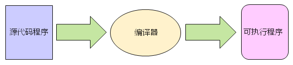 


**进程的概念**

- 广义概念：程序关于某个数据集合的运行活动

- 狭义概念：程序被加载到内存中执行后得到进程


**程序和进程的区别**

- 程序是硬盘中的静态文件：存储系统中的一段二进制表示

- 进程是内存中动态的运行实体：数据段、代码段、指针等


**程序和进程的联系**

（有进程一定有程序，但有程序不一定有进程）

- 一个程序可能对于多个进程：一个程序多次运行，每次运行产生一个进程

- 一个进程可能包含多个程序：一个程序依赖多个其它动态库


> **值得注意的地方**
>
> 在当代操作系统中，`资源分配的基本单位是进程`
>
> 而`CPU调度执行的基本单位是线程`（相当于在CPU眼中根本没有进程）


# **线程**

- 进程中的一个执行单元（进程只是资源的集合，这些资源由线程来使用）

- 操作系统中一个可调度的实体

- 进程相对独立的一个控制流序体

- 执行时的现场数据和其它调度所需要的信息


**main函数**

线程是进程使用CPU资源的基本单位

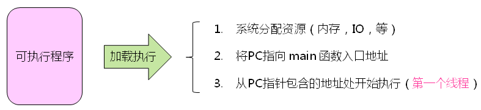 


**深入理解进程和线程**

- 进程中可以存在`多个线程`共享资源

- 线程是被调度的执行单元，而进程`不是调度单元`（进程想要使用CPU资源就必须借助线程）

- `线程不能脱离进程独立存在`，只能依赖于进程执行（因为资源是分配个进程的，进程是操作系统分配资源的基本单位）
- 线程有生命期，有诞生和死亡

- `任意线程都可以创建`其它新的线程

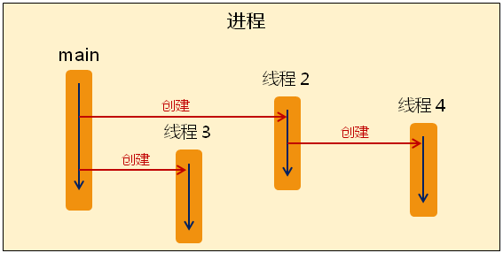 

**小结**

1. 程序是物理存储空间中的数据文件

2. 进程是程序运行后得到的执行实体

3. 线程是进程内部的具体执行单元

4. 一个进程内部可以有多个线程存在

5. 进程是操作系统分配资源的基本单位

6. 线程是操作系统调度执行的基本单位

# 多线程

Qt通过QThread直接支持多线程

- QThread是一个跨平台的多线程解决方案

- QThread以简洁易用的方式实现多线程编程

- 注意
  - Qt中的线程以对象的形式被创建和使用
  - 每一个线程对应着一个QThread对象

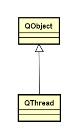 

 

**QThread中的关键成员函数**

- void run() ：线程体函数，用于定义线程功能（执行流）（相当于主线程的入口函数main()）

- void start() : 启动函数，将线程入口地址设置为run函数

- void terminate() : 强制结束线程（**不推荐**）


**QThread编程实例**

子线程类：

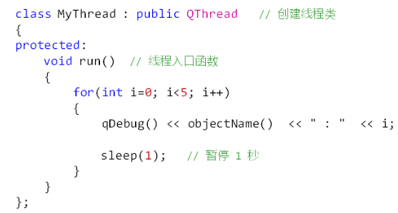 

 在主线程中创建子线程：

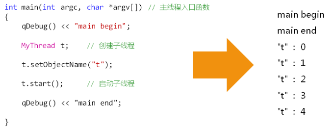 

 <u>**注意：示例中主线程将先于子线程结束，所有线程都结束后，进程结束**</u>


创建多线程

```cpp
class MyThread : public QThread{

protected:
    void run(){
        qDebug() << objectName() << "run() begin";
        for (int i = 0; i < 5; ++i) {
            qDebug() << objectName() << i;
            sleep(i);
        }
        qDebug() << objectName() << "run() end";
    }
};

int main(int argc, char *argv[])
{
    QCoreApplication a(argc, argv);
    qDebug()<< "main() begin";

    MyThread t1;
    t1.setObjectName("t1");
    t1.start();

    MyThread t2;
    t2.setObjectName("t2");
    t2.start();

    qDebug() << "main() end";

    return a.exec();
}
```


**线程的生命周期**

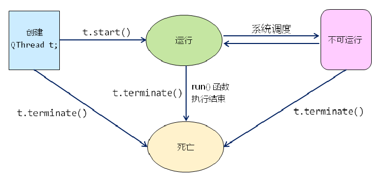 

 **重点注意**

在工程开发中terminate() 是禁止使用的，terminate()会使得操作系统暴力终止线程，而不会考虑数据完整性，资源释放等问题


**线程终止的解决思路**

1. run()函数执行结束是优雅终止线程的唯一方式

2. 在线程类中增加标志变量m_toStop(volatile bool类型，一定注意不要让编译器优化)

3. 通过m_toStop的值判断是否需要从run函数中返回

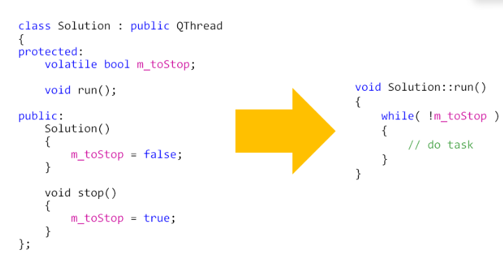 


**结束线程实例**

```cpp
#include <QCoreApplication>
#include <QThread>

class Sample : public QThread {

protected:
    QAtomicInteger<bool> m_toStop;

    void run() override {
        qDebug() << objectName() << " : begin";
        auto p = new int[1000];

        for (int i = 0; !m_toStop && (i < 10); ++i) {
            qDebug() << objectName() << ":" << i;
            p[i] = i*i*i;
            msleep(500);
        }
        delete[] p;
        qDebug() << objectName() << ": end";
    }
public:
    Sample() : m_toStop(false) {}

    void stop() { m_toStop = true; }
};

int main(int argc, char *argv[])
{
    QCoreApplication a(argc, argv);

    qDebug() << "main begin";
    Sample t;
    t.setObjectName("t");
    t.start();

    for (int i = 0; i < 1000; ++i) {
        for (int j = 0; j < 1000; ++j) {

        }
    }

    t.stop();
    //t.terminate();
    qDebug() << "main end";

    return a.exec();
}
```

## 多线程编程的本质

- `并发性`是多线程编程的本质
- 在宏观上，`所有线程并行执行`
- 多个线程间`相对独立`，互不干涉

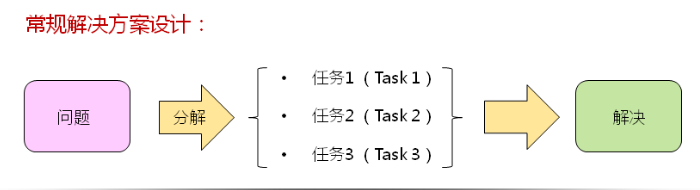 

**常规解决方案设计**

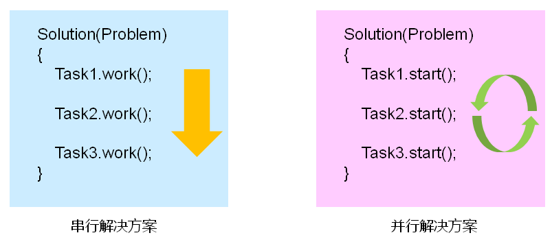 

<u>**特殊情况下，多线程存在依赖**</u>

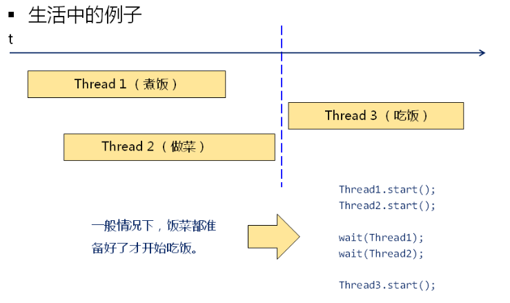 

**同步的概念**

- 在特殊情况下，`控制多线程间的相对执行顺序`
- QThread类支持线程间的同步

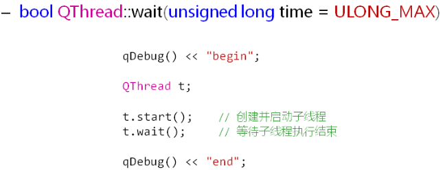 

**wait()函数的使用**

```cpp
#include <QCoreApplication>
#include <QThread>
#include <QDebug>
 
/*
 * sum(n) = 1 + 2 + 3 + ... + n
 * sum(1000) ==>分解成3个任务
 *          [1, 1000] = [1, 300] [301, 600] [601, 1000]
 */
 
class Calculator : public QThread
{
protected:
    int m_begin;
    int m_end;
    int m_result;
 
    void run()
    {
        qDebug() << objectName() << " : run() begin";
 
        for(int i=m_begin; i<=m_end; i++)
        {
            m_result += i;
            msleep(10);
        }
 
         qDebug() << objectName() << " : run() end";
    }
 
public:
    Calculator(int begin, int end)
    {
        m_begin = begin;
        m_end = end;
        m_result = 0;
    }
 
    //模拟串行解决方案
    void work()
    {
         run();
    }
 
    int getResult()
    {
        return m_result;
    }
};
 
int main(int argc, char *argv[])
{
    QCoreApplication a(argc, argv);
 
    qDebug() << "main begin";
 
    Calculator cal1(1, 300);    //任务1
    Calculator cal2(301, 600);  //任务2
    Calculator cal3(601, 1000); //任务3
 
    cal1.setObjectName("cal1");
    cal2.setObjectName("cal2");
    cal3.setObjectName("cal3");
 
    //模拟串行解决方案（将run函数作为一般的成员函数调用）
    //cal1.work();  //先完成任务1
    //cal2.work();  //再完成任务2
    //cal3.work();  //最后完成任务3
    //int result = cal1.getResult() + cal2.getResult() + cal3.getResult();
    //qDebug() << "result = " << result;
 
    //并行解决方案（利用多线程解决）
    cal1.start(); //启动线程1
    cal2.start(); //启动线程2
    cal3.start();  //启动线程3
 
    cal1.wait();  //等待线程1结束
    cal2.wait();  //等待线程2结束
    cal3.wait();  //等待线程3结束
 
    int result = cal1.getResult() + cal2.getResult() + cal3.getResult();//必须等三个子线程结束后再进行结果的相加，否则将出现错误
    qDebug() << "result = " << result;
 
    qDebug() << "main end";
 
    return a.exec();
}
```

