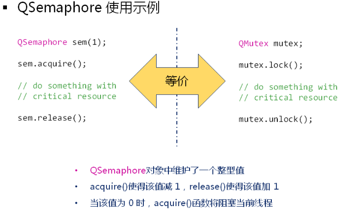

# 进程

- 程序是计算机存储系统中的文件数据
  - 源代码：文本文件，描述程序的行为和功能
  - 可执行程序：二进制文件，直接加载并执行

 


**进程的概念**

- 广义概念：程序关于某个数据集合的运行活动

- 狭义概念：程序被加载到内存中执行后得到进程


**程序和进程的区别**

- 程序是硬盘中的静态文件：存储系统中的一段二进制表示

- 进程是内存中动态的运行实体：数据段、代码段、指针等


**程序和进程的联系**

（有进程一定有程序，但有程序不一定有进程）

- 一个程序可能对于多个进程：一个程序多次运行，每次运行产生一个进程

- 一个进程可能包含多个程序：一个程序依赖多个其它动态库


> **值得注意的地方**
>
> 在当代操作系统中，`资源分配的基本单位是进程`
>
> 而`CPU调度执行的基本单位是线程`（相当于在CPU眼中根本没有进程）


# **线程**

- 进程中的一个执行单元（进程只是资源的集合，这些资源由线程来使用）

- 操作系统中一个可调度的实体

- 进程相对独立的一个控制流序体

- 执行时的现场数据和其它调度所需要的信息


**main函数**

线程是进程使用CPU资源的基本单位

 


**深入理解进程和线程**

- 进程中可以存在`多个线程`共享资源

- 线程是被调度的执行单元，而进程`不是调度单元`（进程想要使用CPU资源就必须借助线程）

- `线程不能脱离进程独立存在`，只能依赖于进程执行（因为资源是分配个进程的，进程是操作系统分配资源的基本单位）
- 线程有生命期，有诞生和死亡

- `任意线程都可以创建`其它新的线程

 

**小结**

1. 程序是物理存储空间中的数据文件

2. 进程是程序运行后得到的执行实体

3. 线程是进程内部的具体执行单元

4. 一个进程内部可以有多个线程存在

5. 进程是操作系统分配资源的基本单位

6. 线程是操作系统调度执行的基本单位

# 多线程

Qt通过QThread直接支持多线程

- QThread是一个跨平台的多线程解决方案

- QThread以简洁易用的方式实现多线程编程

- 注意
  - Qt中的线程以对象的形式被创建和使用
  - 每一个线程对应着一个QThread对象

 

 

**QThread中的关键成员函数**

- void run() ：线程体函数，用于定义线程功能（执行流）（相当于主线程的入口函数main()）

- void start() : 启动函数，将线程入口地址设置为run函数

- void terminate() : 强制结束线程（**不推荐**）


**QThread编程实例**

子线程类：

 

 在主线程中创建子线程：

 

 <u>**注意：示例中主线程将先于子线程结束，所有线程都结束后，进程结束**</u>


创建多线程

```cpp
class MyThread : public QThread{

protected:
    void run(){
        qDebug() << objectName() << "run() begin";
        for (int i = 0; i < 5; ++i) {
            qDebug() << objectName() << i;
            sleep(i);
        }
        qDebug() << objectName() << "run() end";
    }
};

int main(int argc, char *argv[])
{
    QCoreApplication a(argc, argv);
    qDebug()<< "main() begin";

    MyThread t1;
    t1.setObjectName("t1");
    t1.start();

    MyThread t2;
    t2.setObjectName("t2");
    t2.start();

    qDebug() << "main() end";

    return a.exec();
}
```


**线程的生命周期**

 

 **重点注意**

在工程开发中terminate() 是禁止使用的，terminate()会使得操作系统暴力终止线程，而不会考虑数据完整性，资源释放等问题


**线程终止的解决思路**

1. run()函数执行结束是优雅终止线程的唯一方式

2. 在线程类中增加标志变量m_toStop(volatile bool类型，一定注意不要让编译器优化)

3. 通过m_toStop的值判断是否需要从run函数中返回

 


**结束线程实例**

```cpp
#include <QCoreApplication>
#include <QThread>

class Sample : public QThread {

protected:
    QAtomicInteger<bool> m_toStop;

    void run() override {
        qDebug() << objectName() << " : begin";
        auto p = new int[1000];

        for (int i = 0; !m_toStop && (i < 10); ++i) {
            qDebug() << objectName() << ":" << i;
            p[i] = i*i*i;
            msleep(500);
        }
        delete[] p;
        qDebug() << objectName() << ": end";
    }
public:
    Sample() : m_toStop(false) {}

    void stop() { m_toStop = true; }
};

int main(int argc, char *argv[])
{
    QCoreApplication a(argc, argv);

    qDebug() << "main begin";
    Sample t;
    t.setObjectName("t");
    t.start();

    for (int i = 0; i < 1000; ++i) {
        for (int j = 0; j < 1000; ++j) {

        }
    }

    t.stop();
    //t.terminate();
    qDebug() << "main end";

    return a.exec();
}
```

## 多线程编程的本质

- `并发性`是多线程编程的本质
- 在宏观上，`所有线程并行执行`
- 多个线程间`相对独立`，互不干涉

 

**常规解决方案设计**

 

<u>**特殊情况下，多线程存在依赖**</u>

 

**同步的概念**

- 在特殊情况下，`控制多线程间的相对执行顺序`
- QThread类支持线程间的同步

 

**wait()函数的使用**

```cpp
#include <QCoreApplication>
#include <QThread>
#include <QDebug>
 
/*
 * sum(n) = 1 + 2 + 3 + ... + n
 * sum(1000) ==>分解成3个任务
 *          [1, 1000] = [1, 300] [301, 600] [601, 1000]
 */
 
class Calculator : public QThread
{
protected:
    int m_begin;
    int m_end;
    int m_result;
 
    void run()
    {
        qDebug() << objectName() << " : run() begin";
 
        for(int i=m_begin; i<=m_end; i++)
        {
            m_result += i;
            msleep(10);
        }
 
         qDebug() << objectName() << " : run() end";
    }
 
public:
    Calculator(int begin, int end)
    {
        m_begin = begin;
        m_end = end;
        m_result = 0;
    }
 
    //模拟串行解决方案
    void work()
    {
         run();
    }
 
    int getResult()
    {
        return m_result;
    }
};
 
int main(int argc, char *argv[])
{
    QCoreApplication a(argc, argv);
 
    qDebug() << "main begin";
 
    Calculator cal1(1, 300);    //任务1
    Calculator cal2(301, 600);  //任务2
    Calculator cal3(601, 1000); //任务3
 
    cal1.setObjectName("cal1");
    cal2.setObjectName("cal2");
    cal3.setObjectName("cal3");
 
    //模拟串行解决方案（将run函数作为一般的成员函数调用）
    //cal1.work();  //先完成任务1
    //cal2.work();  //再完成任务2
    //cal3.work();  //最后完成任务3
    //int result = cal1.getResult() + cal2.getResult() + cal3.getResult();
    //qDebug() << "result = " << result;
 
    //并行解决方案（利用多线程解决）
    cal1.start(); //启动线程1
    cal2.start(); //启动线程2
    cal3.start();  //启动线程3
 
    cal1.wait();  //等待线程1结束
    cal2.wait();  //等待线程2结束
    cal3.wait();  //等待线程3结束
 
    int result = cal1.getResult() + cal2.getResult() + cal3.getResult();//必须等三个子线程结束后再进行结果的相加，否则将出现错误
    qDebug() << "result = " << result;
 
    qDebug() << "main end";
 
    return a.exec();
}
```

## **多线程间的互斥**

**生产消费者问题**

1. 有n个生产者同时制造产品，并把产品放入仓库中

2. 有m个消费者同时从仓库中取出产品

3. 规则


- 当仓库未满，任意生产者可以存入产品

- 当仓库未空，任意消费者可以取出产品


**生活中的线程互斥例子**

标示牌用于指示是否可用：

 

红绿灯标识十字路口是否可用：

 

 

**线程互斥的相关概念**

1. 临界资源（Critical Resource）：`每次只允许一个线程访问`（读/写）的资源

2. 线程间的互斥（竞争）：多个线程在同一个时间都需要访问临界资源

3. QMutex类是一把线程锁，保证`线程间的互斥`：利用线程锁能够保证临界资源的安全性


### QMutex中的关键成员函数

锁就是类似上面两个生活中例子的标识

**void lock()**

- 当锁空闲时，获取锁并继续执行

- 当锁别人被获取，堵塞并等待锁释放

**void unlock()**

- 释放锁（同一把锁的获取和释放必须在同一线程中成对出现）

 

 

**用线程锁解决生产消费者的问题实例**

```cpp
#include <QCoreApplication>
#include <QThread>
#include <QMutex>
#include <QDebug>

#define MAXSTORAGE 10

static QString g_store;
static QMutex g_mutex;

class Producer : public QThread{

protected:
    void run() override{
        int count {0};
        while (true) {
            g_mutex.lock();
            if(g_store.size() <= MAXSTORAGE){

                g_store.append(QString::number((count++) % 10));
                qDebug() << objectName() << ":" + g_store;
            }
            g_mutex.unlock();
            msleep(1);
        }
    }
};

class Customer : public QThread{

protected:
    void run() override{
        while (true) {
            g_mutex.lock();
            if(g_store.size() > 0){
                g_store.remove(0,1);
                qDebug() << objectName() << ":" + g_store;
            }
            g_mutex.unlock();
            msleep(1);
        }
    }
};

int main(int argc, char *argv[])
{
    QCoreApplication a(argc, argv);

    qDebug() << "main begin";

    Producer p;
    Customer c;

    p.setObjectName("Produer");
    c.setObjectName("Customer");

    p.start();
    c.start();

    qDebug() << "main end";

    return a.exec();
}
```

**小结**

- 临界资源每次`只允许一个线程`访问（读/写）

- 线程锁（QMutex）用于保护临界资源

- 线程只有`获取锁之后才能访问`临界资源

- 锁被其它线程获取时，当前线程处于等待状态

- 线程锁的`获取和释放`必须在同一线程中`成对出现`


**程序的临界资源与线程锁的数量关系**

一般性原则：每一个临界资源都需要一个线程锁进行保护

 


### 死锁的概念

线程间相互等待资源而造成彼此无法继承执行

**发生死锁的条件**

1. 系统中存在多个临界资源且临界资源不可抢占（每次只有一个线程使用）
2. 线程需要多个临界资源才能继续执行

 

**死锁的产生**

```cpp
#include <QCoreApplication>
#include <QThread>
#include <QMutex>
#include <QDebug>
 
static QMutex g_mutex_1;
static QMutex g_mutex_2;
 
class ThreadA : public QThread{
    
protected:
    void run(){
        while(true){
            g_mutex_1.lock();//获取第一把锁后就会去等待第二把锁，但第二把锁可能已经被另一个线程获取，会一直死等
            g_mutex_2.lock();
 
            qDebug() << objectName() << " doing work";
            
            g_mutex_2.unlock();
            g_mutex_1.unlock();
        }
    }
};
 
class ThreadB : public QThread{
    
protected:
    void run(){
        while(true){
            g_mutex_2.lock();
            g_mutex_1.lock();
 
            qDebug() << objectName() << " doing work";
 
            g_mutex_1.unlock();
            g_mutex_2.unlock();
        }
    }
};
 
int main(int argc, char *argv[]){
    QCoreApplication a(argc, argv);
 
    ThreadA ta;
    ThreadB tb;
 
    ta.setObjectName("ta");
    tb.setObjectName("tb");
 
    ta.start();
    tb.start();
 
    return a.exec();
}
```

**死锁的避免**

1. 对所有的临界资源都分配`唯一`一个序号（r1，r2，r3，...，rn）

2. 对应的线程锁也分配同样的序号（m1，m2，m3，..., mn）

3. 系统中的每个线程按照严格`递增的次序`请求资源

 


### 信号量

1. 信号量是`特殊的线程锁`

2. 信号量`允许多个线程同时访问`临界资源

3. Qt中直接支持信号量（QSemaphore）

 

**使用信号量解决多个生产消费者的问题**

```cpp
#include <QCoreApplication>
#include <QThread>
#include <QDebug>
#include <QSemaphore>

const int SIZE = 5;
unsigned char g_buff[SIZE] = {0};
QSemaphore g_sem_free(SIZE);
QSemaphore g_sem_used(0);

class Producer : public QThread{

protected:
    void run() override{
        while (true) {
            int value = rand() % 256;
            g_sem_free.acquire();

            for(int i {0}; i < SIZE; ++i){
                if(!g_buff[i]){
                    g_buff[i] = value;
                    qDebug() << objectName() << " generate: {" << i << ", " << value << "}";
                    break;
                }
            }
            g_sem_used.release();
            sleep(1);
        }
    }
};

class Customer : public QThread{

protected:
    void run() override{
        while (true) {
            g_sem_used.acquire();
            for(int i {0}; i < SIZE; ++i){
                if(g_buff[i]){
                    int value = g_buff[i];
                    g_buff[i] = 0;
                    qDebug() << objectName() << " generate: {" << i << ", " << value << "}";
                    break;
                }
            }
            g_sem_free.release();
            sleep(2);
        }
    }
};

int main(int argc, char *argv[])
{
    QCoreApplication a(argc, argv);

    Producer p1;
    Producer p2;
    Producer p3;

    p1.setObjectName("p1");
    p2.setObjectName("p2");
    p3.setObjectName("p3");

    Customer c1;
    Customer c2;

    c1.setObjectName("c1");
    c2.setObjectName("c2");

    p1.start();
    p2.start();
    p3.start();

    c1.start();
    c2.start();

    return a.exec();
}
```


## **银行家算法**

**问题描述**

研究银行家如何将总数 一定的资金，安全地借给若干个顾客，使顾客既能满足对资金的需求，也使银行家可以收回自己的全部资金，不至于破产；

**限制条件**

1. 每个顾客在借款前必须提前说明所需资金总额

2. 每次借钱都是以一个单位进行（如，一个单位为一万人民币）

3. 顾客在拿到一个单位的借款前可能需要等待

4. 银行保证顾客的等待事件是有限的（借或者不借）

**算法实例**

 

**算法策略**

将资金优先借给需求较少的客户

**应用场景**

1. 操作系统内核中的进程管理

2. 数据库内核中的频繁事务管理

**Qt中算法实施方案**

- 使用多线程机制模拟客户和银行

- 银行优先分配给资源最小的客户

- 当客户的需求无法满足的时候
  - 收回已分配的资源
  - 强制线程结束

```cpp
#include <QCoreApplication>
#include <QThread>
#include <QMutex>
#include <QList>
#include <QDebug>
#include <QSharedPointer>
#include <QWaitCondition>

class Customer : public QThread{

    int m_need;
    int m_current;
    mutable QMutex m_mutex;
    QWaitCondition m_waitCondition;

protected:
    void run() override{
        qDebug() << objectName() << "begins applying for money";

        while (true) {
            {
                QMutexLocker locker(&m_mutex);
                if(m_current >= m_need)
                    break;
                m_waitCondition.wait(&m_mutex);
            }
            msleep(10);
        }
        qDebug() << objectName() << "ends (got enough money)";
    }

public:
    Customer(int current, int need) : m_need(need), m_current(current) {}

    void addMoney(int amount){
        QMutexLocker locker(&m_mutex);
        m_current += amount;
        m_waitCondition.wakeAll();
    }

    int backMoney(){
        QMutexLocker locker(&m_mutex);
        int amout = m_current;
        m_current = 0;
        return amout;
    }

    int current() const{
        QMutexLocker locker(&m_mutex);
        return m_current;
    }

    int need() const{
        return m_need;
    }
};

class Bank : public QThread{

    QList<QSharedPointer<Customer>> m_customers;
    int m_total;
    QMutex m_mutex;

protected:
    void run() override{
        qDebug() << objectName() << "begins with total:" << m_total;

        while (true) {
            QSharedPointer<Customer> targetCustomer;
            int minToGet = std::numeric_limits<int>::max();
            {
                QMutexLocker locker(&m_mutex);

                for(auto it = m_customers.begin(); it != m_customers.end();){
                    if(!(*it)->isRunning() || (*it)->current() >= (*it)->need()){
                        qDebug() << objectName() << "reclaims" << (*it)->current()
                        << "from" << (*it)->objectName();
                        m_total += (*it)->backMoney();
                        it = m_customers.erase(it);

                    }else{
                        ++it;
                    }
                }

                if(m_customers.isEmpty())
                    break;

                for(const auto& customer : m_customers){
                    int needed = customer->need() - customer->current();
                    if(needed < minToGet){
                        minToGet = needed;
                        targetCustomer = customer;
                    }
                }
            }

            if(targetCustomer){
                if(minToGet <= m_total){
                    qDebug() << objectName() << "gives 1 unit to" << targetCustomer->objectName();
                    m_total--;
                    targetCustomer->addMoney(1);

                }else{
                    qDebug() << objectName() << "cannot fulfill" << targetCustomer->objectName()
                    << "- reclaiming" << targetCustomer->current();
                    m_total += targetCustomer->backMoney();
                    targetCustomer->terminate();
                }
            }
            qDebug() << objectName() << "current total:" << m_total;
            sleep(1);
        }
        qDebug() << objectName() << "ends with total:" << m_total;
    }

public:
    Bank(int total) : m_total(total){}

    void addCustomer(QSharedPointer<Customer> customer){
        QMutexLocker locker(&m_mutex);
        m_customers.append(customer);
    }
};

int main(int argc, char *argv[])
{
    QCoreApplication a(argc, argv);

    auto p = QSharedPointer<Customer>::create(4, 8);
    auto q = QSharedPointer<Customer>::create(2, 3);
    auto r = QSharedPointer<Customer>::create(2, 11);

    Bank bank(2);

    p->setObjectName("P");
    q->setObjectName("Q");
    r->setObjectName("R");
    bank.setObjectName("Bank");

    bank.addCustomer(p);
    bank.addCustomer(q);
    bank.addCustomer(r);

    p->start();
    q->start();
    r->start();
    bank.start();

    return a.exec();
}
```

**银行家算法常用于资源分配的场合**

1. 解决的问题：保证资源分配的安全性

2. 算法策略：优先选择量需求较少的客户进行资源分配
