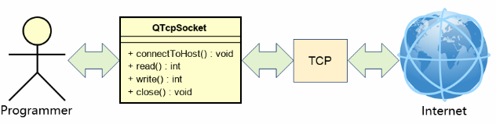
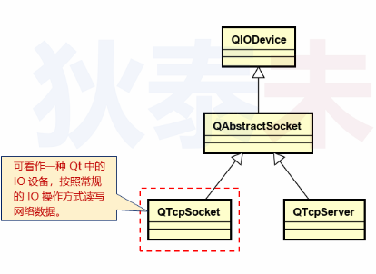
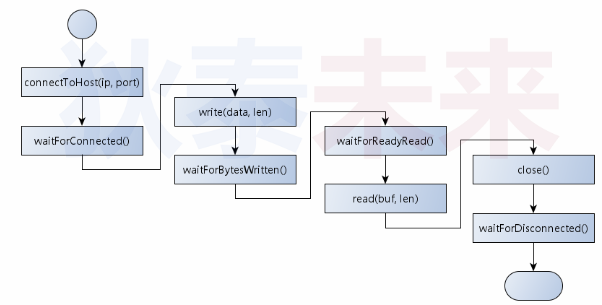
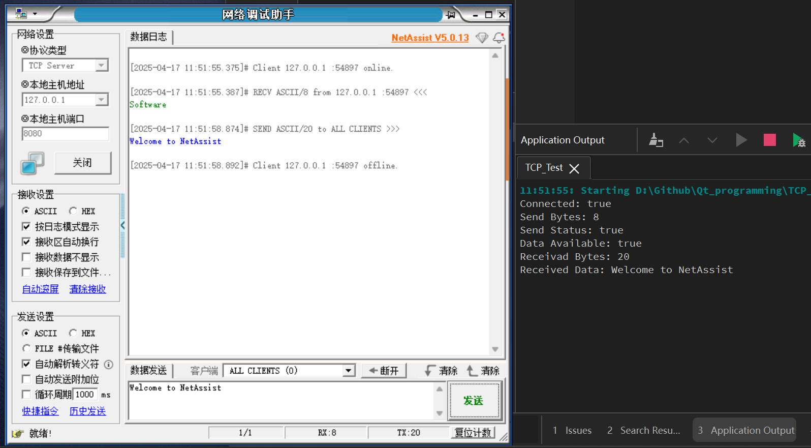
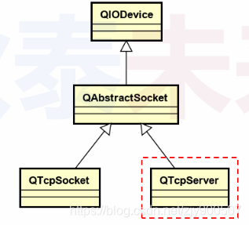
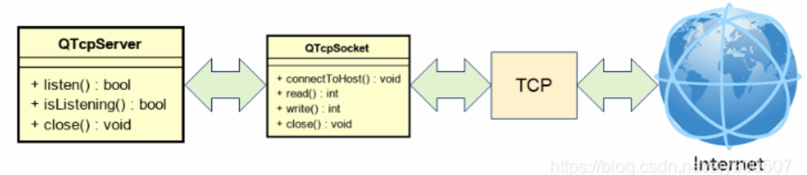
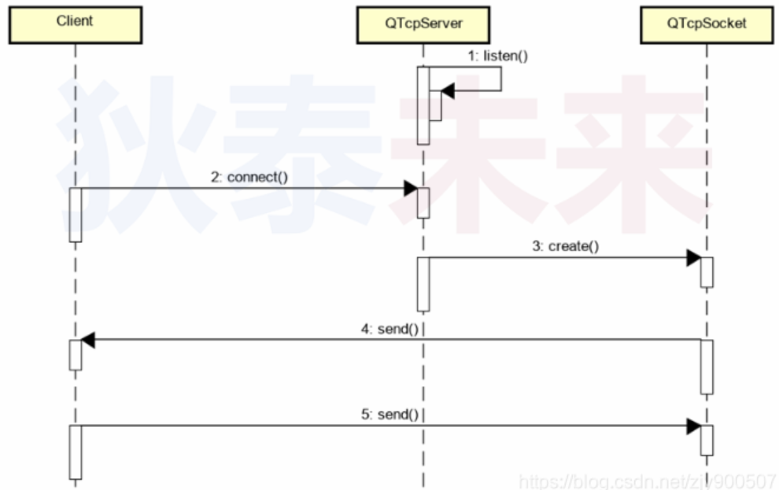
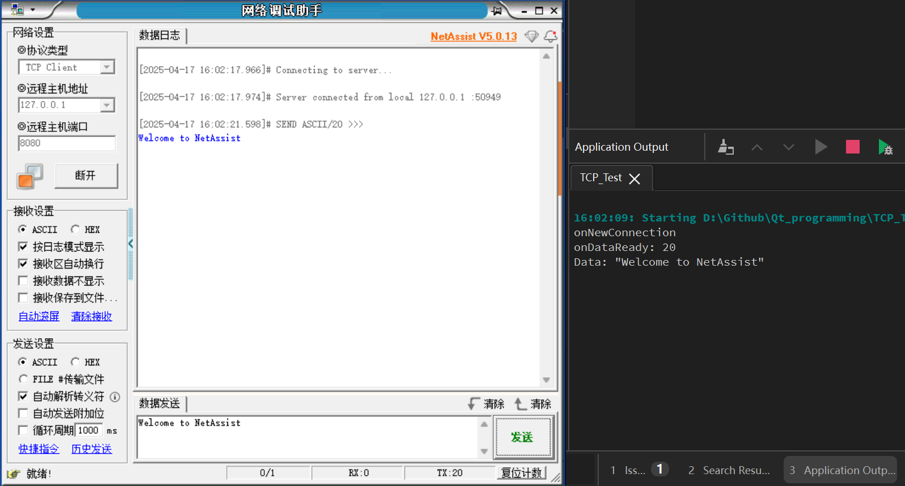

# TCP客户端编程

- 对Qt编程而言，网络只是`数据传输的通道`
- Qt提供了QTcpSocket类（封装了TCP协议细节）
- 将QTcpSocket的对象当做黑盒使用，进行数据首发

 

## QTcpSocket类的继承

 


**QTcpSocket的使用**

1. 连接服务器主机（connectToHost()）
2. 发送数据/接受数据（write()/read()）
3. 关闭连接（close()）

**QTcpSocket的注意事项**

- 默认情况下，QTcpSocket使用`异步编程`的方式
  - 操作完成后立即返回（返回只代表的操作开始，不代表操作的结果，类似C语言中的回调函数以及Qt中的信号和槽机制）
  - 通过发送信号的方式返回操作的结果

## QTcpSocket同步编程

QTcpSocket提供辅助函数可完成同步编程的方式（返回值代表返回结果，平时编程使用的大多是同步编程的方式）

```cpp
waitForConnected()/waitForDisconnected()
waitForBytesWritten()/waitForReadyRead()
```

**QTcpSocket同步编程流程**

调用完功能函数（如connectToHost）立刻调用对应的同步辅助函数即实现同步编程

 

**QTcpSocket同步编程代码**

代码运行时需启动socket的服务程序模拟tcp服务端

 **main.cpp**

```cpp
#include <QCoreApplication>
#include <QTcpSocket>
#include <QDebug>
#include <QThread>

void SyncClientDome(){
    QTcpSocket client;
    char buf[256] = {0};

    client.connectToHost("127.0.0.1", 8080);
    qDebug() << "Connected:" << client.waitForConnected();
    qDebug() << "Send Bytes:" << client.write("Software");
    qDebug() << "Send Status:" << client.waitForBytesWritten();
    qDebug() << "Data Available:" << client.waitForReadyRead();
    qDebug() << "Receivad Bytes:" << client.read(buf, sizeof(buf) - 1);
    qDebug() << "Received Data:" << buf;

    client.close();
    client.waitForDisconnected();
}

int main(int argc, char *argv[])
{
    QCoreApplication a(argc, argv);

    SyncClientDome();

    return a.exec();
}
```




## QTcpSocket异步编程

- QTcpSocket的对象通过发送信号的方式返回操作结果
- 可以在程序中将对应的信号连接到槽函数，获取结果
- 在GUI应用程序中通常使用QTcpSocket的异步编程方式

**QTcpSocket中的关键信号**

- connected():成功连接远端主机
- disconnected：远程主机断开连接
- readyRead()：远端主机数据到达本机
- bytesWritten(qint64)：数据成功发送至系统（OS）

**编程实践**

**clientdemo.h**

```cpp
#ifndef CLIENTDEMO_H
#define CLIENTDEMO_H

#include <QObject>
#include <QTcpSocket>

class ClientDemo : public QObject
{
    Q_OBJECT
    QTcpSocket m_client;

protected slots:
    void onConnected();
    void onDisconnected();
    void onDataReady();
    void onBytesWritten(qint64 bytes);

public:
    explicit ClientDemo(QObject *parent = nullptr);
    void connectTo(QString ip, int port);
    qint64 send(const char* data, int len);
    qint64 available();
    void close();

signals:
};

#endif // CLIENTDEMO_H
```

**clientdemo.cpp**

```cpp
#include "ClientDemo.h"

ClientDemo::ClientDemo(QObject *parent)
    : QObject{parent}
{
    connect(&m_client, &QTcpSocket::connected, this, &ClientDemo::onConnected);
    connect(&m_client, &QTcpSocket::disconnected, this, &ClientDemo::onDisconnected);
    connect(&m_client, &QTcpSocket::readyRead, this, &ClientDemo::onDataReady);
    connect(&m_client, &QTcpSocket::bytesWritten, this, &ClientDemo::onBytesWritten);
}

void ClientDemo::onConnected(){
    qDebug() << "onConnected";
    qDebug() << "Local Address:" << m_client.localAddress();
    qDebug() << "Local Port:" << m_client.localPort();
}

void ClientDemo::onDisconnected(){
    qDebug() << "onDisconnected";
}

void ClientDemo::onDataReady(){
    char buf[256] = {0};
    qDebug() << "onDataReady:" << m_client.read(buf, sizeof(buf) - 1);
    qDebug() <<buf;
}

void ClientDemo::onBytesWritten(qint64 bytes){
    qDebug() << "onBytesWritten:" << bytes;
}

void ClientDemo::connectTo(QString ip, int port){
    m_client.connectToHost(ip, port);
}

qint64 ClientDemo::send(const char* data, int len){
    return m_client.write(data, len);
}

qint64 ClientDemo::available(){
    return m_client.bytesAvailable();
}

void ClientDemo::close(){
    m_client.close();
}
```

**main.cpp**

```cpp
#include "ClientDemo.h"
#include <QCoreApplication>
#include <QTcpSocket>
#include <QDebug>
#include <QThread>

int main(int argc, char *argv[])
{
    QCoreApplication a(argc, argv);

    char data[] = "software";
    ClientDemo client;
    client.connectTo("127.0.0.1", 8080);
    client.send(data, sizeof(data) - 1);

    return a.exec();
}
```


------

# TCP 服务端编程

**Browser/Server软件架构简介(B/S)**

- B/S是一种特殊的C/S网络架构
- B/S中的客户端统一使用浏览器(Browser)
- B/S中的客户端GUI通常采用`HTML`进行开发
- B/S中的客户端与服务端通常采用`http`协议进行通信

## TCP 服务端编程类的调用

 

 **TCP服务端编程介绍**

- Qt提供了QTcpServer类（`封装了TCP协议细节`）
- 将QTcpServer的对象当作黑盒使用，`进行连接监听`
- 每一个连接生成一个 QTcpSocket对象进行通信

 

##  

## QTcpServer的使用方式

- 监听本机地址的端口 listen()
- 通过信号通知客户端连接 newConnection()
- 获取QTcpSocket通信对象 nextPendingConnection()
- 停止监听 close()

**注意事项**

- 用于处理客户端连接，`不进行具体通信`
- 监听的端口只用于响应连接请求
- 监听到连接后，生成`QTcpSocket`对象与客户端通信


## 服务端和客户端的交互流程

 

 **示例**

**ServerDemo.h**

```cpp
#ifndef SERVERDEMO_H
#define SERVERDEMO_H

#include <QObject>
#include <QTcpServer>

class ServerDemo : public QObject
{
    Q_OBJECT

    QTcpServer m_server;

protected slots:
    void onNewConnection();
    void onConnected();
    void onDisconnected();
    void onDataReady();
    void onBytesWritten(qint64 bytes);

public:
    explicit ServerDemo(QObject *parent = nullptr);
    bool start (int port);
    void stop();
    ~ServerDemo();

signals:
};

#endif // SERVERDEMO_H
```

**ServerDemo.cpp**

```cpp
#include "ServerDemo.h"
#include <QTcpSocket>

ServerDemo::ServerDemo(QObject *parent)
    : QObject{parent}
{
    connect(&m_server, &QTcpServer::newConnection, this, &ServerDemo::onNewConnection);
}

void ServerDemo::onNewConnection(){
    qDebug() << "onNewConnection";

    while (m_server.hasPendingConnections()) {
        QTcpSocket *tcp = m_server.nextPendingConnection();
        tcp->setParent(this);

        connect(tcp, &QTcpSocket::connected, this, &ServerDemo::onConnected);
        connect(tcp, &QTcpSocket::disconnected, this, &ServerDemo::onDisconnected);
        connect(tcp, &QTcpSocket::readyRead, this, &ServerDemo::onDataReady);
        connect(tcp, &QTcpSocket::bytesWritten, this, &ServerDemo::onBytesWritten);
    }
}

void ServerDemo::onConnected(){
    auto *tcp = qobject_cast<QTcpSocket*>(sender());
    if(tcp){
        qDebug() << "onConnected";
        qDebug() << "Local Address:" << tcp->localAddress();
        qDebug() << "Local Port:" << tcp->localPort();
    }
}

void ServerDemo::onDisconnected(){
    auto *tcp = qobject_cast<QTcpSocket*>(sender());
    if(tcp){
        qDebug() << "onDisconnected";
        tcp->deleteLater();
    }
}

void ServerDemo::onDataReady(){
    auto *tcp = qobject_cast<QTcpSocket*>(sender());
    if(tcp){
        QByteArray data = tcp->readAll();
        qDebug() << "onDataReady:" << data.size();
        qDebug() << "Data:" << data;
    }
}

void ServerDemo::onBytesWritten(qint64 bytes){
    qDebug() << "onBytesWritten:" << bytes;
}

bool ServerDemo::start (int port){
    if(m_server.isListening()){
        return true;
    }
    return m_server.listen(QHostAddress::LocalHost, port);
}

void ServerDemo::stop(){
    if(m_server.isListening()){
        m_server.close();
    }
}

ServerDemo::~ServerDemo(){}
```




- 服务端是为客户端提供功能服务，被动的接受连接
- Qt提供了QTcpServer类，用于端口的连接监听
- 监听到连接后，生成QTcpSocket对象与客户端通信
- 每个QTcpSocket对象同样需要连接信号到槽函数

