# 文本协议的设计与实现

首先来看一下TCP应用编程中的问题：

<u>数据接收端无法知道数据的发送方式</u>

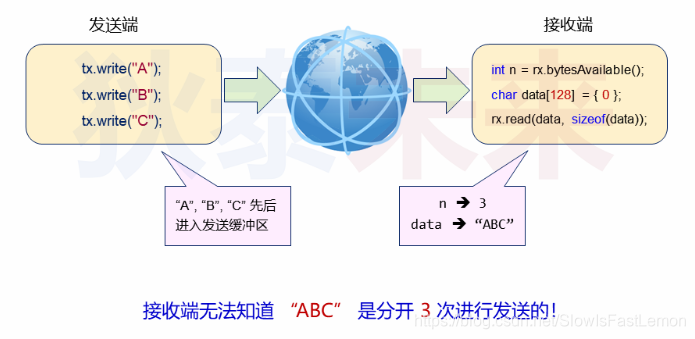 


**网络程序设计中的期望：**

- 每次发送一条完整的消息，每次接收一条完整的消息。
- 即使接收缓冲区中有多条消息，也不会消息粘连。
- 消息中涵盖了数据类型和数据长度等信息。


**应用层协议设计：**

- 什么是协议？
  - 协议是通信双方为`数据交换`而建立的`规则、标准和约定`的集合。
- 协议对数据传输的作用：
  - 通信双方根据协议能够正确收发数据。
  - 通信双方根据协议能够`解释数据的意义`。

## 文本协议设计示例

目标：基于TCP设计可用于文本传输的协议

- 完整消息包含：
  - 数据头：数据类型（即：数据区用途，固定长度）。
  - 数据长度：数据区长度（固定长度）。
  - 数据区：字符数据（变长区域）。

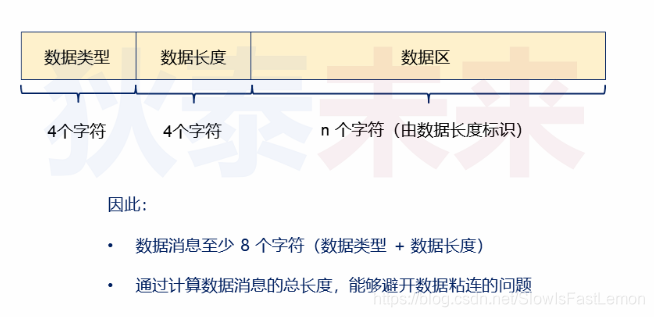 

 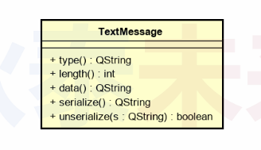 

**TextMessage.h**

```cpp
#ifndef TEXTMESSAGE_H
#define TEXTMESSAGE_H

#include <QObject>

class TextMessage : public QObject
{
    Q_OBJECT

    QByteArray m_type;
    QByteArray m_data;

    static constexpr int HeaderSize {8};

public:
    explicit TextMessage(QObject *parent = nullptr);
    TextMessage(QByteArray type, QByteArray data, QObject *parent= nullptr);

    QByteArray type() const { return m_type; }
    int length() const { return m_data.length(); }
    QByteArray data() const { return m_data; }

    QByteArray serialize() const;
    bool unserialize(QByteArrayView buffer);

};

#endif // TEXTMESSAGE_H
```

**TextMessage.cpp**

```cpp
#include "TextMessage.h"
#include <cstdio>
#include <QDebug>


TextMessage::TextMessage(QObject *parent)
    : QObject(parent), m_type(""), m_data("")
{}

TextMessage::TextMessage(QByteArray type, QByteArray data, QObject *parent)
    :QObject(parent)
{
    m_type = type.left(4);
    m_type.resize(4, ' ');
    m_data = data;
}

QByteArray TextMessage::serialize() const{
    QByteArray result;
    result.reserve(HeaderSize + m_data.length());

    // Append type (4 bytes)
    result.append(m_type);
    // Append length as 4-char hex
    char lenBuf[5];
    snprintf(lenBuf, sizeof(lenBuf), "%04X", static_cast<unsigned int>(m_data.length()));
    result.append(lenBuf, 4);
    // Append data
    result.append(m_data);

    return result;
}

bool TextMessage::unserialize(QByteArrayView buffer){
    if(buffer.size() < HeaderSize){
        return false;
    }

    m_type = buffer.mid(0, 4).toByteArray();

    bool ok;
    QByteArray lenBytes = buffer.mid(4, 4).toByteArray();
    int len = lenBytes.toInt(&ok, 16);
    if(!ok || len != buffer.size() - HeaderSize){
        return false;
    }

    m_data = buffer.mid(HeaderSize, len).toByteArray();
    return true;
}
```


## 从字节流装配文本协议对象

如何将缓冲区中的数据装配成为协议对象？

深度思考：数据是否能够装配成协议对象？

- 数据量足够：
  - 如果数据量足够，是否能够装配不止一个对象？
  - 如何处理剩余数据（属于下一个协议对象）？
- 数据量不足：
  - 是否达到协议最小长度（8字节）？
  - 如何处理数据量超过最小长度，但不足以产生一个对象的情况？


**初步的解决方案：**

- 定义一个类用于接收字节流并装配协议对象。
- 类中提供容器（队列）暂存字节流。
- 当容器中至少存在8个字节时开始状态：
  - 首先装配协议中的类型（type）和数据区长度（length）。
  - 根据数据区长度从容易中取数据装配协议数据（data）。
  - 当协议数据装配完成时，创建协议对象并返回，否则，返回NULL。

**协议对象装配类的初步设计：**

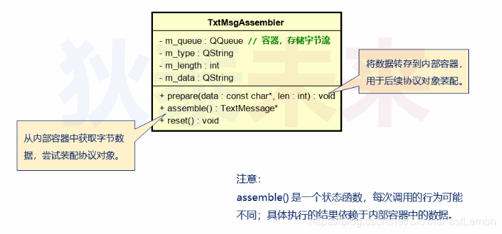 

 **assemble()函数的实现流程：**

 

 **assemble()函数的注意事项：**

- 以m_type作为标志决定是否解析类型和长度。
- m_length是接收后续数据的基础。
- 当m_data的长度与m_length相同时创建协议对象。
- 否则，返回NULL。


**makeTypeAndLength()实现要点：**

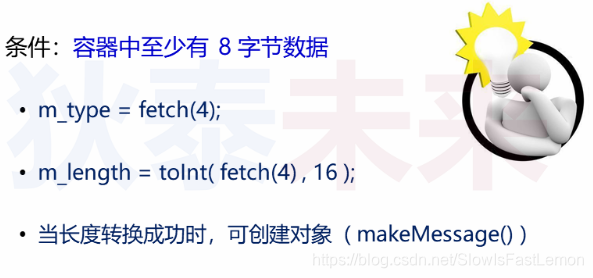 

 

**makeMessage()实现要点：**

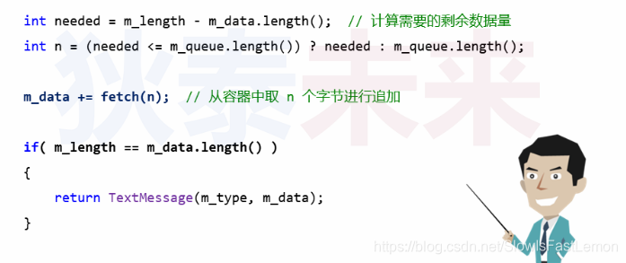 


**TxtMsgAssembler.h**

```cpp
#ifndef TXTMSGASSMBLER_H
#define TXTMSGASSMBLER_H

#include <QObject>
#include <QSharedPointer>
#include "TextMessage.h"

class TxtMsgAssmbler : public QObject
{
    Q_OBJECT

    QByteArray m_buffer;
    QByteArray m_type;
    int m_length {0};
    QByteArray m_data;

    QSharedPointer<TextMessage> tryAssemble();
    bool parseHeader();
    void clear();

public:
    explicit TxtMsgAssmbler(QObject *parent = nullptr);
    QSharedPointer<TextMessage> assemble();
    void append(QByteArrayView data);
    void reset();

};

#endif // TXTMSGASSMBLER_H
```

**TxtMsgAssembler.cpp**

```cpp
#include "TxtMsgAssmbler.h"
#include <QDebug>
#include <algorithm>

TxtMsgAssmbler::TxtMsgAssmbler(QObject *parent)
    : QObject{parent}
{}

QSharedPointer<TextMessage> TxtMsgAssmbler::tryAssemble(){
    if(m_type.isEmpty() && !parseHeader()){
        return nullptr;
    }

    // Accumulate data
    int needed = m_length - m_data.size();
    int available = std::min(needed, static_cast<int>(m_buffer.size()));
    m_data.append(m_buffer.left(available));
    m_buffer.remove(0, available);

    if(m_data.size() == m_length){
        auto msg = QSharedPointer<TextMessage>::create(m_type, m_data);
        clear();
        return msg;
    }

    return nullptr;
}

bool TxtMsgAssmbler::parseHeader(){
    if(m_buffer.size() < 8){
        return false;
    }

    m_type = m_buffer.mid(0, 4);
    bool ok;
    QByteArray lenBytes = m_buffer.mid(4 ,4);
    m_length = lenBytes.toInt(&ok, 16);
    if(!ok){
        clear();
        return false;
    }

    m_buffer.remove(0, 8);
    return true;
}

QSharedPointer<TextMessage> TxtMsgAssmbler::assemble(){
    return tryAssemble();
}

void TxtMsgAssmbler::clear(){
    m_type.clear();
    m_data.clear();
    m_length = 0;
}

void TxtMsgAssmbler::reset(){
    clear();
    m_buffer.clear();
}

void TxtMsgAssmbler::append(QByteArrayView data){
    m_buffer.append(data);
}
```


- 从`连续字节流`装配协议对象是应用自定义协议的基础。
- 装配类（TxtMsgAssembler）用于`解析自定义协议`。
- 装配类的实现的`关键是如何处理字节数据不够的情况`。
- 自定义协议类和装配类能够`有效解决数据粘连`问题。

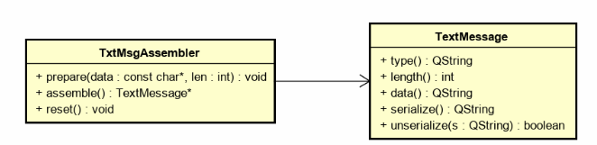 


## 文本协议中的中文处理

文本协议的设计与实现能够支持中文吗？

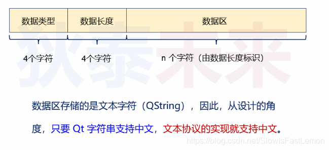 

 检验：

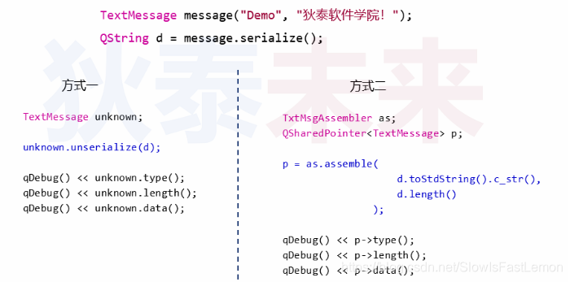 

<u>第一种方式正常输出，第二种方式则不行。</u>


**深度分析：**

文本协议的实现只考虑了ASCII码的情况，对于中文类型的宽字符编码情况并未考虑（宽字符>=2字符）

**协议设计的微小改动：**

- Type：4个ASCII字符。
- Length：4个ASCII字符（存储数据区字节数）。
- 数据区：使用UTF-8方式进行编码。

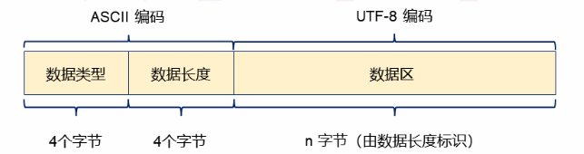 

 **UTF-8编码的特点：**

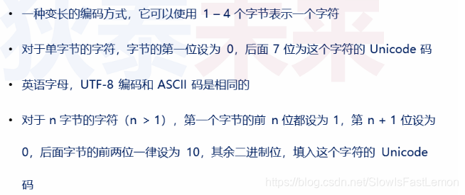 

 **协议实现的改动：**

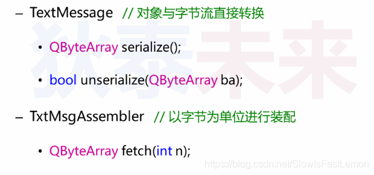 

 **main.cpp**

```cpp
#include "TextMessage.h"
#include "TxtMsgAssmbler.h"
#include <QCoreApplication>

int main(int argc, char *argv[]) {
    QCoreApplication a(argc, argv);

    TextMessage tm("AB", QByteArray("dfgfdbfd"));
    QByteArray message = tm.serialize();
    qDebug() << QString::fromUtf8(message);

    TxtMsgAssmbler assemnler;
    assemnler.append(message);
    QSharedPointer<TextMessage> msg = assemnler.assemble();

    if(msg){
        qDebug() << "Assemble successful";
        qDebug() << QString::fromUtf8(msg->type());
        qDebug() << msg->length();
        qDebug() << QString::fromUtf8(msg->data());

    }else{
        qDebug() << "Assembly failed";
    }

    return a.exec();
}
```

## 文本协议的网络应用

将TextMessage对象作为网络传输的基本单位

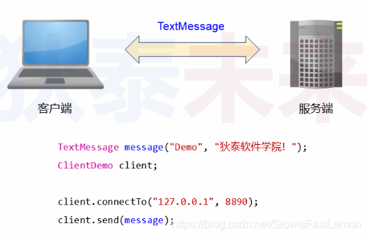 

**架构设计**

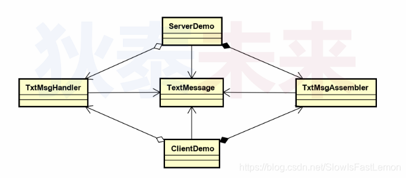 

 **实现概要**

- 客户端提供发送TextMessage对象的成员函数。
- 客户端和服务端均内置TxtMsgAssembler对象：
  - 用于从网络字节流装配TextMessage对象。
- 当成功收到TextMessage对象：
  - 使用TxtMsgHandler接口进行异步通知。

<u>为了使得服务端可以正确接收多个客户端的TextMessage消息，需要为每一个与客户端通信的TcpSocket对象分配一个专用的装配对象</u>

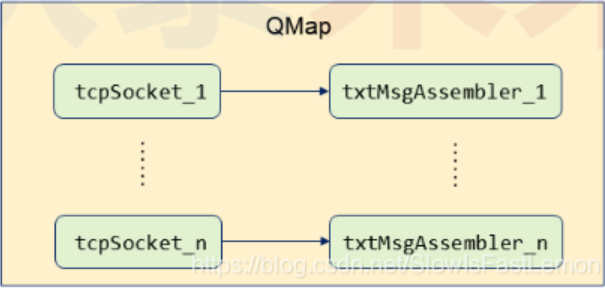 

 简单看一下Qt中的QMap容器：

- QMap是一种基于键值对（Key-Value）的字典数据结构。

- QMap是通过模板定义的，键和值都可以是自定义数据类型。

- QMap使用示例：

  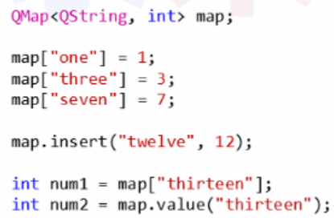 

**解决方案如下：**

- 客户端连接时，动态创建装配对象，插入字典中。
- 网络字节流达到时，在字典中查找装配对象。
- 通过查找到的装配对象处理字节流。
- 客户端断开时，销毁对应的装配对象。

**代码组织结构如下：**

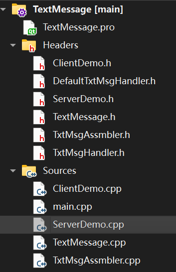 

TxtMsgHandler.h

```cpp
#ifndef TXTMSGHANDLER_H
#define TXTMSGHANDLER_H

#include <QTcpSocket>
#include "TextMessage.h"


class TxtMsgHandler
{
public:
    virtual void handle(QTcpSocket&, TextMessage&) = 0;
    virtual ~TxtMsgHandler() = default;
};

#endif // TXTMSGHANDLER_H
```

DefaultTxtMsgHandler.h

```cpp
#ifndef DEFAULTTXTMSGHANDLER_H
#define DEFAULTTXTMSGHANDLER_H

#include "TxtMsgHandler.h"
#include <QDebug>

class DefaultTxtMsgHandle : public TxtMsgHandler
{
public:
    void handle(QTcpSocket& socket, TextMessage& message) override{

        // Display received message (supports Chinese with UTF-8)
        qDebug() << "Recrived message: ";
        qDebug() << "Type: " << QString::fromUtf8(message.type());
        qDebug() << "Data: " << QString::fromUtf8(message.data());

        // Send response (server-side only, optional for client)
        if(socket.localPort() == 8890){
            TextMessage response("RESP", "收到消息： " + message.data());
            QByteArray responseData = response.serialize();
            socket.write(responseData.data(), responseData.length());
        }
    }
};

#endif // DEFAULTTXTMSGHANDLER_H
```

ClientDemo.h

```cpp
#ifndef CLIENTDEMO_H
#define CLIENTDEMO_H

#include <QObject>
#include <QTcpSocket>
#include "TextMessage.h"
#include "TxtMsgAssmbler.h"
#include "TxtMsgHandler.h"

class ClientDemo : public QObject
{
    Q_OBJECT
    QTcpSocket m_client;
    TxtMsgAssmbler m_assembler;
    TxtMsgHandler* m_handler;

protected slots:
    void onConnected();
    void onDisconnected();
    void onDataReady();
    void onBytesWritten(qint64 bytes);

public:
    explicit ClientDemo(QObject *parent = nullptr);
    bool connectTo(QString ip, int port);
    qint64 send(TextMessage& message);
    qint64 available();
    void setHandler(TxtMsgHandler* handler);
    void close();

signals:
};

#endif // CLIENTDEMO_H
```

ClientDemo.cpp

```cpp
#include "ClientDemo.h"

ClientDemo::ClientDemo(QObject *parent)
    : QObject{parent}
{
    connect(&m_client, &QTcpSocket::connected, this, &ClientDemo::onConnected);
    connect(&m_client, &QTcpSocket::disconnected, this, &ClientDemo::onDisconnected);
    connect(&m_client, &QTcpSocket::readyRead, this, &ClientDemo::onDataReady);
    connect(&m_client, &QTcpSocket::bytesWritten, this, &ClientDemo::onBytesWritten);
}

void ClientDemo::onConnected(){
    qDebug() << "Connected to server";
}

void ClientDemo::onDisconnected(){
    qDebug() << "Disconnected from server";
    m_assembler.reset();
}

void ClientDemo::onDataReady(){
    char buf[256] = {0};
    int len = 0;

    while ((len = m_client.read(buf, sizeof(buf))) > 0) {
        QSharedPointer<TextMessage> ptm = m_assembler.assemble(buf, len);
        if(ptm && m_handler){
            m_handler->handle(m_client, *ptm);
        }
    }
}

void ClientDemo::onBytesWritten(qint64 bytes){
    qDebug() << "onBytesWritten:" << bytes;
}

bool ClientDemo::connectTo(QString ip, int port){
    m_client.connectToHost(ip, port);
    return m_client.waitForConnected();
}

qint64 ClientDemo::send(TextMessage& message){
    QByteArray ba = message.serialize();
    return m_client.write(ba.data(), ba.length());
}

qint64 ClientDemo::available(){
    return m_client.bytesAvailable();
}

void ClientDemo::setHandler(TxtMsgHandler* handler){
    m_handler = handler;
}

void ClientDemo::close(){
    m_client.close();
}
```

ServerDemo.h

```cpp
#ifndef SERVERDEMO_H
#define SERVERDEMO_H

#include <QObject>
#include <QTcpServer>
#include "TxtMsgAssmbler.h"
#include "TxtMsgHandler.h"

class ServerDemo : public QObject
{
    Q_OBJECT

    QTcpServer m_server;
    QMap<QTcpSocket*, TxtMsgAssmbler*> m_map;
    TxtMsgHandler* m_handler;

protected slots:
    void onNewConnection();
    void onConnected();
    void onDisconnected();
    void onDataReady();
    void onBytesWritten(qint64 bytes);

public:
    explicit ServerDemo(QObject *parent = nullptr);
    bool start (int port);
    void stop();
    void setHandler(TxtMsgHandler* handler);
    ~ServerDemo();

signals:
};

#endif // SERVERDEMO_H
```

ServerDemo.cpp

```cpp
#include "ServerDemo.h"
#include <QTcpSocket>

ServerDemo::ServerDemo(QObject *parent)
    : QObject{parent}, m_handler{nullptr}
{
    connect(&m_server, &QTcpServer::newConnection, this, &ServerDemo::onNewConnection);
}

void ServerDemo::onNewConnection(){

    QTcpSocket *tcp = m_server.nextPendingConnection();
    TxtMsgAssmbler* assembler = new TxtMsgAssmbler(tcp);
    m_map.insert(tcp, assembler);

    connect(tcp, &QTcpSocket::connected, this, &ServerDemo::onConnected);
    connect(tcp, &QTcpSocket::disconnected, this, &ServerDemo::onDisconnected);
    connect(tcp, &QTcpSocket::readyRead, this, &ServerDemo::onDataReady);
    connect(tcp, &QTcpSocket::bytesWritten, this, &ServerDemo::onBytesWritten);

    qDebug() << "New client connected:" << tcp->peerAddress().toString();
}

void ServerDemo::onConnected(){
    qDebug() << "Client connected";
}

void ServerDemo::onDisconnected(){
    auto *tcp = qobject_cast<QTcpSocket*>(sender());
    if(tcp){
        qDebug() << "Client disconnected:" << tcp->peerAddress().toString();
        delete m_map.take(tcp);
    }
}

void ServerDemo::onDataReady(){
    auto *tcp = qobject_cast<QTcpSocket*>(sender());
    if(!tcp){
        return;
    }

    char buf[256] = {0};
    int len {0};
    TxtMsgAssmbler* assmbler = m_map.value(tcp);

    while((len = tcp->read(buf, sizeof(buf))) > 0){
        QSharedPointer<TextMessage> ptm = assmbler ? assmbler->assemble(buf, len) : nullptr;
        if(ptm && m_handler){
            m_handler->handle(*tcp, *ptm);
        }
    }
}

void ServerDemo::onBytesWritten(qint64 bytes){
    qDebug() << "Server wrote:" << bytes;
}

bool ServerDemo::start (int port){
    if(!m_server.isListening()){
        bool ret = m_server.listen(QHostAddress("127.0.0.1"), port);
        qDebug() << (ret ? "Server started on port" : "Failed to start server on port") << port;
        return ret;
    }
    return true;
}

void ServerDemo::stop(){
    if(m_server.isListening()){
        m_server.close();
        qDebug() << "Server stopped";
    }
}

ServerDemo::~ServerDemo(){
    stop();
    for(TxtMsgAssmbler* assembler : m_map){
        delete assembler;
    }
    m_map.clear();
}

void ServerDemo::setHandler(TxtMsgHandler* handler){
    m_handler = handler;
}
```

TxtMsgAssmbler.h

```cpp
#ifndef TXTMSGASSMBLER_H
#define TXTMSGASSMBLER_H

#include <QObject>
#include <QSharedPointer>
#include "TextMessage.h"

class TxtMsgAssmbler : public QObject
{
    Q_OBJECT

    QByteArray m_buffer;
    QByteArray m_type;
    int m_length {0};
    QByteArray m_data;

    QSharedPointer<TextMessage> tryAssemble();
    bool parseHeader();
    void clear();

public:
    explicit TxtMsgAssmbler(QObject *parent = nullptr);
    QSharedPointer<TextMessage> assemble();
    QSharedPointer<TextMessage> assemble(const char* data, int len);
    void append(QByteArrayView data);
    void reset();

};

#endif // TXTMSGASSMBLER_H
```

TxtMsgAssmbler.cpp

```cpp
#include "TxtMsgAssmbler.h"
#include <QDebug>
#include <algorithm>

TxtMsgAssmbler::TxtMsgAssmbler(QObject *parent) : QObject{parent}{}

QSharedPointer<TextMessage> TxtMsgAssmbler::tryAssemble(){
    if(m_type.isEmpty() && !parseHeader()){
        return nullptr;
    }

    // Accumulate data
    int needed = m_length - m_data.size();
    int available = std::min(needed, static_cast<int>(m_buffer.size()));
    m_data.append(m_buffer.left(available));
    m_buffer.remove(0, available);

    if(m_data.size() == m_length){
        auto msg = QSharedPointer<TextMessage>::create(m_type, m_data);
        clear();
        return msg;
    }

    return nullptr;
}

bool TxtMsgAssmbler::parseHeader(){
    if(m_buffer.size() < 8){
        return false;
    }

    m_type = m_buffer.mid(0, 4);
    bool ok;
    QByteArray lenBytes = m_buffer.mid(4 ,4);
    m_length = lenBytes.toInt(&ok, 16);
    if(!ok){
        clear();
        return false;
    }

    m_buffer.remove(0, 8);
    return true;
}

QSharedPointer<TextMessage> TxtMsgAssmbler::assemble(){
    return tryAssemble();
}

QSharedPointer<TextMessage> TxtMsgAssmbler::assemble(const char* data, int len){
    m_buffer.append(data, len);
    return tryAssemble();
}

void TxtMsgAssmbler::clear(){
    m_type.clear();
    m_data.clear();
    m_length = 0;
}

void TxtMsgAssmbler::reset(){
    clear();
    m_buffer.clear();
}

void TxtMsgAssmbler::append(QByteArrayView data){
    m_buffer.append(data);
}
```

TextMessage.h

```cpp
#ifndef TEXTMESSAGE_H
#define TEXTMESSAGE_H

#include <QObject>

class TextMessage : public QObject
{
    Q_OBJECT

    QByteArray m_type;
    QByteArray m_data;

    static constexpr int HeaderSize {8};

public:
    explicit TextMessage(QObject *parent = nullptr);
    TextMessage(QByteArray type, QByteArray data, QObject *parent= nullptr);

    QByteArray type() const { return m_type; }
    int length() const { return m_data.length(); }
    QByteArray data() const { return m_data; }

    QByteArray serialize() const;
    bool unserialize(QByteArrayView buffer);

};

#endif // TEXTMESSAGE_H
```

TextMessage.cpp

```cpp
#include "TextMessage.h"
#include <cstdio>
#include <QDebug>


TextMessage::TextMessage(QObject *parent)
    : QObject(parent), m_type(""), m_data("")
{}

TextMessage::TextMessage(QByteArray type, QByteArray data, QObject *parent)
    :QObject(parent)
{
    m_type = type.left(4);
    m_type.resize(4, ' ');
    m_data = data.left(0xFFFF);
}

QByteArray TextMessage::serialize() const{
    QByteArray result;
    result.reserve(HeaderSize + m_data.length());

    // Append type (4 bytes)
    result.append(m_type);
    // Append length as 4-char hex
    char lenBuf[5];
    snprintf(lenBuf, sizeof(lenBuf), "%04X", static_cast<unsigned int>(m_data.length()));
    result.append(lenBuf, 4);
    // Append data
    result.append(m_data);

    return result;
}

bool TextMessage::unserialize(QByteArrayView buffer){
    if(buffer.size() < HeaderSize){
        return false;
    }

    m_type = buffer.mid(0, 4).toByteArray();

    bool ok;
    QByteArray lenBytes = buffer.mid(4, 4).toByteArray();
    int len = lenBytes.toInt(&ok, 16);
    if(!ok || len != buffer.size() - HeaderSize){
        return false;
    }

    m_data = buffer.mid(HeaderSize, len).toByteArray();
    return true;
}
```

mian.cpp

```cpp
#include <QCoreApplication>
#include "ServerDemo.h"
#include "ClientDemo.h"
#include "DefaultTxtMsgHandler.h"

int main(int argc, char *argv[]) {
    QCoreApplication a(argc, argv);

    //Start server
    ServerDemo server;
    DefaultTxtMsgHandle serverHandler;
    server.setHandler(&serverHandler);
    if(!server.start(8890)){
        qDebug() << "Server failed to start";
        return 1;
    }

    //Start client
    ClientDemo client;
    DefaultTxtMsgHandle clientHandler;
    client.setHandler(&clientHandler);
    if(!client.connectTo("127.0.0.1", 8890)){
        qDebug() << "Client failed to connect";
        return 1;
    }

    //Send a Chinese message from client
    TextMessage tm("TEXT", "建立麦克卢汉");
    qint64 bytesSent = client.send(tm);
    qDebug() << "Client sent" << bytesSent << "bytes";


    // Run event loop
    return a.exec();
}
```

