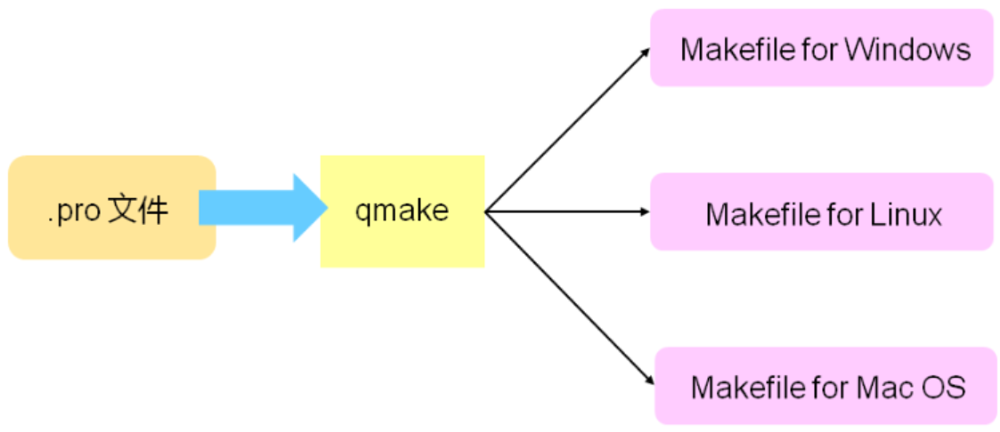

# QT Creator工程管理

QT Creator以工程项目的方式对源码进行管理，一个QT工程中包含不同类型的文件如下：

A、.pro项目描述文件

B、.pro.user用户描述文件

C、.h头文件

D、.cpp源文件

E、.ui界面描述文件

F、资源文件（图片、音频等）

## .pro项目描述文件

### 基本构成

A、# 注释起始符

B、QT 模块声明

C、TARGET 可执行文件名

D、TEMPLATE 程序模板声明

E、SOURCES 源码文件声明

F、HEADERS 头文件声明

G、FORMS 界面文件声明

H、RC_FILE 资源文件声明

### 高级变量

A、INCLUDEPATH 头文件搜索路径

B、CONFIG 设置项目的配置信息和编译选项

C、LIBS 添加第三方库文件

D、DEFINES 定义编译宏

**CONFIG常用选项：**

A、debug 构建debug版本的可执行程序

B、release 构建release版本的可执行程序

C、debug_and_release 同时构建debug和release版本

D、warn_on 尽可能多输出警告信息

E、warn_off 不输出警告信息

**Debug版**

- 可以`进行程序调试`的构建版本
- 可执行程序中包含调试信息，运行`效率不高`

**Release版**

- `最终发布`的应用程序构建版本
- 无调试信息，`运行效率高`

## .pro文件的本质

.pro文件本质为QT中的makefile文件，是QT中与平台无关的Makefile文件。

 

 QT Creator在打开项目文件时会生成.pro.user文件，.pro.user文件包含于QT相关的本地配置信息，当需要在不同计算机间移动项目时，需要删除.pro.user文件。

## .pro项目描述文件实例

```C++
#-------------------------------------------------
#
# Name： Qt Creator Project Demo
# Author：Delphi Tang
# Date：  2015-08-24
#
#-------------------------------------------------
 
QT += core gui
 
greaterThan(QT_MAJOR_VERSION, 4): QT += widgets
 
TARGET = HelloWorld
TEMPLATE = app
 
INCLUDEPATH += E:/BCC/include \
               E:/VC/include
 
SOURCES += Main.cpp \
           HelloWorld.cpp
 
HEADERS += HelloWorld.h
 
FORMS   += HelloWorld.ui
 
RC_FILE += MyIco.rc
 
LIBS    += -LE:/vlc-1.11/sdk/lib
 
CONFIG  += warn_on debug
 
#
# if 'debug' option is set for CONFIG
#
 
CONFIG(debug) {
    DEFINES += DEBUG_LOG
    SOURCES += DebugLog.cpp
    HEADERS += DebugLog.h
```

