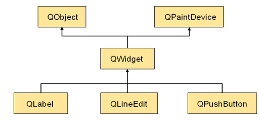
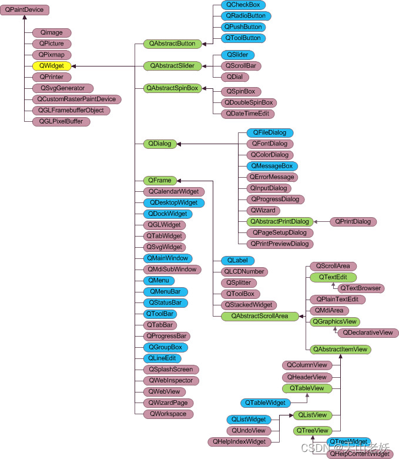
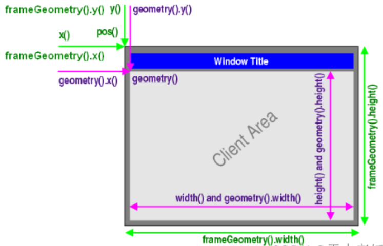

# 窗口组件

图形用户界面由不同的`窗口`和`窗口组件`构成，\<QtGui\>头文件包含窗口组件，对应QT中的GUI模块，QT以组件对象的方式构建GUI。

**组件的类型：**

- 容器类（父组件） 用来包含其他的界面组件

- 功能类（子组件） 用于实现特定的交互功能

<u>QT中没有父组件的顶级组件叫窗口。</u>

QWidget是容器组件，继承自`QObject`类和`QPaintDevice`类

QObject类是所有支持`QT对象模型`的基类，QPaintDevice类是QT中所有`可绘制组件`的基类。

 



## QWidget组件

- QWidget能够绘制自己和处理用户输入
- 是QT中所有窗口组件类的父类(super class)
- 是`所有窗口组件的抽象`
- 每个窗口组件都是一个QWidget
- QWidget类对象常用作`父组件`或`顶级组件`使用

## QLabel组件

- QLabel组件用于`显示一个提示性字符串`
- 是`功能性组件`，一般需要父组件作为容器
- QLabel作为窗口存在没有实际意义

------

# 窗口类型

QT中可以根据需要定制窗口样式，不同的窗口类型可以使窗口具有不同的样式特性。

**窗口类型：**

Qt::Widget

Qt::Window

Qt::Dialog

Qt::Sheet

Qt::Drawer

Qt::Popup

Qt::Tool

Qt::ToolTip

Qt::SplashScreen

Qt::Desktop

Qt::SubWindow

**窗口标识：**

Qt::WindowStaysOnTopHint

……

------

# 坐标系统

QT中的坐标系统以左上角为原点，水平为x轴，从左向右为正向，垂直为y轴，从上到下为正向。

## 窗口部件的定位

GUI程序在坐标系统中进行窗口和部件的定位

定位类型分为：

A、顶级窗口部件的定位

B、窗口内部件的定位

C、窗口部件的大小设置

- QT使用`统一的坐标系统`定位窗口部件的`位置和大小`

- QT部件类提供`成员函数`在坐标系统中进行定位

- QWidget类提供了窗口部件所需的`坐标系统成员函数`

 

**使用实例：**

```c++
#include <QtGui/QApplication>
#include "Widget.h"
 
#include <QDebug>
 
int main(int argc, char *argv[])
{
    QApplication a(argc, argv);
    QWidget w(NULL,Qt::Window|Qt::WindowSystemMenuHint);
    w.setWindowTitle("HelloWorld");
 
    w.show();
 
    qDebug() << w.x();
    qDebug() << w.y();
    qDebug() << w.width();
    qDebug() << w.height();
    qDebug() << w.geometry().x();
    qDebug() << w.geometry().y();
    qDebug() << w.geometry().width();
    qDebug() << w.geometry().height();
    qDebug() << w.frameGeometry().x();
    qDebug() << w.frameGeometry().y();
    qDebug() << w.frameGeometry().width();
    qDebug() << w.frameGeometry().height();
 
    return a.exec();
}
```

geometry()、frameGeometry()函数需要在show()函数后调用

QT平台在窗口显示出来之前无法确定窗口的大小

## 窗口部件的设置

QWidget类提供了设置窗口部件大小的成员函数

- 改变窗口部件的大小

```C++
void resize(const QSize &);
 
void resize(int w, int h);
```

不同平台操作系统对QWidget设置有最小值，如果resize的值小于操作系统的最小值，将设置操作系统的最小值。

- 改变窗口部件的位置

```C++
void move(int x, int y);
 
void move(const QPoint &);
```

