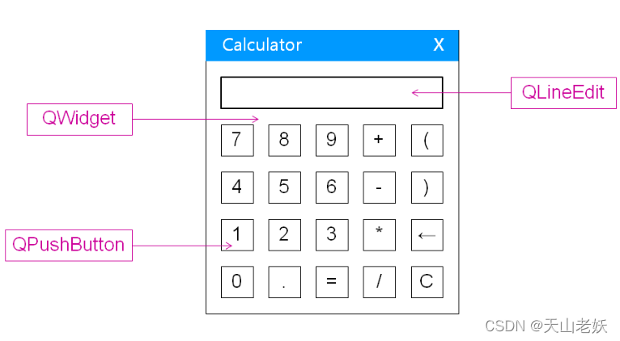
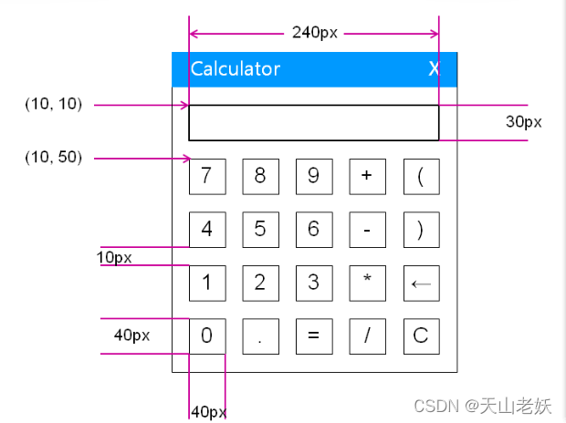
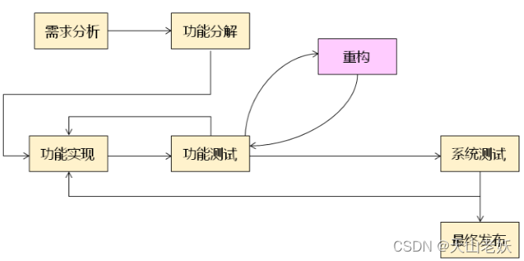
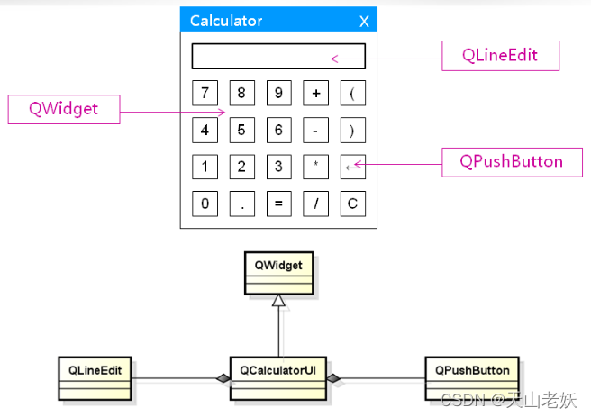
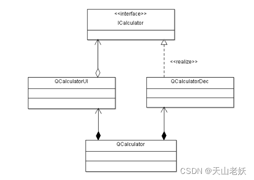

# 计算器界面制作



 计算器界面需要QWidget组件作为顶层窗口，QLineEdit组件作为输入框，QPsuhButton作为按钮。

界面规划设计如下：



```C++
#include <QApplication>
#include <QWidget>
#include <QLineEdit>
#include <QPushButton>
 
int main(int argc, char *argv[])
{
    QApplication a(argc, argv);
    QWidget *widget = new QWidget(NULL, Qt::WindowCloseButtonHint);
 
    //构建输入框，设置属性
    QLineEdit *edit = new QLineEdit(widget);
    edit->move(10, 10);
    edit->resize(240, 30);
    edit->setReadOnly(true);
 
    //构造按钮，设置属性
    QPushButton *button[20] = {0};
    const char *buttontext[20] =
    {
        "7", "8", "9", "+", "(",
        "4", "5", "6", "-", ")",
        "1", "2", "3", "*", "<-",
        "0", ".", "=", "/", "C"
    };
 
    for(int i = 0; i < 4; i++)
    {
        for(int j = 0; j < 5; j++)
        {
            button[5*i + j] = new QPushButton(widget);
            button[5*i + j]->move(10 + (10 + 40)*j, 50 + (10 + 40)*i);
            button[5*i + j]->resize(40, 40);
            button[5*i + j]->setText(buttontext[5*i + j]);
        }
    }
 
    //设置窗口
    int ret = 0;
    widget->show();
    widget->setFixedSize(widget->width(), widget->height());
 
    ret = a.exec();
    delete widget;
 
    return ret;
}
```

# 项目代码重构

重构是以改善代码质量为目的的代码重写，使得软件的设计和架构更加合理，提高了软件的扩展性和维护性。

**代码重构与代码实现的区别：**

- 代码实现是按照设计编程实现，`核心在于功能实现`，不考虑架构的优劣

- 代码重构是以提高代码质量为目的的软件架构优化，`核心在于优化架构`，不考虑对已实现功能的修改。

**代码重构在软件开发过程中的阶段：**

 

**代码重构的适用场合：**

- 项目中重复代码越来越多

- 项目中代码功能越来越不清晰

- 项目中代码实现离设计越来越远

**计算器界面代码重构：**

 

 <u>由于需要申请堆空间资源，使用二阶构造模式。</u>

**CalculatorUI.h**

```C++
#ifndef _QCALCULATORUI_H_
#define _QCALCULATORUI_H_

#include <QWidget>
#include <QLineEdit>
#include <QPushButton>

class QCalculatorUI : public QWidget
{
private:
    QLineEdit* m_edit;
    QPushButton* m_buttons[20];

    QCalculatorUI();
    bool construct();
public:
    static QCalculatorUI* NewInstance();
    void show();
    ~QCalculatorUI();
};

#endif // QCALCULATORUI_H
```

**CalculatorUI.cpp**

```C++
#include "QCalculatorUI.h"

QCalculatorUI::QCalculatorUI(): QWidget(nullptr,Qt::WindowCloseButtonHint){

}

bool QCalculatorUI::construct(){
    bool ret = true;
    const char* btnText[20] =
    {
        "7", "8", "9", "+", "(",
        "4", "5", "6", "-", ")",
        "1", "2", "3", "*", "<-",
        "0", ".", "=", "/", "C",
    };

    m_edit = new QLineEdit(this);
    if(nullptr != m_edit){
        m_edit->move(10,10);
        m_edit->resize(240,30);
        m_edit->setReadOnly(true);
    }else{
        ret = false;
    }


    for (int i = 0; i < 4; ++i) {
        for (int j = 0; j < 5; ++j) {
            m_buttons[i*5 + j] = new QPushButton(this);
            if(nullptr != m_buttons[i*5 + j]){
                m_buttons[i*5 + j]->resize(40,40);
                m_buttons[i*5 + j]->move(10 + (10 + 40) * j, 50 + (10 + 40) * i);
                m_buttons[i*5 + j]->setText(btnText[i*5+j]);
            }else{
                ret = false;
            }
        }
    }
    return ret;
}


QCalculatorUI::~QCalculatorUI(){

}

QCalculatorUI* QCalculatorUI::NewInstance(){

    QCalculatorUI* ret = new QCalculatorUI();
    if((nullptr == ret) || !ret->construct()){
        delete ret;
        ret = nullptr;
    }
    return ret;
}

void QCalculatorUI::show(){
    QWidget::show();
    setFixedSize(width(),height());
}
```

**Main.cpp**

```C++
#include "QCalculatorUI.h"
#include <QWidget>
#include <QApplication>

int main(int argc, char *argv[])
{
    QApplication a(argc, argv);
    QCalculatorUI* cal = QCalculatorUI::NewInstance();
    int ret {-1};

    if(nullptr != cal){
        cal->show();
        ret = a.exec();
        delete cal;
    }

    return ret;
}
```

# 计算器算法引擎

人类思维和阅读习惯的运算表达式为中缀表达式，但计算机的运算表达式为后缀表达式，因此需要将中缀表达式转换为后缀表达式。

算法引擎的解决方案如下：

- 将中缀表达式的数字和运算符分离

- 将中缀表达式转换为后缀表达式

- 使用后缀表达式计算运算表达式的结果

## 计算表达式的分离

分离算法源码：

```C++
QQueue<QString> CalculatorDec::split(const QString& exp)
{
    QQueue<QString> ret;
    QString pre = "";
    QString num = "";
    for(int i=0; i<exp.length(); i++)
    {
        if(isDigitOrDot(exp[i]))
        {
            num += exp[i];
            pre = exp[i];
        }
        else if(isSymbol(exp[i]))
        {
            if(!num.isEmpty())
            {
                ret.enqueue(num);
                num.clear();
            }
 
            if(isSign(exp[i]) && ((pre == "") || (pre == "(") || isOperator(pre)))
            {
                num += exp[i];
            }
            else
            {
                ret.enqueue(exp[i]);
            }
            pre = exp[i];
        }
    }
 
    if(!num.isEmpty())
    {
        ret.enqueue(num);
    }
 
    return ret;
}
```

匹配算法源码：

```C++
bool QCalculatorDec::match(QQueue<QString>& exp){
    bool ret = true;
    int len = exp.length();
    QStack<QString> stack;

    for(int i=0; i<len; i++){
        if( isLeft(exp[i]) ){
            stack.push(exp[i]);

        }else if( isRight(exp[i]) ){

            if( !stack.isEmpty() && isLeft(stack.top()) ){
                stack.pop();
            }else{
                ret = false;
                break;
            }
        }
    }
    return ret && stack.isEmpty();
}
```

转换算法源码：

```C++
bool QCalculatorDec::transform(QQueue<QString>& exp, QQueue<QString>& output){
    bool ret = match(exp);
    QStack<QString> stack;

    output.clear();
    while( ret && !exp.isEmpty() ){

        QString e = exp.dequeue();
        if( isNumber(e) ){
            output.enqueue(e);
        }else if( isOperator(e) ){

            while( !stack.isEmpty() && (priority(e) <= priority(stack.top())) ){
                output.enqueue(stack.pop());
            }
            stack.push(e);

        }else if( isLeft(e) ){
            stack.push(e);

        }else if( isRight(e) ){
            while( !stack.isEmpty() && !isLeft(stack.top()) ){
                output.enqueue(stack.pop());
            }

            if( !stack.isEmpty() ){
                stack.pop();
            }
        }else{
            ret = false;
        }
    }
    while( !stack.isEmpty() ){
        output.enqueue(stack.pop());
    }

    if( !ret ){
        output.clear();
    }

    return ret;
}
```

## 结果计算

遍历结束后，栈中的数字即为结果

```C++
QString QCalculatorDec::calculate(QString l, QString op, QString r){
    QString ret = "Error";

    if( isNumber(l) && isNumber(r) ){
        double lp = l.toDouble();
        double rp = r.toDouble();

        if( op == "+" ){
            ret = QString::number(lp+rp);
        }else if( op == "-" ){
            ret = QString::number(lp-rp);
        }else if( op == "*" ){
            ret = QString::number(lp*rp);
        }else if( op == "/" ){

            const double P = 0.000000000000001;
            if( (-P < rp) && (rp < P) ){
                ret = "Error";
            }else{
                ret = QString::number(lp/rp);
            }
        }else{
            ret = "Error";
        }
    }
    return ret;
}

QString QCalculatorDec::calculate(QQueue<QString>& exp){
    QString ret = "Error";
    QStack<QString> stack;

    while( !exp.isEmpty() ){
        QString e = exp.dequeue();
        if( isNumber(e) ){
            stack.push(e);
        }else if( isOperator(e) ){

            QString rp = !stack.isEmpty() ? stack.pop() : "";
            QString lp = !stack.isEmpty() ? stack.pop() : "";
            QString result = calculate(lp, e, rp);

            if( result != "Error" ){
                stack.push(result);
            }else{
                break;
            }
        }else{
            break;
        }
    }
    if( exp.isEmpty() && (stack.size() == 1) && isNumber(stack.top()) ){
        ret = stack.pop();
    }
    return ret;
}
```

------

# 用户界面与业务逻辑的分离

**架构设计**

- 用户界面模块，接收用户输入，呈现数据

- 业务逻辑模块，根据用户需求处理数据

软件的各个模块之间必须遵循高内聚、低耦合的原则，`每个模块应该只实现单一的功能`，模块内部的子模块只作为整体的单一功能而存在，模块间通过`约定好的接口进行交互`。

模块间仅通过接口进行关联，因此必然存在`使用接口`的模块和`实现接口`的模块，模块间的关系必须是`单向依赖`的。

## 计算器应用程序架构

 

- QCalculatorUI类实现了程序界面，QCalculatorDec类实现了计算器的核心算法。
- QCalculatorUI类通过引入ICalculator指针类型成员变量，增加了ICalculator属性，设置QCalculatorUI的ICalculator的函数；
- QCalculatorDec类继承自ICalculator，实现了ICalculator接口的计算功能。
- <u>QCalculatorUI类与QCalculatorDec类间没有关系。</u>

### ICalculator类

```C++
#ifndef _ICALCULATOR_H_
#define _ICALCULATOR_H_

#include <QString>

class ICalculator
{
public:
    virtual bool expression(const QString& exp) = 0;
    virtual QString result() = 0;
};

#endif // ICALCULATOR_H
```

### QCalculatorDec类

QCalculatorDec类继承自ICalculator，实现ICalculator类的计算功能

QCalculatorDec.h文件：

```C++
#ifndef _QCALCULATORDEC_H_
#define _QCALCULATORDEC_H_

#include "ICalculator.h"
#include <QString>
#include <QStack>
#include <QQueue>

class QCalculatorDec:public ICalculator
{
protected:
    QString m_exp;
    QString m_result;

    bool isDigitOrDot(QChar c);
    bool isSymbol(QChar c);
    bool isSign(QChar c);
    bool isNumber(QString s);
    bool isOperator(QString s);
    bool isLeft(QString s);
    bool isRight(QString s);
    int priority(QString s);
    QQueue<QString> split(const QString& exp);
    bool match(QQueue<QString>& exp);
    bool transform(QQueue<QString>& exp, QQueue<QString>& output);
    QString calculate(QString l, QString op, QString r);
    QString calculate(QQueue<QString>& exp);

public:
    QCalculatorDec();
    ~QCalculatorDec();
    bool expression(const QString& exp);
    QString expression();
    QString result();
};

#endif // QCALCULATORDEC_H
```

QCalculatorDec.cpp文件：

```C++
#include "QCalculatorDec.h"

#include <QDebug>

QCalculatorDec::QCalculatorDec(){
    m_exp = "";
    m_result = "";
}

QCalculatorDec::~QCalculatorDec() {}

bool QCalculatorDec::isDigitOrDot(QChar c){
    return (('0' <= c) && (c <= '9')) || (c == '.');
}

bool QCalculatorDec::isOperator(QString s){
    return (s == "+") || (s == "-") || (s == "*") || (s == "/");
}

bool QCalculatorDec::isSymbol(QChar c){
    return isOperator(c) || (c == '(') || (c == ')');
}

bool QCalculatorDec::isSign(QChar c){
    return (c == '+') || (c == '-');
}

bool QCalculatorDec::isNumber(QString s){
    bool ret = false;
    s.toDouble(&ret);
    return ret;
}

bool QCalculatorDec::isLeft(QString s){
    return (s == "(");
}

bool QCalculatorDec::isRight(QString s){
    return (s == ")");
}

int QCalculatorDec::priority(QString s){
    int ret = 0;
    if( (s == "+") || (s == "-") ){
        ret = 1;
    }
    if( (s == "*") || (s == "/") ){
        ret = 2;
    }
    return ret;
}

bool QCalculatorDec::expression(const QString& exp){
    bool ret = false;
    QQueue<QString> spExp = split(exp);
    QQueue<QString> postExp;
    m_exp = exp;

    if(transform(spExp, postExp)){
        m_result = calculate(postExp);
        ret = (m_result != "Error");
    }else{
        m_result = "Error";
    }

    return ret;
}

QString QCalculatorDec::result(){
    return m_result;
}

QQueue<QString> QCalculatorDec::split(const QString& exp){
    QQueue<QString> ret;
    QString num = "";
    QString pre = "";

    for (int i = 0; i < exp.length(); ++i) {
        if(isDigitOrDot(exp[i])){
            num += exp[i];
            pre = exp[i];

        }else if(isSymbol(exp[i])){
            if(!num.isEmpty()){
                ret.enqueue(num);
                num.clear();
            }
            if( isSign(exp[i]) && ((pre == "") || (pre == "(") || isOperator(pre)) )
            {
                num += exp[i];
            }else{
                ret.enqueue(exp[i]);
            }
            pre = exp[i];
        }
    }

    if (!num.isEmpty()){
        ret.enqueue(num);
    }
    return ret;
}

bool QCalculatorDec::match(QQueue<QString>& exp){
    bool ret = true;
    int len = exp.length();
    QStack<QString> stack;

    for(int i=0; i<len; i++){
        if( isLeft(exp[i]) ){
            stack.push(exp[i]);

        }else if( isRight(exp[i]) ){

            if( !stack.isEmpty() && isLeft(stack.top()) ){
                stack.pop();
            }else{
                ret = false;
                break;
            }
        }
    }
    return ret && stack.isEmpty();
}

bool QCalculatorDec::transform(QQueue<QString>& exp, QQueue<QString>& output){
    bool ret = match(exp);
    QStack<QString> stack;

    output.clear();
    while( ret && !exp.isEmpty() ){

        QString e = exp.dequeue();
        if( isNumber(e) ){
            output.enqueue(e);
        }else if( isOperator(e) ){

            while( !stack.isEmpty() && (priority(e) <= priority(stack.top())) ){
                output.enqueue(stack.pop());
            }
            stack.push(e);

        }else if( isLeft(e) ){
            stack.push(e);

        }else if( isRight(e) ){
            while( !stack.isEmpty() && !isLeft(stack.top()) ){
                output.enqueue(stack.pop());
            }

            if( !stack.isEmpty() ){
                stack.pop();
            }
        }else{
            ret = false;
        }
    }
    while( !stack.isEmpty() ){
        output.enqueue(stack.pop());
    }

    if( !ret ){
        output.clear();
    }

    return ret;
}

QString QCalculatorDec::calculate(QString l, QString op, QString r){
    QString ret = "Error";

    if( isNumber(l) && isNumber(r) ){
        double lp = l.toDouble();
        double rp = r.toDouble();

        if( op == "+" ){
            ret = QString::number(lp+rp);
        }else if( op == "-" ){
            ret = QString::number(lp-rp);
        }else if( op == "*" ){
            ret = QString::number(lp*rp);
        }else if( op == "/" ){

            const double P = 0.000000000000001;
            if( (-P < rp) && (rp < P) ){
                ret = "Error";
            }else{
                ret = QString::number(lp/rp);
            }
        }else{
            ret = "Error";
        }
    }
    return ret;
}

QString QCalculatorDec::calculate(QQueue<QString>& exp){
    QString ret = "Error";
    QStack<QString> stack;

    while( !exp.isEmpty() ){
        QString e = exp.dequeue();
        if( isNumber(e) ){
            stack.push(e);
        }else if( isOperator(e) ){

            QString rp = !stack.isEmpty() ? stack.pop() : "";
            QString lp = !stack.isEmpty() ? stack.pop() : "";
            QString result = calculate(lp, e, rp);

            if( result != "Error" ){
                stack.push(result);
            }else{
                break;
            }
        }else{
            break;
        }
    }
    if( exp.isEmpty() && (stack.size() == 1) && isNumber(stack.top()) ){
        ret = stack.pop();
    }
    return ret;
}
```

### CalculatorUI类

- CalculatorUI类使用ICalculator接口的计算功能。

- 通过在CalculatorUI类中引入ICalculator指针成员变量，增加了ICalculator属性。

- 将所有按钮发送的信号与onCalculate()槽函数连接。

CalculatorUI.h文件：

```C++
#ifndef _QCALCULATORUI_H_
#define _QCALCULATORUI_H_

#include <QWidget>
#include <QLineEdit>
#include <QPushButton>
#include "ICalculator.h"

class QCalculatorUI : public QWidget
{
    Q_OBJECT
private:
    QLineEdit* m_edit;
    QPushButton* m_buttons[20];
    ICalculator* m_cal;

    QCalculatorUI();
    bool construct();
private slots:
    void onButtonClicked();
public:
    static QCalculatorUI* NewInstance();
    void show();
    void setCalculator(ICalculator* cal);
    ICalculator* getCalculator();
    ~QCalculatorUI();
};

#endif // QCALCULATORUI_H
```

CalculatorUI.cpp文件：

```C++
#include "QCalculatorUI.h"
#include <QDebug>

QCalculatorUI::QCalculatorUI(): QWidget(nullptr,Qt::WindowCloseButtonHint){
    m_cal = nullptr;
}

bool QCalculatorUI::construct(){
    bool ret = true;
    const char* btnText[20] =
    {
        "7", "8", "9", "+", "(",
        "4", "5", "6", "-", ")",
        "1", "2", "3", "*", "<-",
        "0", ".", "=", "/", "C",
    };

    m_edit = new QLineEdit(this);
    if(nullptr != m_edit){
        m_edit->move(10,10);
        m_edit->resize(240,30);
        m_edit->setReadOnly(true);
        m_edit->setAlignment(Qt::AlignRight);
    }else{
        ret = false;
    }


    for (int i = 0; i < 4; ++i) {
        for (int j = 0; j < 5; ++j) {
            m_buttons[i*5 + j] = new QPushButton(this);
            if(nullptr != m_buttons[i*5 + j]){
                m_buttons[i*5 + j]->resize(40,40);
                m_buttons[i*5 + j]->move(10 + (10 + 40) * j, 50 + (10 + 40) * i);
                m_buttons[i*5 + j]->setText(btnText[i*5+j]);
                QObject::connect(m_buttons[i*5 + j],&QPushButton::clicked,this,&QCalculatorUI::onButtonClicked);
            }else{
                ret = false;
            }
        }
    }
    return ret;
}


QCalculatorUI::~QCalculatorUI(){

}

QCalculatorUI* QCalculatorUI::NewInstance(){

    QCalculatorUI* ret = new QCalculatorUI();
    if((nullptr == ret) || !ret->construct()){
        delete ret;
        ret = nullptr;
    }
    return ret;
}

void QCalculatorUI::show(){
    QWidget::show();
    setFixedSize(width(),height());
}

void QCalculatorUI::onButtonClicked(){
    QPushButton* btn = qobject_cast<QPushButton*>(sender());
    if(!btn){
        return;
    }

    const QString clickText = btn->text();
    QString currentText = m_edit->text();

    if("<-" == clickText){
        if(!currentText.isEmpty()){
            currentText.chop(1);
            m_edit->setText(currentText);
        }
    }else if("C" == clickText){
        m_edit->clear();
    }else if("=" == clickText){
        m_cal->expression(m_edit->text());
        m_edit->setText(m_cal->result());
    }else{
        m_edit->setText(currentText.append(clickText));
    }
}

void QCalculatorUI::setCalculator(ICalculator* cal){
    m_cal = cal;
}
ICalculator* QCalculatorUI::getCalculator(){
    return m_cal;
}
```

### Calculator类

- 计算器Calculator类包含计算器程序界面CalculatorUI和核心算法CalculatorDec两部分。
- 在Calculator构造过程中需要指定CalculatorUI对应的核心算法CalculatorDec。

Calculator.h文件：

```C++
#ifndef CALCULATOR_H
#define CALCULATOR_H

#include "QCalculatorUI.h"
#include "QCalculatorDec.h"

class Calculator
{
protected:
    QCalculatorUI* m_ui;
    QCalculatorDec m_cal;

    Calculator();
    bool construct();

public:
    static Calculator* newInstance();
    void show();
    ~Calculator();
};

#endif // CALCULATOR_H
```

Calculator.cpp文件：

```C++
#include "Calculator.h"

Calculator::Calculator() {}

bool Calculator::construct(){
    m_ui = QCalculatorUI::NewInstance();
    if(m_ui){
        m_ui->setCalculator(&m_cal);
    }
    return (m_ui);
}

Calculator* Calculator::newInstance(){
    Calculator* ret = new Calculator();
    if((nullptr == ret) || (!ret->construct())){
        delete ret;
        ret =  nullptr;
    }
    return ret;
}

void Calculator::show(){
    m_ui->show();
}

Calculator::~Calculator(){
    delete m_ui;
}
```

## 使用实例

```C++
#include <QApplication>
#include "Calculator.h"

int main(int argc, char *argv[])
{
    QApplication a(argc, argv);

    Calculator* cal = Calculator::newInstance();
    int ret = -1;
    if(cal){
        cal->show();
        ret = a.exec();
        delete cal;
    }

    return ret;
}
```

