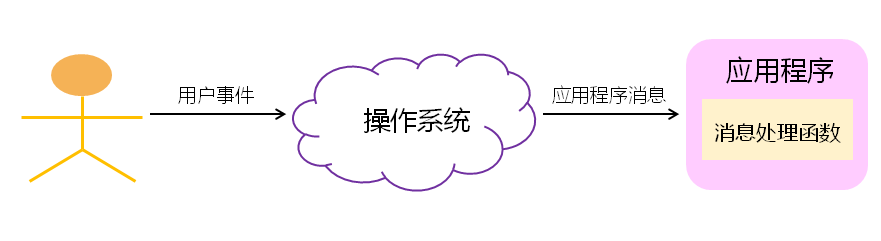
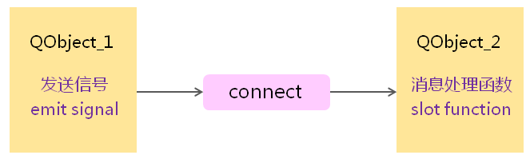

# QT消息模型

- Qt`封装`了具体操作系统的`消息机制`
- Qt遵循经典的GUI消息驱动事件模型

 

## 信号与槽

Qt中定义了与系统消息相关的概念

- 信号（Signal）

  由操作系统产生的消息

- 槽（Slot)

  程序中的消息处理函数

- 连接（Connect ）

  将系统消息绑定到消息处理函数

  

**QObject::connect函数**

```C++
bool QObject::connect ( const QObject * sender, 	//发生对象
                        const char * signal, 		//消息名
                        const QObject * receiver, 	//接收对象
                        const char *method,  		//接收对象的成员函数
                        Qt::ConnectionType type = Qt::AutoConnection )
```

在QT中消息使用`字符串`进行描述，connect函数在`消息名`和`处理函数`之间建立映射。


**QT中信号与槽相关的关键字**：

SIGNAL ——用于指定消息名

SLOT ——用于指定消息处理函数名

Q_OBJECT ——所有自定义槽的类`必须在类声明的开始处加上Q_OBJECT`

slots ——用于在类中声明消息处理函数


**自定义槽**:

只有`QObject的子类`才能自定义槽

定义槽的类`必须在类声明的最开始处使用Q_OBJECT`

类中`声明槽`是需要使用`slots关键字`

槽与所处理的信号在`函数签名上必须一致`

SIGNAL与SLOT指定的名称中可以包含参数类型，不能包含具体的参数名


### 消息处理机制

 

<u>信号到槽的连接必须发生在两个Qt类对象之间</u>