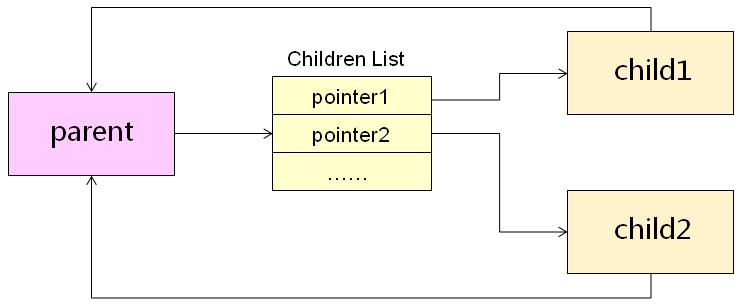
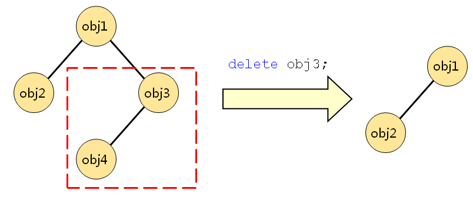

# QT对象间的关系

QT最基础和核心的类是：QObject。QObject内部有一个list，会保存children，还有一个指针保存parent，当自己析构时，会自己从parent列表中删除并且析构所有的children。

- QT对象之间可以存在父子关系
- 每一个对象都可以保存它所有子对象的指针
- 每一个对象都有一个指向其父对象的指针

 

当指定QT对象的父对象时，父对象会在子对象链表中加入该对象的指针，该对象会保存指向其父对象的指针。

```C++
Qobject* P = new Qobject();
Qobject* cl = new Qobject();
QObject* c2 = new Qobject ();

cl->setParent(p);
c2->setParent(p);
```

当QT对象被销毁时，将自己从父对象的子对象链表中删除，将自己的子对象链表中的所有对象销毁。

- 利用Qt 对象间的父子关系可以构成`对象树`
- 删除树中的节点时会导致`对应的子树`被销毁

 

------

# QT的半自动化内存管理

- QObject及其派生类的对象，如果其parent非0，那么其parent析构时会析构该对象。如果父对象和子对象都分配在栈上，并且先释放父对象的内存空间，释放父对象的时候子对象的空间将会被释放，当释放子对象的空间时，子对象空间已经被释放，会发生内存错误。

- QWidget及其派生类的对象，可以设置 Qt::WA_DeleteOnClose 标志位(当close时会析构该对象)。

- QAbstractAnimation派生类的对象，可以设置 QAbstractAnimation::DeleteWhenStopped。

- QRunnable::setAutoDelete()、MediaSource::setAutoDelete()。

- 父子关系：父对象、子对象、父子关系。这是Qt中所特有的，与类的继承关系无关，传递参数是与parent有关（基类、派生类，或父类、子类，这是对于派生体系来说的，与parent无关）。

------

# 垃圾回收机制

**QObjectCleanupHandler**

Qt 对象清理器是实现自动垃圾回收的很重要部分。QObjectCleanupHandler可以注册很多子对象，并在自己删除的时候自动删除所有子对象。同时，它也可以识别出是否有子对象被删除，从而将其从它的子对象列表中删除。QObjectCleanupHandler类可以用于不在同层次中的类的清理操作，例如，当按钮按下时需要关闭很多窗口，由于窗口的 parent 属性不可能设置为别的窗口的 button，此时使用QObjectCleanupHandler类就会很方便。

```C++
#include <QApplication>
#include <QObjectCleanupHandler>
#include <QPushButton>
 
int main(int argc, char *argv[])
{
    QApplication a(argc, argv);
    QObjectCleanupHandler *cleaner = new QObjectCleanupHandler;
    QPushButton *w = new QPushButton("Remove me");
 
    w->show();
    cleaner->add(w);
 
    //点击“remove me”按钮删除自身
    QObject::connect(w, SIGNAL(clicked()), w, SLOT(deleteLater()));
    w = new QPushButton("Nothing");
 
    cleaner->add(w);
    w->show();
    w = new QPushButton("Remove all");
 
    cleaner->add(w);
    w->show();
 
    //点击“remove all”按钮删除所有QObject
    QObject::connect(w, SIGNAL(clicked()), cleaner, SLOT(deleteLater()));
 
    return a.exec();
}
```

点击“Remove me”按钮会删除掉自己（通过 deleteLater() 槽），cleaner 会自动将其从自己的列表中清除。点击“Remove all”按钮后会删除cleaner，会同时删除掉所有未关闭的窗口，即注册在cleaner的QObject对象。