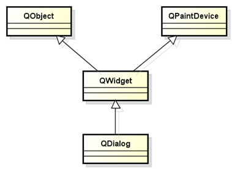
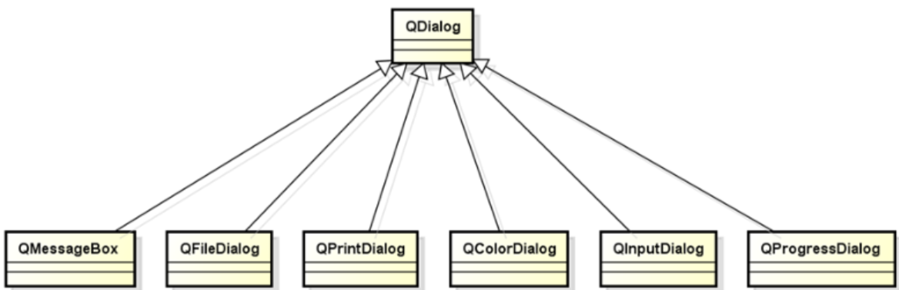
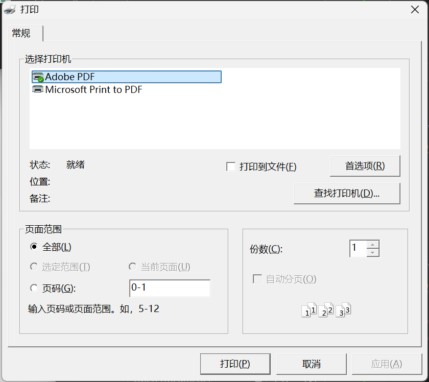
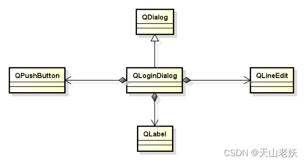

# 对话框

- 对话框是与用户进行`简短交互`的顶层窗口

- QDialog是QT中所有对话框窗口的基类

- QDialog继承于QWidget，是一种容器型的组件，是定制了窗口样式的特殊QWidget。

 

QDialog作为一种专用的交互窗口，不能作为子部件嵌入其他容器中；

## 对话框类型

对话框类型分为模态对话框和非模态对话框。

### 模态对话框

模态对话框显示后无法与父窗口进行交互，是一种`阻塞式`的对话框，使用`QDialog::exec()`函数调用。

模态对话框一般`在栈上`创建。

```C++
QDialog dialog(this);
 
dialog.exec();
```

模态对话框适用于必须依赖用户选择的场合，比如消息显示，文件选择，打印设置等。

### 非模态对话框

非模态对话框显示后独立存在，可以同时与父窗口进行交互，是一种`非阻塞式`对话框，使用`QDialog::show()`函数调用。

非模态对话框一般`在堆上`创建，需要指定Qt:WA_DeleteOnClose属性，`避免内存泄漏`。

```C++
QDialog* dialog = new QDialog(this);
 
dialog->setAttribute(Qt::WA_DeleteOnClose);
 
dialog->show();
```

非模态对话框适用于特殊功能设置的场合，比如查找操作，属性设置等。

### 混合属性对话框

混合属性对话框同时具有模态对话框和非模态对话框的属性，对话框的生成和销毁具有非模态对话框属性，功能上具有模态对话框的属性。

使用`QDialog::setModal()`函数可以创建混合特性的对话框。通常，创建对话框都需要`指定对话框的父组件`。

```C++
QDialog* dialog = new QDialog(this);
 
dialog->setAttribute(Qt::WA_DeleteOnClose);
 
dialog->setModal(true);
 
dialog->show();
```

## 对话框的返回值

- 只有模态对话框采用返回值，模态对话框的返回值用于表示交互结果。

- QDialog::exec()函数的返回值作为交互结果。

- void QDialog::done(int i)函数关闭对话框，并将参数作为交互结果。
  - QDialog::Accepted表示用户操作成功
  - QDialog::Rejected表示用户操作失败

<u>如果对话框以模态方式运行作为程序主窗口，主程序main函数不能在此调用a.exec()，避免在此进入消息事件循环。</u>

# 标准对话框

QT为开发者提供了多种可复用的对话框类型，即QT标准对话框。QT标准对话框全部继承于QDialog类。常用标准对话框类型如下：



对话框对象的定义

```cpp
QDialogType dialog(this);
```

对话框属性设置

```cpp
dialog.setPropertyxxxx(value);

if(dialog.exec() == QDialogType::vaule){
    Type v = dialog.getDialogValue();
}
```

## 消息对话框 QMessageBox

消息对话框是应用程序中最常用的界面元素。消息对话框主要用于为用户提示重要信息，强制用户进行选择操作。

消息对话框的使用方式如下：

- 创建消息对话框对象

```C++
QMessageBox msg(this);
```

- 设置消息对话框属性

```cpp
msg.setWindowTitle(“Warning Message”);
msg.setText(“Error Massage!”);
msg.setIcon(QMessageBox::Information);
msg.setStandardButtons(QMessageBox::Ok | QMessage::Cancel);

if(dialog.exec() == QMessageBox::Ok)
{
//
}
```

- QMessageBox实用函数

QMessageBox定义了静态成员函数，可以直接调用创建不同风格的消息对话框。

```cpp
QString getOpenFileName(QWidget * parent = 0, const QString & caption = QString(), 
                        const QString & dir = QString(), 
                        const QString& filter = QString(), 
                        QString * selectedFilter = 0, Options options = 0)
 
QStringList getOpenFileNames(QWidget * parent = 0, 
                            const QString& caption = QString(),     
                            const QString & dir = QString(), 
                            const QString & filter = QString(), 
                            QString * selectedFilter = 0, Options options = 0)
 
QString getSaveFileName(QWidget * parent = 0, const QString & caption = QString(), 
                        const QString & dir = QString(), 
                        const QString& filter = QString(), 
                        QString * selectedFilter = 0, Options options = 0)
```

## 文件对话框QFileDialog

文件对话框用于应用程序中需要打开一个外部文件或需要将当前内容存储到指定的外部文件。

**文件对话框的使用方式如下**

- 创建文件对话框对象

```cpp
QFileDialog fdialog(this);
```

- 文件对话框属性设置

打开文件设置如下：

```cpp
fdialog.setAcceptMode(QFileDialog::AcceptOpen);
//选择打开多个文件QFileDialog::ExistingFiles
fdialog.setFileMode(QFileDialog::ExistingFile);

if(fdialog.exec() == QFileDialog::Accepted){
	QStringList s = fdialog.selectedFiles();
    for(int i = 0; i < s.count(); i++){
            qDebug() << s[i];
    }
}
```

保存文件设置如下：

```cpp
fdialog.setAcceptMode(QFileDialog::AcceptSave);

if(fdialog.exec() == QFileDialog::Accepted){
    QStringList s = fdialog.selectedFiles();
    for(int i = 0; i < s.count(); i++){
        qDebug() << s[i];
    }
}
```

- 文件类型过滤器

在文件对话框中可以通过文件后缀定义文件过滤器。文件过滤器定义规则如下：

显示名(*.后缀名1 *.后缀名2 ...*.后缀名n)

```cpp
Image(*.jpg *.png)
Text(*.txt)
All(*.*)
fdialog.setFilter("Image(*.png *.jpg)");
```

- 文件对话框实用函数

QFileDialog定义了多个静态成员函数用于直接使用文件对话框。

```cpp
QString getOpenFileName(QWidget * parent = 0, const QString & caption = QString(), 
                        const QString & dir = QString(), 
                        const QString& filter = QString(), 
                        QString * selectedFilter = 0, Options options = 0)
 
QStringList getOpenFileNames(QWidget * parent = 0, 
                            const QString& caption = QString(),     
                            const QString & dir = QString(), 
                            const QString & filter = QString(), 
                            QString * selectedFilter = 0, Options options = 0)
 
QString getSaveFileName(QWidget * parent = 0, const QString & caption = QString(), 
                        const QString & dir = QString(), 
                        const QString& filter = QString(), 
                        QString * selectedFilter = 0, Options options = 0)
```

## 颜色对话框QColorDialog

QT中也提供了预定义的颜色对话框类QColorDialog。颜色对话框使用方式如下：

```cpp
//创建颜色对话框QColorDialog对象
QColorDialog cdialog(this);

//颜色对话框属性设置
    cdialog.setWindowTitle("Color Editer");
    //设置初始颜色
    cdialog.setCurrentColor(Qt::red);
    if(cdialog.exec() == QColorDialog::Accepted)
    {
        qDebug() << cdialog.selectedColor();
    }
```

- QColor

QT中使用QColor表示颜色，支持多种颜色的表示方法。

RGB：红、绿、蓝为基准的三色模型

HSV：色调、饱和度、明度为基准的六角锥体模型

CMYK：天蓝、品红、黄色、黑为基准的全彩印刷色彩模型

QColor支持在三种颜色模型间转换。

```cpp
QColor color = dlg.selectedColor();
 
qDebug() << color;
qDebug() << color.red();
qDebug() << color.green();
qDebug() << color.blue();
qDebug() << color.hue();
qDebug() << color.saturation();
qDebug() << color.value();
```

- QColorDialog实用函数

QColorDialog定义了直接使用颜色对话框的静态成员函数。

```cpp
QColor getColor(const QColor & initial, QWidget * parent, 
                    const QString & title, ColorDialogOptions options = 0)
 
QColor getColor(const QColor & initial = Qt::white, QWidget * parent = 0)
```

## 输入对话框QInputDialog

QT中提供了预定义的输入对话框类QInputDialog，用于需要临时进行数据输入的场合。

输入对话框的使用方法如下:

```cpp
//创建输入对话框对象
 QInputDialog idialog(this);
 
 //输入对话框属性设置
     idialog.setWindowTitle("Enter Data");
    idialog.setLabelText("Please Enter a int:");
    idialog.setInputMode(QInputDialog::IntInput);
 
    if(idialog.exec() == QInputDialog::Accepted)
    {
        qDebug() << idialog.intValue();
    }
```

- 输入对话框的输入模式

QInputDialog::TextInput 输入文本字符串

QInputDialog::IntInput 输入整型数

QInputDialog::DoubleInput 输入浮点数

D、QInputDialog的实用函数

QInputDialog定义了多个静态成员函数，直接调用使用输入对话框。

```cpp
double getDouble(QWidget * parent, const QString & title, const QString & label,
                    double value = 0, double min = -2147483647, 
                    double max = 2147483647, int decimals = 1, 
                    bool * ok = 0, Qt::WindowFlags flags = 0)
 
int getInt(QWidget * parent, const QString & title, const QString & label, 
            int value = 0, int min = -2147483647, int max = 2147483647, 
            int step= 1, bool * ok = 0, Qt::WindowFlags flags = 0)
 
QString getItem(QWidget * parent, const QString & title, const QString & label, 
                const QStringList & items, int current = 0, bool editable = true, 
                bool *ok = 0, Qt::WindowFlags flags = 0)
 
QString getText(QWidget * parent, const QString & title, const QString & label,
                QLineEdit::EchoMode mode = QLineEdit::Normal, 
                const QString &text = QString(), bool * ok = 0, 
                Qt::WindowFlags flags = 0)
```

## 字体对话框QFontDialog

QT中提供了预定义的字体对话框类QFontDialog，用于提供选择字体的对话框部件。

字体对话框的使用方法如下：

```
//创建字体对话框对象
QFontDialog fdialog(this);

//字体对话框属性设置
    fdialog.setWindowTitle("Select Font");
    fdialog.setCurrentFont(QFont("Courier New", 10, QFont::Bold));
    if(fdialog.exec() == QFontDialog::Accepted)
    {
        qDebug() << fdialog.selectedFont();
    }
```

- QFontDialog实用函数

QFontDialog定义了静态成员函数，直接调用可以使用字体对话框选择字体。

```cpp
QFont getFont(bool * ok, const QFont & initial, QWidget * parent, 
            const QString & title, FontDialogOptions options)
QFont getFont(bool * ok, const QFont & initial, QWidget * parent, 
                const char * name)
QFont getFont(bool * ok, QWidget * parent, const char * name)
QFont getFont(bool * ok, const QFont & initial, QWidget * parent, 
                const QString & title)
 
QFont getFont(bool * ok, const QFont & initial, QWidget * parent = 0)
QFont getFont(bool * ok, QWidget * parent = 0)
```

## 进度对话框QProgressDialog

QT提供了预定义的进度对话框类QProgressDialog，用于显示进度信息和需要用户等待的场合。

进度对话框的使用方法如下：

```cpp
//创建进度对话框对象
QProgressDialog pdialog(this);

//进度对话框属性设置
    pdialog.setWindowTitle("Progress.....");
    pdialog.setLabelText("The application having done at ....");
    pdialog.setMaximum(100);
    pdialog.setMinimum(0);
    pdialog.setValue(30);
    pdialog.exec();
```

## 打印对话框QPrintDialog

QT中提供了预定义的打印对话框类QPrintDialog，用于设置打印相关的参数信息。

打印对话框的使用方法如下：

```cpp
QPrintDialog prdialog(this);
prdialog.setWindowTitle("Setting the Printer");
    if(prdialog.exec() == QPrintDialog::Accepted)
    {
        QPrinter *p = prdialog.printer();
        QTextDocument td;
        td.setPlainText("Hello world!");
        p->setOutputFileName("d:\\hello.pdf");
        td.print(p);
    }
```

- QPrinter类

QT中的QPrinter类是打印设备及其参数的封装，封装了系统中打印设备的驱动接口，以相同方式使用系统中的不同打印设备。

 

# 窗体之间数据的传递

QT窗体之间数据的传递有三种方式：信号槽机制、公有函数接口、全局变量。

- QT信号槽传递

在发送数据的窗体类中定义带参数的信号，发送信号；在接收数据的窗体中定义接收数据的槽函数；将发送数据的信号和接收数据的槽函数连接。

声明信号：

```cpp
signals:  
    void sendData(QString);   
```

发送信号（带参数内容）：

```cpp
emit sendData(lineEdit->text());
```

定义槽函数（带参数内容）：

```cpp
private slots:  
   void receiveData(QString data);
```

连接信号与槽：

```cpp
connect(sender,SIGNAL(sendData(QString)),receiver,SLOT(receiveData(QString)));
```

- 公有函数接口传递
使用公有成员函数接口可以在不同类外调用类的成员函数，返回需要的数据。

- 全局变量传递
  全局变量可以在一个文件中定义，其他文件中声明后使用，实现数据的共享传递。

# 登录对话框实例

**登录对话框需求分析：**

A、作为可复用的软件部件

B、获取用户名和密码

C、随机码验证

**登录对话框的设计和架构**

 

对话框之间通过成员变量和成员函数传递数据，将用户数据保存在私有成员变量中，通过公有成员函数进行数据传递。

**登录对话框类设计**

QLogindialog.h

```cpp
#ifndef _QLOGINDIALOG_H_
#define _QLOGINDIALOG_H_

#include <QDialog>
#include <QLabel>
#include <QLineEdit>
#include <QPushButton>

class QLoginDialog : public QDialog
{
    Q_OBJECT
protected:
    QLabel UserLabel;
    QLabel PwdLabel;
    QLineEdit UserEdit;
    QLineEdit PwdEdit;
    QPushButton LoginBtn;
    QPushButton CancelBtn;
    QString m_user;
    QString m_pwd;

private slots:
    void LoginBtn_Clicked();
    void CancelBtn_Clicked();

public:
    QLoginDialog(QWidget* parent = nullptr);
    QString getUser();
    QString getPwd();
    ~QLoginDialog();
};

#endif // QLOGINDIALOG_H
```

QLogindialog.cpp

```cpp
#include "QLogindialog.h"
#include <QMessageBox>

QLoginDialog::QLoginDialog(QWidget *parent) : QDialog(parent, Qt::WindowCloseButtonHint),
UserLabel(this), PwdLabel(this), UserEdit(this), PwdEdit(this), LoginBtn(this), CancelBtn(this){

    UserLabel.setText("User ID:");
    UserLabel.move(20, 30);
    UserLabel.resize(60, 25);

    UserEdit.move(85, 30);
    UserEdit.resize(180, 25);

    PwdLabel.setText("Password:");
    PwdLabel.move(20, 65);
    PwdLabel.resize(60,25);

    PwdEdit.move(85, 65);
    PwdEdit.resize(180, 25);
    PwdEdit.setEchoMode(QLineEdit::Password);

    CancelBtn.setText("Cancel");
    CancelBtn.move(85, 110);
    CancelBtn.resize(85, 30);

    LoginBtn.setText("Login");
    LoginBtn.move(180, 110);
    LoginBtn.resize(85, 30);

    setWindowTitle("Login");
    setFixedSize(285, 170);

    connect(&LoginBtn, &QPushButton::clicked, this, &QLoginDialog::LoginBtn_Clicked);
    connect(&CancelBtn, &QPushButton::clicked, this, &QLoginDialog::CancelBtn_Clicked);
}

void QLoginDialog::LoginBtn_Clicked(){
    qDebug() << "LoginBtn_Clicked() Begin";

    m_user = UserEdit.text().trimmed();
    m_pwd = PwdEdit.text();
    if(!(m_user.isEmpty() || m_pwd.isEmpty())){
        done(Accepted);
    }else {
        QMessageBox mb(this);
        mb.setWindowTitle("Warning Message");
        mb.setIcon(QMessageBox ::Warning);
        mb.setText("User or PassWord can't empty! \nPlease check your username or password!");
        mb.setStandardButtons(QMessageBox::Ok);
        mb.exec();
    }
    qDebug() << "LoginBtn_Clicked() End";
}

void QLoginDialog::CancelBtn_Clicked(){
    qDebug() << "CancelBtn_Clicked() Begin";
    done(Rejected);
    qDebug() << "CancelBtn_Clicked() End";
}

QString QLoginDialog::getUser(){
    return m_user;
}

QString QLoginDialog::getPwd(){
    return m_pwd;
}

QLoginDialog::~QLoginDialog(){

}
```

