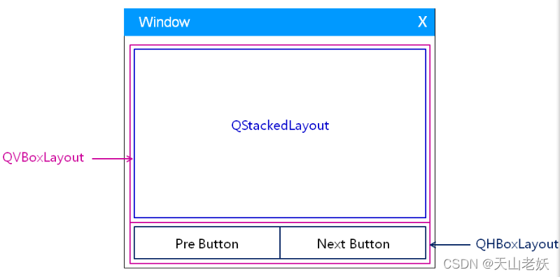

# 布局管理器

QT中使用绝对定位的布局方式无法`自适应`窗口的变化。

QT中提供了对界面组件进行布局管理的类，用于对界面组件进行管理，能够自动排列窗口中的界面组件，窗口大小变化后自动更新界面组件的大小。

 

- QLayout是QT中布局管理器的`抽象基类`，通过对QLayout的继承，实现了功能各异且互补的布局管理器。

- 布局管理器不是界面组件，而是界面组件的定位策略。

- 任意容器类型的组件都可以指定布局管理器。

- 同一个布局管理器管理中的组件拥有`相同的父组件`，在设置布局管理器的同时已经隐式指定了父子关系。

# QBoxLayout布局管理器

QBoxLayout以垂直或水平的方式管理界面组件。

QBoxLayout有两个子类：QHBoxLayout和QVBoxLayput。

## QBoxLayout使用

- QVBoxLayout使用

```cpp
void Widget::VBoxLayout()
{
    QVBoxLayout *vLayout = new QVBoxLayout();
 
    //设置组件间隔
    vLayout->setSpacing(20);
 
    //设置组件的标签
    button1.setText("button1");
    button2.setText("button2");
    button3.setText("button3");
    button4.setText("button4");
 
    //设置每个组件的尺寸策略
    button1.setSizePolicy(QSizePolicy::Expanding, QSizePolicy::Expanding);
    button2.setSizePolicy(QSizePolicy::Expanding, QSizePolicy::Expanding);
    button3.setSizePolicy(QSizePolicy::Expanding, QSizePolicy::Expanding);
    button4.setSizePolicy(QSizePolicy::Expanding, QSizePolicy::Expanding);
 
    //设置组件的最小尺寸
    button1.setMinimumSize(60,30);
    button2.setMinimumSize(60,30);
    button3.setMinimumSize(60,30);
    button4.setMinimumSize(60,30);
 
    //添加组件到布局管理器
    vLayout->addWidget(&button1);
    vLayout->addWidget(&button2);
    vLayout->addWidget(&button3);
    vLayout->addWidget(&button4);
 
    //设置窗口的布局管理器
    setLayout(vLayout);
}
```

- QHBoxLayout使用

```cpp
void Widget::HBoxLayout()
{
    QHBoxLayout *hLayout = new QHBoxLayout();
 
    //设置组件间隔
    hLayout->setSpacing(20);
 
    //设置组件的标签
    button1.setText("button1");
    button2.setText("button2");
    button3.setText("button3");
    button4.setText("button4");
 
    //设置每个组件的尺寸策略
    button1.setSizePolicy(QSizePolicy::Expanding, QSizePolicy::Expanding);
    button2.setSizePolicy(QSizePolicy::Expanding, QSizePolicy::Expanding);
    button3.setSizePolicy(QSizePolicy::Expanding, QSizePolicy::Expanding);
    button4.setSizePolicy(QSizePolicy::Expanding, QSizePolicy::Expanding);
 
    //设置组件的最小尺寸
    button1.setMinimumSize(60,30);
    button2.setMinimumSize(60,30);
    button3.setMinimumSize(60,30);
    button4.setMinimumSize(60,30);
 
    //添加组件到布局管理器
    hLayout->addWidget(&button1);
    hLayout->addWidget(&button2);
    hLayout->addWidget(&button3);
    hLayout->addWidget(&button4);
 
    //设置窗口的布局管理器
    setLayout(hLayout);
}
```

## QBoxLayout嵌套使用

布局管理器可以相互嵌套，形成复杂的布局管理方式。

QBoxLayout布局管理器的嵌套使用实例如下：

 

```cpp
void Widget::HVBoxLayout()
{
    QHBoxLayout *hLayout1 = new QHBoxLayout();
    QHBoxLayout *hLayout2 = new QHBoxLayout();
 
    //button1、buuton2使用水平布局管理器hLayout1管理
    hLayout1->setSpacing(20);
    button1.setText("button1");
    button2.setText("button2");
    button1.setSizePolicy(QSizePolicy::Expanding, QSizePolicy::Expanding);
    button2.setSizePolicy(QSizePolicy::Expanding, QSizePolicy::Expanding);
    button1.setMinimumSize(60,30);
    button2.setMinimumSize(60,30);
    hLayout1->addWidget(&button1);
    hLayout1->addWidget(&button2);
 
    //button3、buuton4使用水平布局管理器hLayout2管理
    hLayout2->setSpacing(20);
    button3.setText("button3");
    button4.setText("button4");
    button3.setSizePolicy(QSizePolicy::Expanding, QSizePolicy::Expanding);
    button4.setSizePolicy(QSizePolicy::Expanding, QSizePolicy::Expanding);
    button3.setMinimumSize(60,30);
    button4.setMinimumSize(60,30);
    hLayout2->addWidget(&button3);
    hLayout2->addWidget(&button4);
 
    //水平布局管理器hLayout1、hLayout2使用垂直布局管理器vLayout管理
    QVBoxLayout *vLayout = new QVBoxLayout();
    vLayout->setSpacing(20);
    vLayout->addLayout(hLayout1);
    vLayout->addLayout(hLayout2);
 
    //设置窗口的布局管理器为vLayout
    setLayout(vLayout);
}
```

## QBoxLayout布局管理器比例系数设置

QBoxLayout中比例系数的设置：

```cpp
void setStretch(int index, int stretch)
bool setStretchFactor(QWidget * widget, int stretch) 
bool setStretchFactor(QLayout * layout, int stretch)

    vLayout->setStretch(0,1);
    vLayout->setStretch(1,0.5);
    vLayout->setStretch(2,1);
    vLayout->setStretch(3,2);
 
    vLayout->setStretchFactor(&button1, 1);
    vLayout->setStretchFactor(&button2, 1);
 
    vLayout->setStretchFactor(hLayout1, 1);
    vLayout->setStretchFactor(hLayout2, 2);
```

界面组件的初始大小是独立于布局管理器设置的，比例系数只有在窗口变化的时候才会生效。

# QGridLayout布局管理器

QGridLayout布局管理器以网格的方式管理界面组件。

QGridLayout布局管理器比例系数设置函数：

```cpp
void setColumnStretch(int column, int stretch)
 
void setRowStretch(int row, int stretch)
```

## QGridLayout布局管理器使用

```cpp
void Widget::GridLayout()
{
    QGridLayout *gLayout = new QGridLayout();
    //设置组件间隔
    gLayout->setSpacing(20);
 
    //设置组件的标签
    button1.setText("button1");
    button2.setText("button2");
    button3.setText("button3");
    button4.setText("button4");
 
    //设置每个组件的尺寸策略
    button1.setSizePolicy(QSizePolicy::Expanding, QSizePolicy::Expanding);
    button2.setSizePolicy(QSizePolicy::Expanding, QSizePolicy::Expanding);
    button3.setSizePolicy(QSizePolicy::Expanding, QSizePolicy::Expanding);
    button4.setSizePolicy(QSizePolicy::Expanding, QSizePolicy::Expanding);
 
    //设置组件的最小尺寸
    button1.setMinimumSize(60,30);
    button2.setMinimumSize(60,30);
    button3.setMinimumSize(60,30);
    button4.setMinimumSize(60,30);
 
    //添加组件到网格布局管理器
    gLayout->addWidget(&button1, 0, 0);
    gLayout->addWidget(&button2, 0, 1);
    gLayout->addWidget(&button3, 1, 0);
    gLayout->addWidget(&button4, 1, 1);
 
    //设置行和列的比例系数
    gLayout->setColumnStretch(0, 1);
    gLayout->setColumnStretch(1, 2);
    gLayout->setRowStretch(0, 1);
    gLayout->setRowStretch(1, 2);
 
    //设置窗口的布局管理器
    setLayout(gLayout);
}
```

## 界面组件在QGridLayout中跨网格使用

```cpp
void Widget::HVGridLayout()
{
    QGridLayout *gLayout = new QGridLayout();
 
    //设置组件间隔
    gLayout->setSpacing(20);
 
    //设置组件的标签
    button1.setText("button1");
    button2.setText("button2");
    button3.setText("button3");
    button4.setText("button4");
 
    //设置每个组件的尺寸策略
    button1.setSizePolicy(QSizePolicy::Expanding, QSizePolicy::Expanding);
    button2.setSizePolicy(QSizePolicy::Expanding, QSizePolicy::Expanding);
    button3.setSizePolicy(QSizePolicy::Expanding, QSizePolicy::Expanding);
    button4.setSizePolicy(QSizePolicy::Expanding, QSizePolicy::Expanding);
 
    //设置组件的最小尺寸
    button1.setMinimumSize(60,30);
    button2.setMinimumSize(60,30);
    button3.setMinimumSize(60,30);
    button4.setMinimumSize(60,30);
 
    //添加组件到网格布局管理器,放置的位置，占用的行和列
    gLayout->addWidget(&button1, 0, 0, 1, 1);
    gLayout->addWidget(&button2, 0, 1, 1, 1);
    gLayout->addWidget(&button3, 1, 0, 1, 2);
    gLayout->addWidget(&button4, 2, 0, 3, 1);
 
    //设置窗口的布局管理器
    setLayout(gLayout);
}
```

QGridLayout布局管理器支持嵌套使用。

# QFormLayout布局管理器

QFormLayout布局管理器使用表单的方式管理界面组件，表单中的标签和组件是相互对应的关系，支持嵌套使用。

 

## QFormLayout布局管理器使用

```cpp
void addRow(QWidget * label, QWidget * field)
 
void addRow(QWidget * label, QLayout * field)
 
void addRow(const QString & labelText, QWidget * field)
 
void addRow(const QString & labelText, QLayout * field)
```

```cpp
  void Widget::FormLayout()
 {
     //创建组件和表单布局管理器
     QLineEdit *nameEdit = new QLineEdit();
     QLineEdit *mailEdit = new QLineEdit();
     QLineEdit *addrEdit = new QLineEdit();
     QFormLayout *fLayout = new QFormLayout();
     fLayout->setSpacing(20);
     fLayout->setLabelAlignment(Qt::AlignRight);
 
     //添加组件到表单布局管理器
     fLayout->addRow("name:", nameEdit);
     fLayout->addRow("mail:", mailEdit);
     fLayout->addRow("addr:", addrEdit);
 
     //设置窗口标题
     setWindowTitle("FTP");
 
     //设置表单布局管理器到窗口
     setLayout(fLayout);
 }
```

## QFormLayout布局管理器嵌套

 

```cpp
void Widget::FormLayout()
 {
     //创建组件和表单布局管理器
     QLineEdit *nameEdit = new QLineEdit();
     QLineEdit *mailEdit = new QLineEdit();
     QLineEdit *addrEdit1 = new QLineEdit();
     QLineEdit *addrEdit2 = new QLineEdit();
     QFormLayout *fLayout = new QFormLayout();
 
     //添加addrEdit1、addrEdit2到QVBoxLayout
     QVBoxLayout *vLayout = new QVBoxLayout();
     vLayout->addWidget(addrEdit1);
     vLayout->addWidget(addrEdit2);
     vLayout->setSpacing(6);
     fLayout->setSpacing(20);
 
     //添加组件到表单布局管理器
     fLayout->addRow("name:", nameEdit);
     fLayout->addRow("mail:", mailEdit);
     fLayout->addRow("address:", vLayout);
 
     //设置对齐
     fLayout->setLabelAlignment(Qt::AlignRight);
     fLayout->setFormAlignment(Qt::AlignLeft);
 
     //设置窗口标题
     setWindowTitle("FTP");
 
     //设置表单布局管理器到窗口
     setLayout(fLayout);
 }
```

## QFormLayout样式函数

```cpp
void setRowWrapPolicy(RowWrapPolicy policy)
 
void setLabelAlignment(Qt::Alignment alignment)
```

# QStackedLayout栈式布局管理器

QStackedLayout栈式布局管理器管理的所有组件在垂直于屏幕的方向上，每次只有一个界面组件会显示在屏幕上，只要最顶层的界面组件会被显示。

QStackedLayout栈式布局管理器的特点如下：

- 组件大小一致，且充满父组件的显示区

- 不能直接嵌套其它布局管理器

- 能够自由切换需要显示的组件

- 每次仅能显示一个界面组件

 

## QStackedLayout栈式布局管理器使用

```cpp
void Widget::StackedLayout()
 {
     //创建组件并设置显示标签
     QPushButton *button1 = new QPushButton();
     QPushButton *button2 = new QPushButton();
     QPushButton *button3 = new QPushButton();
     QPushButton *button4 = new QPushButton();
 
     button1->setText("1st");
     button2->setText("2rd");
     button3->setText("3th");
     button4->setText("4th");
 
     //创建栈式布局管理器并添加组件
     QStackedLayout *sLayout = new QStackedLayout();
     sLayout->addWidget(button1);
     sLayout->addWidget(button2);
     sLayout->addWidget(button3);
     sLayout->addWidget(button4);
 
     //设置当前栈顶显示的组件
     sLayout->setCurrentIndex(0);
 
     //设置栈式布局管理器到窗口
     setLayout(sLayout);
 }
```

## QStackedLayout栈式布局管理器嵌套

QStackedLayout栈式布局管理器不能直接嵌套其他布局管理器，但可以间接嵌套使用其他布局管理器。

```cpp
 void Widget::StackedLayout()
 {
     //创建组件并设置显示标签
     QPushButton *button1 = new QPushButton();
     QPushButton *button2 = new QPushButton();
     QPushButton *button3 = new QPushButton();
     QPushButton *button4 = new QPushButton();
 
     button1->setText("1st");
     button2->setText("2rd");
     button3->setText("3th");
     button4->setText("4th");
 
     //创建要嵌套的QVBoxLayout布局管理器
     QVBoxLayout * vbLayout = new QVBoxLayout();
 
     //创建中间对象并将需要嵌套布局管理管理的组件的父组件设置为中间对象
     QWidget * qwidget = new QWidget();
     button2->setParent(qwidget);
     button3->setParent(qwidget);
 
     //设置组件的QVBoxLayout布局管理器
     vbLayout->addWidget(button2);
     vbLayout->addWidget(button3);
 
     //设置中间对象的布局管理器为要嵌套的QVBoxLayout布局管理器
     qwidget->setLayout(vbLayout);
 
     //创建栈式布局管理器并添加组件
     QStackedLayout *sLayout = new QStackedLayout();
     sLayout->addWidget(button1);
     sLayout->addWidget(qwidget);
     sLayout->addWidget(button4);
 
     //设置当前栈顶显示的组件
     sLayout->setCurrentIndex(1);
 
     //设置栈式布局管理器到窗口
     setLayout(sLayout);
 }
```

## QStackedLayout实用函数

```cpp
int addWidget (QWidget * widget)
QWidget * currentWidget() const
void setCurrentIndex(int index)
int currentIndex() const
```

# QTimer计时器

QT中提供了预定义的定时器类QTimer，用于每隔一定时间触发一个消息，触发的计时器消息会被转化为函数调用。

**QTimer的使用如下：**

- 编写计时器消息处理函数

- 创建计时器对象

- 连接计时器消息和消息处理函数

- 设置计时器计时间隔并启动计时器

```cpp
 void Widget::StackedLayout()
 {
     //创建组件并设置显示标签
     QPushButton *button1 = new QPushButton();
     QPushButton *button2 = new QPushButton();
     QPushButton *button3 = new QPushButton();
     QPushButton *button4 = new QPushButton();
 
     button1->setText("1st");
     button2->setText("2rd");
     button3->setText("3th");
     button4->setText("4th");
 
     //创建要嵌套的QVBoxLayout布局管理器
     QVBoxLayout * vbLayout = new QVBoxLayout();
 
     //创建中间对象并将需要嵌套布局管理管理的组件的父组件设置为中间对象
     QWidget * qwidget = new QWidget();
     button2->setParent(qwidget);
     button3->setParent(qwidget);
 
     //设置组件的QVBoxLayout布局管理器
     vbLayout->addWidget(button2);
     vbLayout->addWidget(button3);
 
     //设置中间对象的布局管理器为要嵌套的QVBoxLayout布局管理器
     qwidget->setLayout(vbLayout);
     //创建栈式布局管理器并添加组件
     QStackedLayout *sLayout = new QStackedLayout();
     sLayout->addWidget(button1);
     sLayout->addWidget(qwidget);
     sLayout->addWidget(button4);
 
     //设置当前栈顶显示的组件
     sLayout->setCurrentIndex(1);
     //设置栈式布局管理器到窗口
     setLayout(sLayout);
 
     //创建QTimer对象
     QTimer *timer = new QTimer(this);
     //绑定定时器消息到消息处理函数
     connect(timer, SIGNAL(timeout()), this, SLOT(timer()));
     //启动定时器，设定间隔
 
     timer->start(2000);
 }
 
//定时器消息处理函数
 void Widget::timer()
 {
     //获取当前窗口布局管理器并转换为栈式布局管理器
     QStackedLayout *sLayout = dynamic_cast<QStackedLayout *>(layout());
     if(sLayout != NULL)
     {
         int index = (sLayout->currentIndex() + 1) % sLayout->count();
         //设置栈顶显示的组件
         sLayout->setCurrentIndex(index);
     }
 }
```

# 布局管理器综合实例

用户向导界面开发需求：

- 在同一个界面显示不同的向导页面

- 通过上一步和下一步按钮进行页面切换

**界面设计：**

 

栈式布局管理器显示不同页面

 

